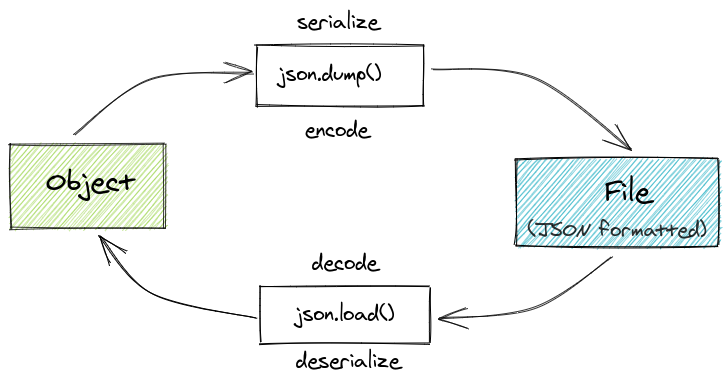

# Dicas de Django

Várias dicas de Django - assuntos diversos.

1. [Django boilerplate e cookiecutter-django](#1---django-boilerplate-e-cookiecutter-django)
2. [Django extensions](#2---django-extensions)
3. [Django bulk_create e django-autoslug](#3---django-bulk_create-e-django-autoslug)
4. [Django Admin personalizado](#4---django-admin-personalizado)
5. [Django Admin Date Range filter](#5---django-admin-date-range-filter)
6. [Geradores de senhas randômicas - uuid, hashids, secrets](#6---geradores-de-senhas-rand%C3%B4micas---uuid-hashids-secrets)
7. [Rodando o ORM do Django no Jupyter Notebook](#7---rodando-o-orm-do-django-no-jupyter-notebook)
8. [Conhecendo o Django Debug Toolbar](#8---conhecendo-o-django-debug-toolbar)
9. [Escondendo suas senhas python-decouple](#9---escondendo-suas-senhas-python-decouple)
10. [Prototipagem de web design (Mockup)](#10---prototipagem-de-web-design-mockup)
11. [Bootstrap e Bulma + Colorlib](#11---bootstrap-e-bulma--colorlib)
12. [Imagens: pexels e unsplash](#12---imagens-pexels-e-unsplash)
13. [Cores](#13---cores)
14. [Herança de Templates e Arquivos estáticos](#14---herança-de-templates-e-arquivos-estáticos)
15. [Busca por data no frontend](#15---busca-por-data-no-frontend)
16. [Filtros com django-filter](#16---filtros-com-django-filter)
17. [Criando comandos personalizados](#17---criando-comandos-personalizados)
18. [bulk_create e bulk_update](#18---bulk_create-e-bulk_update)
19. [Criando Issues por linha de comando com a api do github](#19---criando-issues-por-linha-de-comando-com-a-api-do-github)
20. [api github e click](#20---api-github-e-click)
21. [Criando issues por linha de comando com gitlab cli](#21---criando-issues-por-linha-de-comando-com-gitlab-cli)
22. [Criando issues por linha de comando com bitbucket cli](#22---criando-issues-por-linha-de-comando-com-bitbucket-cli)
23. [Diferença entre JSON dump, dumps, load e loads](#23---diferença-entre-json-dump-dumps-load-e-loads)
24. [Barra de progresso](#24---barra-de-progresso)
25. [Rodando Shell script dentro do Python](#25---rodando-shell-script-dentro-do-python)
26. [Rodando Python dentro do Shell script](#26---rodando-python-dentro-do-shell-script)
27. [Retornando os nomes dos campos do model](#27---retornando-os-nomes-dos-campos-do-model)
28. [Admin: Usando short description](#28---admin-usando-short-description)


## This project was done with:

* Python 3.8.2
* Django 2.2.19

## How to run project?

* Clone this repository.
* Create virtualenv with Python 3.
* Active the virtualenv.
* Install dependences.
* Run the migrations.

```
git clone https://github.com/rg3915/dicas-de-django.git
cd dicas-de-django
python -m venv .venv
source .venv/bin/activate
pip install -r requirements.txt
python contrib/env_gen.py
python manage.py migrate
```

## Este projeto foi feito com:

* Python 3.8.2
* Django 2.2.19

## Como rodar o projeto?

* Clone esse repositório.
* Crie um virtualenv com Python 3.
* Ative o virtualenv.
* Instale as dependências.
* Rode as migrações.

```
git clone https://github.com/rg3915/dicas-de-django.git
cd dicas-de-django
python3 -m venv .venv
source .venv/bin/activate
pip install -r requirements.txt
python contrib/env_gen.py
python manage.py migrate
```

# 1 - Django boilerplate e cookiecutter-django

<a href="https://youtu.be/OYcOpcPcp8Y">
    
</a>

[boilerplatesimple.sh](https://gist.github.com/rg3915/b363f5c4a998f42901705b23ccf4b8e8)

[boilerplate2.sh](https://gist.github.com/rg3915/a264d0ade860d2f2b4bf)

[cookiecutter-django](https://github.com/pydanny/cookiecutter-django)

```
python -m venv .venv
source .venv/bin/activate

pip install "cookiecutter>=1.7.0"
cookiecutter https://github.com/pydanny/cookiecutter-django
pip install -r requirements/local.txt 
python manage.py migrate

createdb myproject -U postgres

python manage.py migrate
```

# 2 - Django extensions

<a href="https://youtu.be/qUKzDSSuh2w">
    
</a>


https://django-extensions.readthedocs.io/en/latest/index.html

```
pip install django-extensions
```

```python
# settings.py
INSTALLED_APPS = (
    ...
    'django_extensions',
)
```

```
python manage.py show_urls
```

```
python manage.py shell_plus
```


# 3 - Django bulk_create e django-autoslug

### python-slugify

https://pypi.org/project/python-slugify/

```python
from slugify import slugify
text = 'Dicas de Django'
print(slugify(text))
url = f'example.com/{slugify(text)}'
```

#### bulk-create

https://docs.djangoproject.com/en/3.0/ref/models/querysets/#bulk-create


#### django-autoslug

https://pypi.org/project/django-autoslug/

```
pip install django-autoslug
```


#### models.py

```python
from django.db import models
from autoslug import AutoSlugField


class Article(models.Model):
    title = models.CharField('título', max_length=200)
    subtitle = models.CharField('sub-título', max_length=200)
    slug = AutoSlugField(populate_from='title')
    category = models.ForeignKey(
        'Category',
        related_name='categories',
        verbose_name='categoria',
        on_delete=models.SET_NULL,
        null=True,
        blank=True
    )
    published_date = models.DateTimeField(
        'criado em',
        auto_now_add=True,
        auto_now=False
    )

    class Meta:
        ordering = ('title',)
        verbose_name = 'artigo'
        verbose_name_plural = 'artigos'

    def __str__(self):
        return self.title


class Category(models.Model):
    title = models.CharField('título', max_length=50, unique=True)

    class Meta:
        ordering = ('title',)
        verbose_name = 'categoria'
        verbose_name_plural = 'categorias'

    def __str__(self):
        return self.title
```


#### shell_plus

```python
categories = [
    'dicas',
    'django',
    'python',
]

aux = []

for category in categories:
    obj = Category(title=category)
    aux.append(obj)

Category.objects.bulk_create(aux)


titles = [
    {
        'title': 'Django Boilerplate',
        'subtitle': 'Django Boilerplate',
        'category': 'dicas'
    },
    {
        'title': 'Django extensions',
        'subtitle': 'Django extensions',
        'category': 'dicas'
    },
    {
        'title': 'Django Admin',
        'subtitle': 'Django Admin',
        'category': 'admin'
    },
    {
        'title': 'Django Autoslug',
        'subtitle': 'Django Autoslug',
        'category': 'dicas'
    },
]

aux = []

for title in titles:
    category = Category.objects.filter(title=title['category']).first()
    article = dict(
        title=title['title'],
        subtitle=title['subtitle']
    )
    if category:
        obj = Article(category=category, **article)
    else:
        obj = Article(**article)
    aux.append(obj)

Article.objects.bulk_create(aux)
```


# 4 - Django Admin personalizado

https://docs.djangoproject.com/en/3.0/ref/contrib/admin/#modeladmin-options

#### admin.py

```python
from django.conf import settings
from django.contrib import admin
from .models import Article, Category
# from .forms import ArticleAdminForm


@admin.register(Article)
class ArticleAdmin(admin.ModelAdmin):
    list_display = ('title', 'slug', 'get_published_date')
    search_fields = ('title',)
    list_filter = (
        'category',
    )
    readonly_fields = ('slug',)
    date_hierarchy = 'published_date'
    # form = ArticleAdminForm

    def get_published_date(self, obj):
        if obj.published_date:
            return obj.published_date.strftime('%d/%m/%Y')

    get_published_date.short_description = 'Data de Publicação'


@admin.register(Category)
class CategoryAdmin(admin.ModelAdmin):
    actions = None

    def has_add_permission(self, request, obj=None):
        return False

    if not settings.DEBUG:
        def has_delete_permission(self, request, obj=None):
            return False
```


# 5 - Django Admin Date Range filter

https://github.com/tzulberti/django-datefilterspec

```
pip install django-daterange-filter
```

```python
# settings.py
INSTALLED_APPS = (
    ...
    'daterange_filter'
)
```

```python
# admin.py
from daterange_filter.filter import DateRangeFilter
...

@admin.register(Article)
class ArticleAdmin(admin.ModelAdmin):
    ...
    list_filter = (
        ('published_date', DateRangeFilter),
        'category',
    )
```

# 6 - Geradores de senhas randômicas - uuid, hashids, secrets

## 6.1 - uuid

https://docs.python.org/3/library/uuid.html

```python
import uuid

uuid.uuid4()

uuid.uuid4().hex
```

```python
# models.py
import uuid
from django.db import models


class UuidModel(models.Model):
    slug = models.UUIDField(unique=True, editable=False, default=uuid.uuid4)

    class Meta:
        abstract = True

class Category(UuidModel):
    title = models.CharField('título', max_length=50, unique=True)
    ...
```

## 6.2 - shortuuid

https://pypi.org/project/shortuuid/

```
pip install shortuuid
```

```python
>>> import shortuuid
>>> 
>>> shortuuid.uuid()
'823MMBZx7LNEnnPBtCAorG'
>>> 
>>> shortuuid.uuid(name='example.com')
'exu3DTbj2ncsn9tLdLWspw'
>>> 
>>> shortuuid.ShortUUID().random(length=22)
'4CHN7TshKtrVnW4KLgVMhY'
>>> 
>>> shortuuid.set_alphabet('regis')
>>> shortuuid.uuid()
'gerigigiesreissgisrsggrrseieereggierrgreriissreiiisiegrr'
>>> 
```

## 6.3 - hashids

https://gist.github.com/rg3915/4684721a603cf6d0dd3b9495744482fe

https://pypi.org/project/hashids/

```
pip install hashids
```

```python
from hashids import Hashids
hashids = Hashids()

>>> hashids.encode(42)
'9x'
>>> hashids.decode('9x')
(42,)
>>> hashids.encode(665190)
'k7qWJ'
>>> hashids.decode('k7qWJ')
(665190,)
>>> hashids.encode(1122, 4200, 32665)
'ELmhW0mFD7o'
>>> hashids.decode('ELmhW0mFD7o')
(1122, 4200, 32665)
>>> hashids = Hashids(alphabet='abcdefghijklmnopqrstuvwxyz1234567890', min_length=22)
>>> for i in range(10): hashids.encode(i)
... 
'9xkwnvoj3ejwgp6481y5mq'
'ml6kz731jdkoe524rxn0yq'
'kwp7yx456gl9g91lm23v8n'
'0qr6jxo9memje214w8zlvp'
'9poy2jq1xdn0e037nwv4zl'
'nz97pw01jgo5el24yrxv6m'
'q4pkmy631epjenrxv70w5l'
'n97kyw8q0dq9eo143z2x6v'
'x7n4zl0pkgr4d6o3vq92wy'
'6y27mjnzkev3d3549vq0xl'
>>> 
```

### django-hashid-field

https://pypi.org/project/django-hashid-field/

```
pip install django-hashid-field==3.1.3
```

```python
# models.py
from hashid_field import HashidAutoField


class Article(models.Model):
    id = HashidAutoField(primary_key=True)
    ...
```


```python
# python manage.py shell_plus
from hashid_field import Hashid

articles = Article.objects.all()
for article in articles:
    hashid = Hashid(article.id)
    print(article.id, hashid.id)
```

https://www.howtogeek.com/howto/30184/10-ways-to-generate-a-random-password-from-the-command-line/

### Gerando senhas no terminal Linux

```
date +%s | sha256sum | base64 | head -c 32 ; echo

openssl rand -base64 32

strings /dev/urandom | grep -o '[[:alnum:]]' | head -n 30 | tr -d '\n'; echo

date | md5sum
```


```
# apt install -y gpw

gpw

gpw 3 32

gpw 1 5
```

### Gerando senhas com Python

#### com random

```python
import random

chars = "abcdefghijklmnopqrstuvwxyz01234567890ABCDEFGHIJKLMNOPQRSTUVWXYZ!@#$%^&*()?"
size = 8
secret_key = "".join(random.sample(chars,size))
print(secret_key)
```

#### com random e string

https://pynative.com/python-generate-random-string/

```python
# Generate a random string of specific letters only

import random
import string

def randString(length=5):
    # put your letters in the following string
    your_letters='abcdefghi'
    return ''.join((random.choice(your_letters) for i in range(length)))

print("Random String with specific letters ", randString())
print("Random String with specific letters ", randString(5))
```

#### com secrets

https://docs.python.org/3/library/secrets.html

*New in Python 3.6*

```python
import secrets

secrets.token_hex(16)

secrets.token_urlsafe(16)

url = 'https://mydomain.com/reset=' + secrets.token_urlsafe()
```

### Django

```
vim contrib/env_gen.py
```

```python
"""
Django SECRET_KEY generator.
"""
from django.utils.crypto import get_random_string


chars = 'abcdefghijklmnopqrstuvwxyz0123456789!@#$%^&*(-_=+)'

CONFIG_STRING = """
DEBUG=True
SECRET_KEY=%s
ALLOWED_HOSTS=127.0.0.1, .localhost
""".strip() % get_random_string(50, chars)

print(CONFIG_STRING)

# Writing our configuration file to '.env'
with open('.env', 'w') as configfile:
    configfile.write(CONFIG_STRING)
```

```
python contrib/env_gen.py
```

# 7 - Rodando o ORM do Django no Jupyter Notebook

Instale

```
pip install ipython[notebook]
```

Rode

```
python manage.py shell_plus --notebook
```

**Obs**: No Django 3.x talvez você precise dessa configuração [async-safety](https://docs.djangoproject.com/en/3.0/topics/async/#async-safety).

`os.environ["DJANGO_ALLOW_ASYNC_UNSAFE"] = "true"`


# 8 - Conhecendo o Django Debug Toolbar

https://django-debug-toolbar.readthedocs.io/en/latest/

```
pip install django-debug-toolbar
```

#### Configurando o `settings.py`

```
INSTALLED_APPS = [
    # ...
    'django.contrib.staticfiles',
    # ...
    'debug_toolbar',
]

MIDDLEWARE = [
    # ...
    'debug_toolbar.middleware.DebugToolbarMiddleware',
    # Deve estar por último.
]

INTERNAL_IPS = [
    # ...
    '127.0.0.1',
    # ...
]

STATIC_URL = '/static/'
```

#### Configurando o `urls.py`

```
from django.conf import settings
from django.urls import include, path

if settings.DEBUG:
    import debug_toolbar
    urlpatterns = [
        path('__debug__/', include(debug_toolbar.urls)),
    ] + urlpatterns
```

# 9 - Escondendo suas senhas python-decouple

https://github.com/henriquebastos/python-decouple

[Video do Henrique Bastos na Live de Python #97](https://www.youtube.com/watch?v=zYJGpLw5Wv4)

```
pip install python-decouple
```

Crie um arquivo `.env` com o seguinte conteúdo (de exemplo)

```
DEBUG=True
SECRET_KEY=c9^3g^bn6wgo8tabf*dl$@vx@m-!9ux%*9)88qnun&hk++sa90
ALLOWED_HOSTS=127.0.0.1,.localhost
POSTGRES_DB=mydb
POSTGRES_USER=myuser
POSTGRES_PASSWORD=mypass
DB_HOST=localhost

AWS_ACCESS_KEY_ID=
AWS_SECRET_ACCESS_KEY=
AWS_STORAGE_BUCKET_NAME=

# console ou smtp
EMAIL_BACKEND=django.core.mail.backends.console.EmailBackend
EMAIL_HOST=smtp.sendgrid.net
EMAIL_PORT=587
EMAIL_USE_TLS=True
EMAIL_HOST_USER=
EMAIL_HOST_PASSWORD=
```

repare que não deve haver espaços e nem aspas.

E em `settings.py` faça

```
SECRET_KEY = config('SECRET_KEY')
DEBUG = config('DEBUG', default=False, cast=bool)
ALLOWED_HOSTS = config('ALLOWED_HOSTS', default=[], cast=Csv())

EMAIL_BACKEND = config('EMAIL_BACKEND')
EMAIL_HOST = config('EMAIL_HOST')
EMAIL_PORT = config('EMAIL_PORT')
EMAIL_USE_TLS = config('EMAIL_USE_TLS')
EMAIL_HOST_USER = config('EMAIL_HOST_USER')
EMAIL_HOST_PASSWORD = config('EMAIL_HOST_PASSWORD')

DATABASES = {
    'default': {
        'ENGINE': 'django.db.backends.postgresql',
        'NAME': config('POSTGRES_DB'),
        'USER': config('POSTGRES_USER'),
        'PASSWORD': config('POSTGRES_PASSWORD'),
        'HOST': config('DB_HOST', 'localhost'),
        'PORT': '5432',
    }
}
```

# 10 - Prototipagem de web design (Mockup)

[excalidraw.com](https://excalidraw.com/)

[moqups.com](https://moqups.com/)

[balsamiq.com](https://balsamiq.com/)

[marvelapp.com](https://marvelapp.com/)

[mockflow.com](https://www.mockflow.com/)


# 11 - Bootstrap e Bulma + Colorlib

[getbootstrap.com](https://getbootstrap.com/)

[getbootstrap.com/docs/4.5/examples](https://getbootstrap.com/docs/4.5/examples/)

[bulma.io](https://bulma.io/)

[bulmatemplates.github.io/bulma-templates](https://bulmatemplates.github.io/bulma-templates/)

[bulmathemes.com](https://bulmathemes.com/)

[colorlib.com](https://colorlib.com/)


# 12 - Imagens: pexels e unsplash

[pexels.com](https://www.pexels.com/pt-br/)

[unsplash.com](https://unsplash.com/)


# 13 - Cores

[color.adobe.com/pt/create/color-wheel](https://color.adobe.com/pt/create/color-wheel)

[coolors.co](https://coolors.co/)

[materialuicolors.co](https://materialuicolors.co/)

[htmlcolorcodes.com](https://htmlcolorcodes.com/)

[clrs.cc](http://clrs.cc/)


# 14 - Herança de Templates e Arquivos estáticos

[Video Introdução a Arquitetura do Django - Pyjamas 2019](https://www.youtube.com/watch?v=XjXpwZhOKOs)


# 15 - Busca por data no frontend

Considere um template com os campos:

```html
<input class="form-control" name='start_date' type="date">
<input class="form-control" name='end_date' type="date">
```

Em `views.py` basta fazer:

```python
def article_list(request):
    template_name = 'core/article_list.html'
    object_list = Article.objects.all()

    start_date = request.GET.get('start_date')
    end_date = request.GET.get('end_date')

    if start_date and end_date:
        # Converte em data e adiciona um dia.
        end_date = parse(end_date) + timedelta(1)
        object_list = object_list.filter(
            published_date__range=[start_date, end_date]
        )

    context = {'object_list': object_list}
    return render(request, template_name, context)
```

Pra não precisar fazer o

```python
end_date = parse(end_date) + timedelta(1)
```

basta acrescentar `date` antes do `range`, dai fica assim:

```python
object_list = object_list.filter(
    published_date__date__range=[start_date, end_date]
)
```

Agradecimentos a [@walisonfilipe](https://twitter.com/walisonfilipe)


# 16 - Filtros com [django-filter](https://django-filter.readthedocs.io/en/stable/)

Instale o [django-filter](https://django-filter.readthedocs.io/en/stable/)

```
pip install django-filter
```

Acrescente-o ao `INSTALLED_APPS`

```python
INSTALLED_APPS = [
    ...
    'django_filters',
]
```

Crie um arquivo `filters.py`

```python
import django_filters
from .models import Article


class ArticleFilter(django_filters.FilterSet):
    title = django_filters.CharFilter(lookup_expr='icontains')
    subtitle = django_filters.CharFilter(lookup_expr='icontains')

    class Meta:
        model = Article
        fields = ('title', 'subtitle')
```

Em `views.py`

```python
from .filters import ArticleFilter


def article_list(request):
    template_name = 'core/article_list.html'
    object_list = Article.objects.all()
    article_filter = ArticleFilter(request.GET, queryset=object_list)

    ...

    context = {
        'object_list': article_filter,
        'filter': article_filter
    }
    return render(request, template_name, context)
```

Em `article_list.html`

```html
  <div class="row">
    <div class="col-md-4">
      <form method="GET">
        {{ filter.form.as_p }}
        <input type="submit" />
      </form>
    </div>

    <div class="col-md-8">
      <table class="table">
        <thead>
          <tr>
            <th>Título</th>
            <th>Sub-título</th>
            <th>Data de publicação</th>
          </tr>
        </thead>
        <tbody>
          
            <tr>
              <td>{{ obj.title }}</td>
              <td>{{ obj.subtitle }}</td>
              <td>{{ obj.published_date }}</td>
            </tr>
          
        </tbody>
      </table>
    </div>
  </div>
```

# 17 - Criando comandos personalizados

Baseado em [Criando novos comandos no django-admin](http://pythonclub.com.br/criando-novos-comandos-no-django-admin.html) e na [Live 95 do Edu Live de Python](https://youtu.be/cyxky2QJlwg?t=3482).

### Criando as pastas

Para criarmos um novo comando precisamos das seguintes pastas:

```
core
├── management
│   ├── __init__.py
│   ├── commands
│   │   ├── __init__.py
│   │   ├── novocomando.py
```

No nosso caso, teremos 2 novos comandos, então digite, estando na pasta myproject

```
mkdir -p core/management/commands
touch core/management/__init__.py
touch core/management/commands/{__init__.py,hello.py,search.py}
```


```python
# hello.py
from django.core.management.base import BaseCommand


class Command(BaseCommand):
    help = 'Print hello world.'

    def add_arguments(self, parser):
        # Argumento nomeado (opcional)
        parser.add_argument(
            '--awards', '-a',
            action='store_true',
            help='Ajuda da opção aqui.'
        )

    def handle(self, *args, **options):
        self.stdout.write('Hello world.')
        if options['awards']:
            self.stdout.write('Awards')
```


```python
# search.py
from django.core.management.base import BaseCommand
from myproject.core.models import Article


class Command(BaseCommand):
    help = """Localiza um artigo pelo título ou sub-título."""

    def add_arguments(self, parser):
        parser.add_argument(
            '--title', '-t',
            dest='title',
            default=None,
            help='Localiza um artigo pelo título.'
        )
        parser.add_argument(
            '--subtitle', '-sub',
            dest='subtitle',
            default=None,
            help='Localiza um artigo pelo sub-título.'
        )

    def handle(self, title=None, subtitle=None, **options):
        """ dicionário de filtros """
        self.verbosity = int(options.get('verbosity'))

        filters = {
            'title__icontains': title,
            'subtitle__icontains': subtitle,
        }

        filter_by = {
            key: value for key,
            value in filters.items() if value is not None
        }
        queryset = Article.objects.filter(**filter_by)

        if self.verbosity > 0:
            for article in queryset:
                self.stdout.write("{0} {1}".format(
                    article.title, article.subtitle))
            self.stdout.write(f'\n{queryset.count()} artigos localizados.')
```

# 18 - bulk_create e bulk_update

## bulk_create

O [bulk_create](https://docs.djangoproject.com/en/3.0/ref/models/querysets/#bulk-create) serve para inserir uma grande quantidade de dados num banco de forma super rápida.

Vamos usar o

`python manage.py shell_plus`

Primeiro vamos criar uns dados aleatórios

```python
import secrets
import string

N = 12
list_items = []

for i in range(100):
    res = ''.join(secrets.choice(string.ascii_lowercase) for i in range(N))
    list_items.append(res)
```

Agora vamos inserir os dados com bulk_create

```python
aux = []
for item in list_items:
    obj = Article(title=item, subtitle=item)
    aux.append(obj)

Article.objects.bulk_create(aux)
```

## bulk_update

Como o nome já diz, o [bulk_update](https://docs.djangoproject.com/en/3.0/ref/models/querysets/#bulk-update) serve para atualizar os dados.


```python
articles = Article.objects.all()
category = Category.objects.first()
for article in articles:
    article.category = category

Article.objects.bulk_update(articles, ['category'])
```

# 19 - Criando Issues por linha de comando com a api do github

## [github cli](https://docs.github.com/en/rest/reference/issues#create-an-issue)

`pip install requests`

```python
import json
import requests
from decouple import config

# Autenticação
REPO_USERNAME = config('REPO_USERNAME')
REPO_PASSWORD = config('REPO_PASSWORD')

# O repositório para adicionar a issue
REPO_OWNER = config('REPO_OWNER')
REPO_NAME = config('REPO_NAME')


def make_github_issue(title, body=None, assignee=None, milestone=None, labels=None):
    '''
    Create an issue on github.com using the given parameters.
    '''
    url = 'https://api.github.com/repos/%s/%s/issues' % (REPO_OWNER, REPO_NAME)
    session = requests.Session()
    session.auth = (REPO_USERNAME, REPO_PASSWORD)
    # Create our issue
    issue = {
        'title': title,
        'body': body,
        'assignee': assignee,
        'milestone': milestone,
        'labels': labels
    }
    # Add the issue to our repository
    r = session.post(url, json.dumps(issue))
    if r.status_code == 201:
        print('Successfully created Issue "%s"' % title)
    else:
        print('Could not create Issue "%s"' % title)
        print('Response:', r.content)


if __name__ == '__main__':
    title = 'Criar github cli'
    body = 'API para criar issues por linha de comando.'
    make_github_issue(
        title=title,
        body=body,
        assignee='rg3915',
        milestone=None,
        labels=['enhancement']
    )
```


## 20 - api github e click

`pip install click`

```python
import click
import json
import requests
from decouple import config

'''
https://docs.github.com/en/rest/reference/issues#create-an-issue

Usage: python github_cli2.py --title='Your title' \
            --body='Your description' \
            --assignee='Assignee name' \
            --labels='enhancement'
'''

# Autenticação
REPO_USERNAME = config('REPO_USERNAME')
REPO_PASSWORD = config('REPO_PASSWORD')

# O repositório para adicionar a issue
REPO_OWNER = config('REPO_OWNER')
REPO_NAME = config('REPO_NAME')


@click.command()
@click.option('--title', prompt='Title', help='Type the title.')
@click.option('--body', prompt='Description', help='Type the description.')
@click.option('--assignee', prompt='Assignee', help='Type the assignee name.')
@click.option('--labels', prompt='Labels', help='Type the labels.')
def make_github_issue(title, body=None, assignee=None, milestone=None, labels=None):
    '''
    Create an issue on github.com using the given parameters.
    '''
    url = 'https://api.github.com/repos/%s/%s/issues' % (REPO_OWNER, REPO_NAME)
    session = requests.Session()
    session.auth = (REPO_USERNAME, REPO_PASSWORD)
    # Create our issue
    issue = {
        'title': title,
        'body': body,
        'assignee': assignee,
        'milestone': milestone,
        'labels': [labels]
    }
    # Add the issue to our repository
    r = session.post(url, json.dumps(issue))
    if r.status_code == 201:
        print('Successfully created Issue "%s"' % title)
    else:
        print('Could not create Issue "%s"' % title)
        print('Response:', r.content)


if __name__ == '__main__':
    make_github_issue()
```

Como usar

```
python github_cli2.py --title='Your title' \
    --body='Your description' \
    --assignee='username' \
    --labels='enhancement'
```


# 21 - Criando issues por linha de comando com gitlab cli

## Configuração

Primeiro precisamos criar um arquivo `/etc/myfile.cfg`

`sudo vim /etc/myfile.cfg  # precisa do sudo`

```
[global]
default = somewhere
ssl_verify = true
timeout = 5

[somewhere]
url = https://gitlab.com
private_token = your-token
api_version = 4
```

## Instalação

`pip install python-gitlab`


## Fazendo um teste no Python

```python
import gitlab
gl = gitlab.Gitlab.from_config('somewhere', ['/etc/myfile.cfg'])

issues = gl.issues.list()
for issue in issues:
    print(issue.iid, issue.title)
```

## Criando issues

```python
import gitlab
gl = gitlab.Gitlab.from_config('somewhere', ['/etc/myfile.cfg'])

issues = gl.issues.list()

project = gl.projects.get(ID-DO-PROJETO)

project.issues.create(
    {'title': 'I have a bug',
   'description': 'Lorem ipsum...'})

for issue in project.issues.list():
    print(issue.iid, issue.title)
```

## gitlab + click

```python
import click
import gitlab
from decouple import config


'''
Usage: python glab-cli.py --title='Your title' --description='Your description'
'''


gl = gitlab.Gitlab.from_config('somewhere', ['/etc/myfile.cfg'])
project = gl.projects.get(config('GITLAB_PROJECT_ID'))


@click.command()
@click.option('--title', prompt='Title', help='Type the title.')
@click.option('--description', prompt='Description', help='Type the description.')
def create_issue(title, description):
    response = project.issues.create(
        {"title": f"{title}",
         "description": f"{description}"})

    click.echo(response.iid)
    click.echo(response.title)


if __name__ == '__main__':
    create_issue()
```

# 22 - Criando issues por linha de comando com bitbucket cli


## Instalação

`pip install bitbucket-python`


## Usando com Python

> Lembre-se de habilitar a criação de issues no repositório.


```python
from bitbucket.client import Client
from decouple import config

email = config('BITBUCKET_EMAIL')
password = config('BITBUCKET_PASSWORD')
client = Client(email, password)

repository_slug = config('REPOSITORY_SLUG')

repo = client.get_repository(repository_slug)

data = {
    'title': 'Your title',
    'content': {'raw': 'Your description'},
    'kind': 'task'
}
# kind: task or bug

response = client.create_issue(repository_slug, data)
```

## Usando com click

```python
import click
from bitbucket.client import Client
from decouple import config

'''
Usage: python bitbucket_cli.py --title='Your title' --description='Your description' --kind='task'
'''


@click.command()
@click.option('--title', prompt='Title', help='Type the title.')
@click.option('--description', prompt='Description', help='Type the description.')
@click.option('--kind', prompt='Kind', help='Kind is task or bug.')
def create_issue(title, description, kind):
    email = config('BITBUCKET_EMAIL')
    password = config('BITBUCKET_PASSWORD')
    repository_slug = config('REPOSITORY_SLUG')

    client = Client(email, password)

    data = {
        'title': title,
        'content': {'raw': description},
        'kind': kind
    }
    response = client.create_issue(repository_slug, data)

    click.echo(response['title'])


if __name__ == '__main__':
    create_issue()
```


# 23 - Diferença entre JSON dump, dumps, load e loads

**Documentação:** [JSON](https://docs.python.org/3/library/json.html)


--



## [dumps](https://docs.python.org/3/library/json.html#json.dumps)

Serializa um objeto Python para uma string no formato JSON.

`json.dumps(obj)`

```python
import json

my_dict = {
    "name": "Elliot",
    "age": 25
}
json.dumps(my_dict)
```


## [dump](https://docs.python.org/3/library/json.html#json.dump)

Serializa um objeto Python para um arquivo no formato JSON.

`json.dump(obj, fp)`

onde *fp* significa *file-like object*.

```python
import json

my_dict = {
    "name": "Elliot",
    "age": 25
}
with open('/tmp/file.txt', 'w') as f:
    json.dump(my_dict, f)
```


## [loads](https://docs.python.org/3/library/json.html#json.loads)

Deserializa uma string no formato JSON para um arquivo.

`json.loads(s)`

```python
import json

text = """
{
    "name": "Darlene",
    "age": 27
}
"""
json.loads(text)
```

## [load](https://docs.python.org/3/library/json.html#json.load)

Deserializa um arquivo no formato JSON para um arquivo.

`json.load(fp)`

```python
import json

text = """
{
    "name": "Darlene",
    "age": 27
}
"""
with open('/tmp/file.txt', 'r') as f:
    data = json.load(f)

print(data)
```


**Exemplo**


```python
# json_example.py
import json
from io import StringIO
from pprint import pprint


def json_to_string_with_dumps(my_dict):
    '''
    Serializa (encode) objeto para string no formato JSON.
    '''
    return json.dumps(my_dict, indent=4)


def json_to_string_with_dump_stringio(my_dict):
    '''
    Serializa (encode) objeto para string no formato JSON usando StringIO.
    '''
    io = StringIO()
    json.dump(my_dict, io, indent=4)
    return io.getvalue()


def json_to_file_with_dump_open_file(filename, my_dict):
    '''
    Serializa (encode) objeto para arquivo no formato JSON usando open.
    '''
    with open(filename, 'w') as f:
        json.dump(my_dict, f, indent=4)


def string_to_json_with_loads(text):
    '''
    Deserializa (decode) string no formato JSON para objeto.
    '''
    return json.loads(text)


def string_to_json_with_load_stringio(text):
    '''
    Deserializa (decode) string no formato JSON para objeto usando StringIO.
    '''
    io = StringIO(text)
    return json.load(io)


def file_to_json_with_load_open_file(filename):
    '''
    Deserializa (decode) string no formato JSON para arquivo usando open.
    '''
    with open(filename, 'r') as f:
        data = json.load(f)
    return data


if __name__ == '__main__':
    # Serialize (encode)

    my_dict = {
        "name": "Elliot",
        "age": 25
    }
    print(json_to_string_with_dumps(my_dict))
    print(type(json_to_string_with_dumps(my_dict)))

    my_dict = {
        "name": "Elliot",
        "full_name": {"first_name": "Elliot", "last_name": "Alderson"},
        "items": [1, 2.5, "a"],
        "pi": 3.14,
        "active": True,
        "nulo": None
    }
    print(json_to_string_with_dump_stringio(my_dict))
    print(type(json_to_string_with_dump_stringio(my_dict)))

    filename = '/tmp/file.txt'
    my_dict = {
        "name": "Elliot",
        "full_name": {"first_name": "Elliot", "last_name": "Alderson"},
        "items": [1, 2.5, "a"],
        "pi": 3.14,
        "active": True,
        "nulo": None
    }
    json_to_file_with_dump_open_file(filename, my_dict)

    # Deserialize (decode)

    text = """
    {
        "name": "Darlene",
        "age": 27
    }
    """
    pprint(string_to_json_with_load_stringio(text))
    print(type(string_to_json_with_load_stringio(text)))

    pprint(string_to_json_with_loads(text))
    print(type(string_to_json_with_loads(text)))

    pprint(file_to_json_with_load_open_file(filename))
```


[JsonResponse](https://docs.djangoproject.com/en/2.2/ref/request-response/#jsonresponse-objects) [[source](https://docs.djangoproject.com/en/2.2/_modules/django/http/response/#JsonResponse)]


```python
# core/views.py
import json
from django.http import JsonResponse


def article_json(request):
    text = '''
    {
        "title": "JSON",
        "subtitle": "Entendento JSON dumps e loads",
        "slug": "entendento-json-dumps-e-loads",
        "value": "42"
    }
    '''
    data = json.loads(text)
    pprint(data)
    print(type(data))
    print(data['value'], 'is', type(data['value']))

    data['title'] = 'Introdução ao JSON'
    data['value'] = int(data['value']) + 1
    data['pi'] = 3.14
    data['active'] = True
    data['nulo'] = None
    return JsonResponse(data)
```

```python
# core/urls.py
...
path('articles/json/', v.article_json, name='article_json'),
...
```

Leia mais em [Working With JSON Data in Python](https://realpython.com/python-json/).


# 24 - Barra de progresso

* [progress](https://pypi.org/project/progress/)
* [tqdm](https://tqdm.github.io/)
* [click](https://click.palletsprojects.com/en/7.x/) - [click progressbar](https://click.palletsprojects.com/en/7.x/utils/#showing-progress-bars)
* [progressbar 2](https://progressbar-2.readthedocs.io/en/latest/index.html)
* [clint](https://github.com/kennethreitz-archive/clint)
* [with sys](https://stackoverflow.com/a/3160819)
* [gist rg3915](https://gist.github.com/rg3915/b6368374f74d00d9ea045470718a8ddd)
* [progressbar on Jupyter notebook](https://opensource.com/article/20/12/tqdm-python)

Leia mais em [How to Easily Use a Progress Bar in Python](https://codingdose.info/posts/how-to-use-a-progress-bar-in-python/)


### [progress](https://pypi.org/project/progress/)

`pip install progress`


```python
# example01_progress.py
from time import sleep
from progress.bar import Bar

with Bar('Processing...') as bar:
    for i in range(100):
        sleep(0.02)
        bar.next()
```

```
$ python example01_progress.py
```


### [tqdm](https://tqdm.github.io/)

```
pip install tqdm
```

```python
# example02_tqdm.py
from tqdm import tqdm
from time import sleep

for i in tqdm(range(100)):
    sleep(0.02)
    # Do something
```

```
python example02_tqdm.py
```


### [click](https://click.palletsprojects.com/en/7.x/)

[click progressbar](https://click.palletsprojects.com/en/7.x/utils/#showing-progress-bars)


```
pip install click
```

```python
# example03_click.py
import click
from time import sleep

# Fill character is # by default, you can change it
# for any other char you want, or even change the color.
fill_char = click.style('=', fg='yellow')
with click.progressbar(range(100), label='Loading...', fill_char=fill_char) as bar:
    for i in bar:
        sleep(0.02)
```

```
python example03_click.py
```


### [progressbar 2](https://progressbar-2.readthedocs.io/en/latest/index.html)

```
pip install progressbar2
```

```python
# example04_progressbar2.py
from time import sleep
from progressbar import progressbar

for i in progressbar(range(100)):
    sleep(0.02)
```

```
python example04_progressbar2.py
```


### [clint](https://github.com/kennethreitz-archive/clint)

```
pip install clint
```

```python
# example05_clint.py
from time import sleep
from clint.textui import progress

print('Clint - Regular Progress Bar')
for i in progress.bar(range(100)):
    sleep(0.02)

print('Clint - Mill Progress Bar')
for i in progress.mill(range(100)):
    sleep(0.02)
```

```
python example05_clint.py
```


### [with sys](https://stackoverflow.com/a/3160819)

```python
# example06_sys.py
import time
import sys

toolbar_width = 40

# setup toolbar
sys.stdout.write("[%s]" % (" " * toolbar_width))
sys.stdout.flush()
sys.stdout.write("\b" * (toolbar_width+1)) # return to start of line, after '['

for i in range(toolbar_width):
    time.sleep(0.1) # do real work here
    # update the bar
    sys.stdout.write("-")
    sys.stdout.flush()

sys.stdout.write("]\n") # this ends the progress bar
```

```
python example06_sys.py
```


### [gist rg3915](https://gist.github.com/rg3915/b6368374f74d00d9ea045470718a8ddd)

```python
# example07_sys.py
import sys
import time


def progressbar(it, prefix="", size=60, file=sys.stdout):
    count = len(it)

    def show(j):
        x = int(size * j / count)
        file.write("%s[%s%s] %i/%i\r" %
                   (prefix, "#" * x, "." * (size - x), j, count))
        file.flush()
    show(0)
    for i, item in enumerate(it):
        yield item
        show(i + 1)
    file.write("\n")
    file.flush()


users = ['Regis', 'Abel', 'Eduardo', 'Elaine']


for user in progressbar(users, "Processing: "):
    time.sleep(0.1)
    # Do something.


for i in progressbar(range(42), "Processing: "):
    time.sleep(0.05)
    # Do something.
```


```
python example07_sys.py
```


### [progressbar on Jupyter notebook](https://opensource.com/article/20/12/tqdm-python)

```
$ jupyter notebook
```


```python
# progressbar_jupyter.ipynb
import sys
if hasattr(sys.modules["__main__"], "get_ipython"):
    from tqdm import notebook as tqdm
else:
    import tqdm
from time import sleep

n = 0
for i in tqdm.trange(100):
    n += 1
    sleep(0.01)

url = "https://www.python.org/ftp/python/3.9.0/Python-3.9.0.tgz"
import httpx
with httpx.stream("GET", url) as response:
    total = int(response.headers["Content-Length"])
    with tqdm.tqdm(total=total) as progress:
        for chunk in response.iter_bytes():
            progress.update(len(chunk))
```

# 25 - Rodando Shell script dentro do Python

Para rodar Shell script dentro do Python só precisamos do [subprocess](https://docs.python.org/3/library/subprocess.html).

```python
# subprocess01.py
import subprocess
from datetime import datetime


subprocess.call('echo "Hello"', shell=True)

subprocess.run('echo "Running"', shell=True)

now = datetime.now()

subprocess.run(f'notify-send --urgency=LOW "{now}"', shell=True)


def write_numbers(n):
    return ' '.join([str(i) for i in range(n)])


# print(write_numbers(5))

subprocess.run(f'echo {write_numbers(10)} > /tmp/numbers.txt', shell=True)
subprocess.run('cat /tmp/numbers.txt', shell=True)

subprocess.run('wc -l /tmp/out.log', shell=True)
```

```
$ python subprocess01.py
```


# 26 - Rodando Python dentro do Shell script

Leia mais em:

[Grande Portal - Shell script 1](http://grandeportal.github.io/shell/2016/shell-script1/)

[Grande Portal - Shell script 2](http://grandeportal.github.io/shell/2016/shell-script2/)

[Grande Portal - Shell script 3](http://grandeportal.github.io/shell/2016/shell-script3/)


Assista também:

[Mini-curso Shell script 1](https://www.youtube.com/watch?v=NoQW5CGAGNA)

[Mini-curso Shell script 2](https://www.youtube.com/watch?v=aspwrDLSrPI)


**Exemplo 1:**


```sh
# running_python01.sh
python -c "print('Rodando Python dentro do Shell script')"
```

```
$ source running_python01.sh
```

Ou

```
$ chmod +x running_python01.sh
$ ./running_python01.sh
```


**Exemplo 2:**

```sh
# ./running_python02.sh 1 2
# ./running_python02.sh 2 1
# ./running_python02.sh 2 2

a=${1}
b=${2}

if [[ $a -eq $b ]]; then
    python -c "print('${a} é igual a ${b}')"
elif [[ $a -lt $b ]]; then
    python -c "print('${a} é menor que ${b}')"
else
    python -c "print('${a} é maior que ${b}')"
fi
```

```
chmod +x running_python02.sh
./running_python02.sh 1 2
./running_python02.sh 2 1
./running_python02.sh 2 2
```

**Exemplo 3:**

```sh
# ./running_python03.sh 1 10
# ./running_python03.sh 35 42

start_value=${1}
end_value=${2}

function join { local IFS="$1"; shift; echo "$*"; }

if [[ $start_value -gt $end_value ]]; then
    python -c "print('O valor inicial não pode ser maior que o valor final.')"
else
    IDS=$(seq -s ' ' $start_value $end_value)

    for id in $IDS; do
        python -c "print('$id')"
    done

    python -c "print('$IDS')"
    python -c "print('$IDS'.split())"
    python -c "print([int(i) for i in '$IDS'.split()])"
    python -c "print(sum([int(i) for i in '$IDS'.split()]))"
    python -c "ids=[int(i) for i in '$IDS'.split()]; print(ids)"
    # Não dá pra usar o laço for do Python na mesma linha, então façamos
    echo "IDS:" $IDS
    result=$(join , ${IDS[@]})
    echo "result:" $result
    python running_python03.py -ids $result
fi
```

```python
# running_python03.py
import click


@click.command()
@click.option('-ids', prompt='Ids', help='Digite uma sequência de números separado por vírgula.')
def get_numbers(ids):
    print('>>>', ids)
    for id in ids.split(','):
        print(id)


if __name__ == '__main__':
    get_numbers()
```


```
chmod +x running_python03.sh
./running_python03.sh 1 10
./running_python03.sh 35 42
```

**Exemplo 4:** Não está no video.

```sh
# running_python04.sh
# Como pegar o resultado do Python e usar numa variável no Shell script.

result=$(python -c "result = 42; print(result)" | xargs echo $var1)
echo 'Resultado:' $result
echo 'Dobro:' $(( $result*2 ))

result2=$(python -c "result = sum([i for i in range(11)]); print(result)" | xargs echo $var2)
echo 'Resultado:' $result2
echo 'Dobro:' $(( $result2*2 ))


# Como usar comandos multilinha.

result=$(python << EOF
aux = []
for i in range(1, 11):
    aux.append(i)
print(sum(aux))
EOF
)
echo 'Resultado:' $result

python << EOF
aux = []
for i in range(1, 11):
    print(i)
    aux.append(i)
print(f'Total: {sum(aux)}')
EOF

result=$(python fibonacci.py | xargs echo $f)
echo 'Fibonacci'
echo $result
```

```python
# fibonacci.py
# Function for nth Fibonacci number

def Fibonacci(n):
    if n < 0:
        print("Incorrect input")
    # First Fibonacci number is 0
    elif n == 0:
        return 0
    # Second Fibonacci number is 1
    elif n == 1:
        return 1
    else:
        return Fibonacci(n - 1) + Fibonacci(n - 2)


print(Fibonacci(9))
# This code is contributed by Saket Modi
```

https://www.geeksforgeeks.org/program-for-nth-fibonacci-number/


# 27 - Retornando os nomes dos campos do model

```python
$ python manage.py shell_plus

>>> [field.name for field in User._meta.get_fields()]
['logentry',
 'id',
 'password',
 'last_login',
 'is_superuser',
 'username',
 'first_name',
 'last_name',
 'email',
 'is_staff',
 'is_active',
 'date_joined',
 'groups',
 'user_permissions']

>>> [field.name for field in Article._meta.get_fields()]
['id', 'title', 'subtitle', 'slug', 'category', 'published_date']
```


# 28 - Admin: Usando short description

Quando não conseguimos usar o `dunder` no `list_display` do admin, então usamos o `short_description`.


```python
@admin.register(Article)
class ArticleAdmin(admin.ModelAdmin):
    list_display = ('id', 'title', 'slug', 'get_published_date', 'get_category')
    ...

    def get_published_date(self, obj):
        if obj.published_date:
            return obj.published_date.strftime('%d/%m/%Y')

    get_published_date.short_description = 'Data de Publicação'

    def get_category(self, obj):
        if obj.category:
            return obj.category.title

    get_category.short_description = 'Categoria'
```

