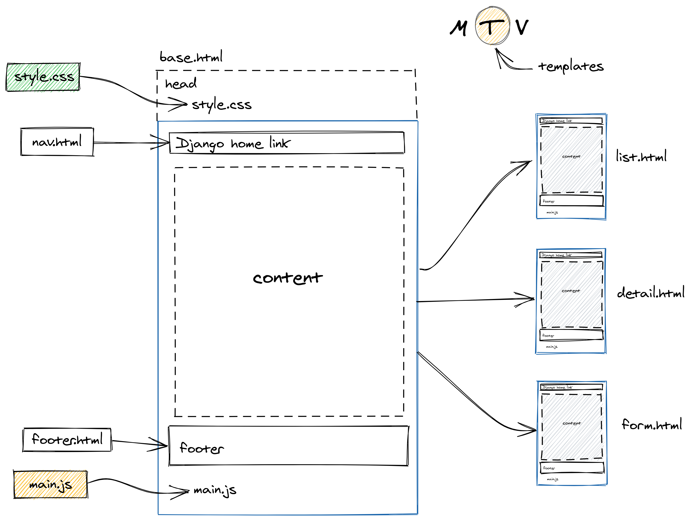

# Dica 14 - Herança de Templates e Arquivos estáticos

**Versões usadas no vídeo:** Django 2.2.13, Python 3.8 e Bootstrap 4.0.
{: .versoes }

<a href="https://youtu.be/wSfuzUVnuzw">
    
</a>

Quando falamos do Django, falamos de **MTV**: Model, Template e View. Nesta dica vamos tratar do **T**, os templates, e de duas ideias que todo projeto usa desde o primeiro dia:

* **Herança de templates**: uma página principal, o `base.html`, define a estrutura comum (cabeçalho com o CSS, menu, conteúdo, rodapé e o JavaScript no final), e as outras páginas herdam dela, trocando só o pedaço que muda, o conteúdo.
* **Arquivos estáticos**: CSS, JavaScript e imagens que o template carrega com a tag ``.

Para entender a arquitetura do Django como um todo (request, response, url, view, model, template), veja também a palestra:

[Video Introdução a Arquitetura do Django - Pyjamas 2019](https://www.youtube.com/watch?v=XjXpwZhOKOs)

<a href="https://www.youtube.com/watch?v=XjXpwZhOKOs">
    
</a>

## A ideia

O diagrama abaixo resume o que vamos montar:



* O `base.html` tem um `head`, onde carregamos o `style.css`.
* O `nav.html` é o menu (navbar) do site, incluído no topo do `base.html`.
* O `content` é o conteúdo principal, e é ele que será substituído em cada página (`list.html`, `detail.html`, `form.html`).
* O `footer.html` é o rodapé, também incluído no `base.html`.
* No finalzinho carregamos o `main.js`. É boa prática carregar o JavaScript no final da página.

## Pré-requisitos

Um projeto Django com um app. No vídeo é o projeto do repositório [dicas-de-django](https://github.com/rg3915/dicas-de-django), com esta estrutura (o app `core` fica dentro da pasta `myproject`):

```
.
├── manage.py
├── requirements.txt
└── myproject
    ├── core
    │   ├── admin.py
    │   ├── apps.py
    │   ├── __init__.py
    │   ├── migrations
    │   ├── models.py
    │   ├── tests.py
    │   ├── urls.py
    │   └── views.py
    ├── __init__.py
    ├── settings.py
    ├── urls.py
    └── wsgi.py
```

Com o app registrado no `settings.py`:

```python
# myproject/settings.py
INSTALLED_APPS = [
    'django.contrib.admin',
    'django.contrib.auth',
    'django.contrib.contenttypes',
    'django.contrib.sessions',
    'django.contrib.messages',
    'django.contrib.staticfiles',
    ...
    'myproject.core'
]

...

TEMPLATES = [
    {
        'BACKEND': 'django.template.backends.django.DjangoTemplates',
        'DIRS': [],
        'APP_DIRS': True,
        ...
    },
]

...

STATIC_URL = '/static/'
STATIC_ROOT = os.path.join(BASE_DIR, 'staticfiles')
```

Repare em duas configurações que já vêm assim no projeto padrão e são elas que fazem tudo funcionar sem mexer em mais nada:

* `'APP_DIRS': True`: o Django procura templates na pasta `templates` de cada app instalado.
* `'django.contrib.staticfiles'` em `INSTALLED_APPS` e `STATIC_URL = '/static/'`: o Django procura arquivos estáticos na pasta `static` de cada app, e o `runserver` serve esses arquivos em `/static/` durante o desenvolvimento (`DEBUG = True`).

As rotas do projeto apontam para as rotas do app:

```python
# myproject/urls.py
from django.urls import include, path
from django.contrib import admin


urlpatterns = [
    path('', include('myproject.core.urls', namespace='core')),
    path('admin/', admin.site.urls),
]
```

E o app já tem uma página inicial:

```python
# myproject/core/urls.py
from django.urls import path
from myproject.core import views as v


app_name = 'core'


urlpatterns = [
    path('', v.index, name='index'),
]
```

```python
# myproject/core/views.py
from django.shortcuts import render


def index(request):
    template_name = 'index.html'
    return render(request, template_name)
```

## Criando os templates

Entre na pasta do app e crie a pasta `templates` com os quatro arquivos de uma vez. A dica de shell aqui é usar as chaves (sem espaço entre os nomes): o bash expande `{base,index,nav,footer}.html` em quatro nomes de arquivo.

```bash
cd myproject/core
mkdir templates
touch templates/{base,index,nav,footer}.html
tree templates/
```

```
templates/
├── base.html
├── footer.html
├── index.html
└── nav.html

0 directories, 4 files
```

## O base.html

Comece pelo esqueleto do HTML (no vídeo foi usado o atalho `!` do Emmet no Sublime Text). O título é "Dicas de Django", e acrescentamos o `viewport` e o ícone do Django:

```html
<!-- myproject/core/templates/base.html -->
<!DOCTYPE html>
<html lang="en">
<head>
  <meta charset="UTF-8">
  <meta name="viewport" content="width=device-width, initial-scale=1.0">
  <link rel="shortcut icon" href="https://www.djangoproject.com/favicon.ico">
  <title>Dicas de Django</title>
</head>
<body>
  <div class="jumbotron">
    <h1>Dicas de Django</h1>
  </div>

  
</body>
</html>
```

O `` é um **bloco**: um espaço vazio que as páginas filhas podem preencher.

## Herdando o base.html no index.html

No `index.html` não escrevemos mais o HTML inteiro. Basta dizer que ele estende o `base.html` e preencher o bloco:

```html
<!-- myproject/core/templates/index.html -->



  <h1>Conteúdo</h1>

```

Rode o servidor (com a virtualenv ativada; no vídeo a primeira tentativa deu `ModuleNotFoundError: No module named 'django'` justamente porque ela não estava ativa):

```bash
source .venv/bin/activate
python manage.py runserver
```

Em `http://localhost:8000` aparece "Dicas de Django", que vem do `base.html`, e "Conteúdo", que vem do bloco `content` do `index.html`. Ou seja, o `index.html` herda tudo o que está no `base.html` e só troca o que está dentro do bloco. Se o `index.html` não definir o bloco, a página continua funcionando, só fica sem o conteúdo.

## Bootstrap e Font Awesome

Para dar uma cara melhor à página, copie do [gist do base.html](https://gist.github.com/rg3915/0144a2408ec54c4e8008999631c64a30) os links do Bootstrap 4.0 e do Font Awesome 4.7 e cole no `head`. Coloque também o conteúdo dentro de uma `div` com a classe `container`, para que o jumbotron não ocupe a largura toda da tela:

```html
<!-- myproject/core/templates/base.html -->
<!DOCTYPE html>
<html lang="en">

<head>
  <meta charset="UTF-8">
  <meta name="viewport" content="width=device-width, initial-scale=1.0">
  <link rel="shortcut icon" href="https://www.djangoproject.com/favicon.ico">
  <!-- Bootstrap core CSS -->
  <link rel="stylesheet" href="https://maxcdn.bootstrapcdn.com/bootstrap/4.0.0/css/bootstrap.min.css">
  <!-- Font-awesome -->
  <link rel="stylesheet" href="https://maxcdn.bootstrapcdn.com/font-awesome/4.7.0/css/font-awesome.min.css">
  <title>Dicas de Django</title>
</head>

<body>
  <div class="container">
    <div class="jumbotron">
      <h1>Dicas de Django</h1>
    </div>
    
  </div>
</body>

</html>
```

## O menu com include

Agora o menu. Copie a navbar do gist (ela vem do [starter template do Bootstrap 4.0](https://getbootstrap.com/docs/4.0/examples/starter-template/)) para o `nav.html`:

```html
<!-- myproject/core/templates/nav.html -->
<!-- https://getbootstrap.com/docs/4.0/examples/starter-template/ -->
<!-- https://github.com/JTruax/bootstrap-starter-template/blob/master/template/start.html -->

<nav class="navbar navbar-expand-md navbar-dark bg-dark fixed-top">
    <a class="navbar-brand" href="#">Navbar</a>
    <button class="navbar-toggler" type="button" data-toggle="collapse" data-target="#navbarsExampleDefault" aria-controls="navbarsExampleDefault" aria-expanded="false" aria-label="Toggle navigation">
        <span class="navbar-toggler-icon"></span>
    </button>

    <div class="collapse navbar-collapse" id="navbarsExampleDefault">
        <ul class="navbar-nav mr-auto">
            <li class="nav-item active">
                <a class="nav-link" href="#">Home <span class="sr-only">(current)</span></a>
            </li>
            <li class="nav-item">
                <a class="nav-link" href="#">Link</a>
            </li>
            <li class="nav-item">
                <a class="nav-link disabled" href="#">Disabled</a>
            </li>
            <li class="nav-item dropdown">
                <a class="nav-link dropdown-toggle" href="#" id="dropdown01" data-toggle="dropdown" aria-haspopup="true" aria-expanded="false">Dropdown</a>
                <div class="dropdown-menu" aria-labelledby="dropdown01">
                    <a class="dropdown-item" href="#">Action</a>
                    <a class="dropdown-item" href="#">Another action</a>
                    <a class="dropdown-item" href="#">Something else here</a>
                </div>
            </li>
        </ul>
        <form class="form-inline my-2 my-lg-0">
            <input class="form-control mr-sm-2" type="text" placeholder="Search" aria-label="Search">
            <button class="btn btn-secondary my-2 my-sm-0" type="submit">Search</button>
        </form>
    </div>
</nav>
```

Ele ainda não aparece, porque está em outro arquivo. Para colocá-lo no `base.html` usamos a tag ``:

```html

```

Diferente do `extends`, o `include` simplesmente insere o conteúdo de outro template naquele ponto.

Como a navbar é `fixed-top` (fica fixa no topo, por cima da página), o conteúdo fica escondido atrás dela. Para resolver, acrescente no `head` um estilo que empurra o `body` 60 pixels para baixo, o que vale para todas as páginas:

```html
  <style>
    body {
      margin-top: 60px;
    }
  </style>
```

## O rodapé

O rodapé aqui é só um exemplo, um parágrafo:

```html
<!-- myproject/core/templates/footer.html -->
<p>Dicas de Django</p>
```

E ele entra no final do `base.html`, também com `include`:

```html

```

Fixar o rodapé na parte inferior da página é outro assunto; aqui o objetivo é só mostrar a estrutura.

## Arquivos estáticos

Os arquivos estáticos ficam na pasta `static` do app. Ainda dentro de `myproject/core`, crie as pastas `css`, `img` e `js` de uma vez (o `-p` cria a pasta `static` e as subpastas) e os arquivos `style.css` e `main.js`:

```bash
mkdir -p static/{css,img,js}
touch static/css/style.css
touch static/js/main.js
tree static/
```

```
static/
├── css
│   └── style.css
├── img
└── js
    └── main.js

3 directories, 2 files
```

Para usar esses arquivos no template:

1. Carregue a biblioteca de tags com `` na **primeira linha** do `base.html`.
2. Use ``, com o caminho relativo à pasta `static`, para gerar a URL do arquivo.

```html

...
  <link rel="stylesheet" href="">
...
<script src=""></script>
```

O `` vira `/static/css/style.css` no HTML final.

Para ver se o CSS foi carregado mesmo, coloque uma regra bem visível no `style.css`, deixando todos os parágrafos em vermelho:

```css
/* myproject/core/static/css/style.css */
p {
  color: red;
}
```

O `main.js` pode ficar vazio por enquanto.

Rode de novo o `python manage.py runserver` e recarregue a página: o rodapé fica vermelho. Para conferir, clique com o botão direito em **Inspecionar** > aba **Network** e recarregue a página: na lista aparecem o `style.css` e o `main.js` carregados (status 200 ou 304). Clicando no `style.css` você vê o conteúdo dele.

## O base.html completo

Com tudo junto, o `base.html` fica assim:

```html
<!-- myproject/core/templates/base.html -->

<!DOCTYPE html>
<html lang="en">

<head>
  <meta charset="UTF-8">
  <meta name="viewport" content="width=device-width, initial-scale=1.0">
  <link rel="shortcut icon" href="https://www.djangoproject.com/favicon.ico">
  <!-- Bootstrap core CSS -->
  <link rel="stylesheet" href="https://maxcdn.bootstrapcdn.com/bootstrap/4.0.0/css/bootstrap.min.css">
  <!-- Font-awesome -->
  <link rel="stylesheet" href="https://maxcdn.bootstrapcdn.com/font-awesome/4.7.0/css/font-awesome.min.css">
  <title>Dicas de Django</title>

  <link rel="stylesheet" href="">

  <style>
    body {
      margin-top: 60px;
    }
  </style>
</head>

<body>
  <div class="container">

    

    
  </div>

  

<script src=""></script>

</body>

</html>
```

Repare que o jumbotron saiu do `base.html`. Ele só faz sentido na página inicial, então foi para o `index.html` (veja na próxima seção). Assim, o `base.html` fica só com o que é comum a todas as páginas: o `head` com o CSS, o menu, o bloco de conteúdo, o rodapé e o JavaScript.

## Criando novas páginas

Agora qualquer página nova só precisa estender o `base.html`. É comum organizar os templates de cada app numa subpasta com o mesmo nome do app, então dentro de `templates` crie a pasta `core` e os templates de uma lista, um detalhe e um formulário de pessoas:

```bash
cd templates
mkdir core
cd core
touch person_{list,detail,form}.html
```

A estrutura do app fica assim:

```
myproject/core
├── static
│   ├── css
│   │   └── style.css
│   ├── img
│   └── js
│       └── main.js
├── templates
│   ├── base.html
│   ├── core
│   │   ├── person_detail.html
│   │   ├── person_form.html
│   │   └── person_list.html
│   ├── footer.html
│   ├── index.html
│   └── nav.html
├── tests.py
├── urls.py
└── views.py
```

Vamos usar só a lista. Ela estende o `base.html` e preenche o bloco `content`:

```html
<!-- myproject/core/templates/core/person_list.html -->



  <h1>Lista de pessoas</h1>

```

O `index.html` final, agora com o jumbotron:

```html
<!-- myproject/core/templates/index.html -->




    <div class="jumbotron">
      <h1>Dicas de Django</h1>
    </div>

  <h1>Conteúdo</h1>

```

Para a página ser renderizada, ela precisa de uma view e de uma rota. A view é uma cópia da `index`:

```python
# myproject/core/views.py
from django.shortcuts import render


def index(request):
    template_name = 'index.html'
    return render(request, template_name)


def person_list(request):
    template_name = 'core/person_list.html'
    return render(request, template_name)
```

```python
# myproject/core/urls.py
from django.urls import path
from myproject.core import views as v


app_name = 'core'


urlpatterns = [
    path('', v.index, name='index'),
    path('persons/', v.person_list, name='person_list'),
]
```

Atenção ao `template_name`: o caminho é relativo à pasta `templates`. No vídeo, a view foi escrita primeiro com `template_name = 'person_list.html'`, e acessar `http://localhost:8000/persons/` deu erro:

```
TemplateDoesNotExist at /persons/
person_list.html
```

Como o arquivo está na subpasta `core`, o certo é `'core/person_list.html'`. Corrigido isso, a página mostra o menu, o título "Lista de pessoas" e o rodapé, tudo herdado do `base.html`, sem repetir uma linha de HTML.

## Arquivos estáticos não têm nada a ver com o Django

A figura abaixo, da palestra do Pyjamas 2019, mostra a estrutura de um projeto Django e como as partes se comunicam:


O caminho básico de uma requisição é: o navegador faz uma requisição (request) para uma URL; o `urls.py` chama uma função no `views.py`; a view, se precisar, consulta o `models.py`, que por sua vez consulta o banco de dados (PostgreSQL, MySQL, SQLite...) através do ORM do Django; e por fim a view renderiza um template, como o `index.html`, que volta para o navegador como resposta (response). Esse é o **MTV**: o **M** é o `models.py`, o **T** são os templates e o **V** é o `views.py`, que funciona como o controlador da aplicação.

Os arquivos da pasta `static` ficam fora desse fluxo: o Django só os entrega para o template usar. Por isso você pode usar o que quiser ali:

* CSS: CSS puro, Bootstrap, Material Design, Bulma, Skeleton...
* JavaScript: JavaScript puro (vanilla JS), jQuery, Angular, React, Vue.js...

Todos eles são arquivos estáticos, independentes do Django.

## Testando

O código desta página (os arquivos do commit `1c8d196` do repositório [dicas-de-django](https://github.com/rg3915/dicas-de-django), gravado junto com o vídeo) foi rodado com Django 2.2 e Python 3.8: `/` renderiza `index.html`, `base.html`, `nav.html` e `footer.html`; `/persons/` renderiza `core/person_list.html` com os mesmos três templates herdados/incluídos; e `python manage.py findstatic css/style.css js/main.js` encontra os dois arquivos em `myproject/core/static/`.

Observação: a partir do Django 3.1 o `settings.py` gerado usa `pathlib` (`BASE_DIR / 'staticfiles'`) em vez de `os.path.join`, mas a herança de templates e a tag `` funcionam do mesmo jeito.
