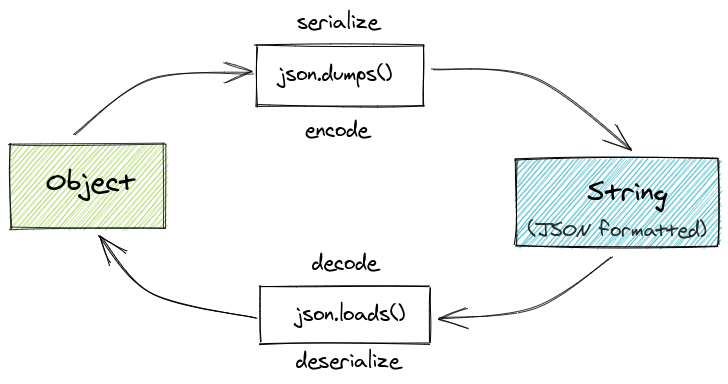

# Dica 23 - Diferença entre JSON dump, dumps, load e loads

**Versões usadas no vídeo:** Django 2.2.13 e Python 3.8.
{: .versoes }

<a href="https://youtu.be/4AupIlLYkgE">
    
</a>


**Documentação:** [JSON](https://docs.python.org/3/library/json.html)

O módulo `json` da biblioteca padrão do Python tem quatro funções que confundem bastante: `dump`, `dumps`, `load` e `loads`. Nesta dica vamos ver a diferença entre elas, com exemplos que você pode rodar, e depois usar o que aprendemos numa view do Django que devolve JSON com o `JsonResponse`, que é o assunto principal do vídeo.

Os dois conceitos que importam:

* **Serializar** (*encode*): transformar um objeto Python (um dicionário, uma lista...) em texto no formato JSON. É o que fazem o `dumps` e o `dump`.
* **Deserializar** (*decode*): o caminho inverso, transformar texto JSON em objeto Python. É o que fazem o `loads` e o `load`.

E a regra para lembrar: o **`s` no final** (`dumps`, `loads`) significa **string**. Sem o `s` (`dump`, `load`), a função trabalha com um **arquivo** (ou qualquer objeto parecido com arquivo).



--


## [dumps](https://docs.python.org/3/library/json.html#json.dumps)

Serializa um objeto Python para uma string no formato JSON.

`json.dumps(obj)`

```python
import json

my_dict = {
    "name": "Elliot",
    "age": 25
}
json.dumps(my_dict)
```

O resultado é uma `str`: `'{"name": "Elliot", "age": 25}'`. Com `indent=4` a string sai formatada, com quebras de linha e recuo.


## [dump](https://docs.python.org/3/library/json.html#json.dump)

Serializa um objeto Python para um arquivo no formato JSON.

`json.dump(obj, fp)`

onde *fp* significa *file-like object*.

```python
import json

my_dict = {
    "name": "Elliot",
    "age": 25
}
with open('/tmp/file.txt', 'w') as f:
    json.dump(my_dict, f)
```

Aqui nada é devolvido: o JSON é escrito direto no arquivo `/tmp/file.txt`.


## [loads](https://docs.python.org/3/library/json.html#json.loads)

Deserializa uma string no formato JSON para um objeto Python.

`json.loads(s)`

```python
import json

text = """
{
    "name": "Darlene",
    "age": 27
}
"""
json.loads(text)
```

O resultado é um `dict`: `{'name': 'Darlene', 'age': 27}`.

## [load](https://docs.python.org/3/library/json.html#json.load)

Deserializa um arquivo no formato JSON para um objeto Python.

`json.load(fp)`

```python
import json

with open('/tmp/file.txt', 'r') as f:
    data = json.load(f)

print(data)
```

Lê o arquivo gravado no exemplo do `dump` e devolve o dicionário `{'name': 'Elliot', 'age': 25}`.

## Tabela de conversão

Na serialização, os tipos do Python viram tipos do JSON, e na deserialização o caminho é o inverso:

| Python | JSON |
| --- | --- |
| `dict` | objeto (`{...}`) |
| `list`, `tuple` | array (`[...]`) |
| `str` | string |
| `int`, `float` | number |
| `True` / `False` | `true` / `false` |
| `None` | `null` |

Repare que uma tupla vira array, e na volta o array vira `list` (não volta a ser tupla).


## Exemplo completo

O arquivo abaixo junta todas as formas: `dumps`, `dump` em memória com `StringIO` (um objeto que se comporta como arquivo, mas fica na memória), `dump` num arquivo de verdade, e os equivalentes `loads` e `load`.


```python
# json_example.py
import json
from io import StringIO
from pprint import pprint


def json_to_string_with_dumps(my_dict):
    '''
    Serializa (encode) objeto para string no formato JSON.
    '''
    return json.dumps(my_dict, indent=4)


def json_to_string_with_dump_stringio(my_dict):
    '''
    Serializa (encode) objeto para string no formato JSON usando StringIO.
    '''
    io = StringIO()
    json.dump(my_dict, io, indent=4)
    return io.getvalue()


def json_to_file_with_dump_open_file(filename, my_dict):
    '''
    Serializa (encode) objeto para arquivo no formato JSON usando open.
    '''
    with open(filename, 'w') as f:
        json.dump(my_dict, f, indent=4)


def string_to_json_with_loads(text):
    '''
    Deserializa (decode) string no formato JSON para objeto.
    '''
    return json.loads(text)


def string_to_json_with_load_stringio(text):
    '''
    Deserializa (decode) string no formato JSON para objeto usando StringIO.
    '''
    io = StringIO(text)
    return json.load(io)


def file_to_json_with_load_open_file(filename):
    '''
    Deserializa (decode) string no formato JSON para arquivo usando open.
    '''
    with open(filename, 'r') as f:
        data = json.load(f)
    return data


if __name__ == '__main__':
    # ... (veja o arquivo completo no GitHub)
```

Código completo: [json_example.py](https://github.com/rg3915/dicas-de-django/blob/07630cc876c41c7d16d7c8a898db9f0977650bfe/json_example.py)

Rodando com `python json_example.py`:

```
{
    "name": "Elliot",
    "age": 25
}
<class 'str'>
{
    "name": "Elliot",
    "full_name": {
        "first_name": "Elliot",
        "last_name": "Alderson"
    },
    "items": [
        1,
        2.5,
        "a"
    ],
    "pi": 3.14,
    "active": true,
    "nulo": null
}
<class 'str'>
{'age': 27, 'name': 'Darlene'}
<class 'dict'>
{'age': 27, 'name': 'Darlene'}
<class 'dict'>
{'active': True,
 'full_name': {'first_name': 'Elliot', 'last_name': 'Alderson'},
 'items': [1, 2.5, 'a'],
 'name': 'Elliot',
 'nulo': None,
 'pi': 3.14}
```

Repare como `True` e `None` do Python viraram `true` e `null` no JSON, e voltaram a ser `True` e `None` na leitura. O `pprint` mostra as chaves do dicionário em ordem alfabética.


## JsonResponse no Django

[JsonResponse](https://docs.djangoproject.com/en/2.2/ref/request-response/#jsonresponse-objects) [[source](https://docs.djangoproject.com/en/2.2/_modules/django/http/response/#JsonResponse)]

O `JsonResponse` é uma subclasse de `HttpResponse` que devolve uma resposta em JSON. Pela documentação:

* o cabeçalho `Content-Type` padrão é `application/json`;
* o primeiro parâmetro, `data`, deve ser um `dict`. Para mandar outro tipo (uma lista, por exemplo), passe `safe=False`; com `safe=True` (o padrão) e um objeto que não é `dict`, ele levanta `TypeError`;
* o `encoder` padrão é o `django.core.serializers.json.DjangoJSONEncoder`, que também sabe serializar datas, `Decimal` e `UUID`.

E olhando o código-fonte (link *source* acima), o que ele faz por dentro é justamente um `json.dumps`:

```python
data = json.dumps(data, cls=encoder, **json_dumps_params)
super().__init__(content=data, **kwargs)
```

Ou seja: nós entregamos um dicionário Python e o `JsonResponse` serializa com `dumps` e devolve a string JSON como conteúdo da resposta.

### A view

O exemplo usa o projeto do repositório [rg3915/dicas-de-django](https://github.com/rg3915/dicas-de-django), com o app `core` dentro de `myproject`. Vamos fingir que o texto abaixo chegou numa requisição: o que vem pela rede chega sempre como **texto**, então primeiro precisamos transformá-lo em dicionário com `json.loads`.

```python
# core/views.py
import json
from pprint import pprint

from django.http import JsonResponse


def article_json(request):
    text = '''
    {
        "title": "JSON",
        "subtitle": "Entendento JSON dumps e loads",
        "slug": "entendento-json-dumps-e-loads",
        "value": "42"
    }
    '''
    data = json.loads(text)
    pprint(data)
    print(type(data))
    print(data['value'], 'is', type(data['value']))

    data['title'] = 'Introdução ao JSON'
    data['value'] = int(data['value']) + 1
    data['pi'] = 3.14
    data['active'] = True
    data['nulo'] = None
    return JsonResponse(data)
```

```python
# core/urls.py
...
path('articles/json/', v.article_json, name='article_json'),
...
```

No `core/urls.py` do projeto, as views são importadas como `from myproject.core import views as v`.

### Passo a passo

**1. `json.loads(text)`** transforma o texto em `dict`. Os `print` mostram isso no terminal do `runserver` ao acessar `http://localhost:8000/articles/json/`:

```
{'slug': 'entendento-json-dumps-e-loads',
 'subtitle': 'Entendento JSON dumps e loads',
 'title': 'JSON',
 'value': '42'}
<class 'dict'>
42 is <class 'str'>
```

No vídeo, nesse primeiro teste a view ainda não tinha o `return`, e o navegador mostrou o erro `ValueError: The view myproject.core.views.article_json didn't return an HttpResponse object. It returned None instead.` Toda view precisa devolver uma resposta.

**2. `value` é string**: no texto JSON o valor está entre aspas (`"42"`), então depois do `loads` ele continua sendo `str`. Para somar 1, convertemos com `int(data['value']) + 1`.

**3. Alterando e acrescentando dados**: trocamos o título e acrescentamos `pi` (`float`), `active` (`True`) e `nulo` (`None`).

**4. `return JsonResponse(data)`** serializa o dicionário e devolve:

```
{"title": "Introdu\u00e7\u00e3o ao JSON", "subtitle": "Entendento JSON dumps e loads", "slug": "entendento-json-dumps-e-loads", "value": 43, "pi": 3.14, "active": true, "nulo": null}
```

Repare no resultado: o título mudou, `value` agora é o número `43` (sem aspas), `True` virou `true` e `None` virou `null`. Os acentos aparecem como `ç` porque o `json.dumps` usa `ensure_ascii=True` por padrão; o navegador e qualquer cliente JSON interpretam isso como "ç". Se quiser os acentos literais na resposta, use `JsonResponse(data, json_dumps_params={'ensure_ascii': False})`.

No vídeo o navegador mostra o JSON formatado e colorido porque está com a extensão **JSONView** do Chrome; desativando a extensão, aparece o texto puro, numa linha só.

## Conclusão

Resumindo: `dumps` e `loads` trabalham com **strings**, `dump` e `load` trabalham com **arquivos**; os `dump` serializam (Python para JSON) e os `load` deserializam (JSON para Python). No Django, o `JsonResponse` faz o `dumps` por você: basta montar um dicionário e devolvê-lo na view. Se memorizar as duas imagens do começo da página, você não esquece mais a diferença.

Leia mais em [Working With JSON Data in Python](https://realpython.com/python-json/).
