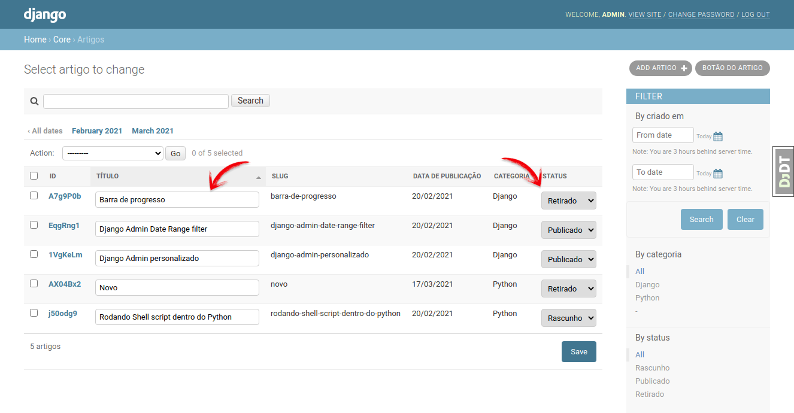

# Dica 30 - Django Admin: Editando direto na listview do Admin

**Versões usadas no vídeo:** Django 2.2.19 e Python 3.8.
{: .versoes }

<a href="https://youtu.be/3skHZrRR1PE">
    
</a>

Código: [https://github.com/rg3915/dicas-de-django](https://github.com/rg3915/dicas-de-django)

Por padrão, a lista de registros do Django Admin (a *changelist*) só mostra os dados: para mudar um título ou um status você precisa abrir cada registro, alterar e salvar. Com o atributo `list_editable` do `ModelAdmin`, alguns campos da lista viram campos de formulário e você edita vários registros de uma vez, direto na lista, com um único botão **Save**.



## Pré-requisitos

Continuamos o projeto das dicas anteriores do Admin ([Dica 28](028-admin-usando-short-description.md) e [Dica 29](029-django-admin-criando-actions-no-admin.md)): um app `core` dentro de `myproject`, com os modelos `Article` e `Category`.

O `models.py`, como estava no vídeo:

```python
# myproject/core/models.py
# ... (veja o arquivo completo no GitHub)

STATUS_CHOICES = (
    ('d', 'Rascunho'),
    ('p', 'Publicado'),
    ('w', 'Retirado'),
)


class Article(models.Model):
    id = HashidAutoField(primary_key=True)
    title = models.CharField('título', max_length=200)
    subtitle = models.CharField('sub-título', max_length=200)
    slug = AutoSlugField(populate_from='title')
    # ... (category e published_date, veja o arquivo completo no GitHub)
    status = models.CharField(max_length=1, choices=STATUS_CHOICES)

    class Meta:
        ordering = ('title',)
        verbose_name = 'artigo'
        verbose_name_plural = 'artigos'

    def __str__(self):
        return self.title

# ... (veja o arquivo completo no GitHub)
```

Código completo: [myproject/core/models.py](https://github.com/rg3915/dicas-de-django/blob/8c9763e178dbe8bf5f7d6ade8125bb1b335b999d/myproject/core/models.py)

`AutoSlugField` vem do pacote `django-autoslug` e `HashidAutoField` do `django-hashid-field`, usados nas dicas anteriores. Para esta dica, o que importa são os campos `title` e `status`.

## Acrescentando o `list_editable`

Em `admin.py`, dentro do `ArticleAdmin`, basta uma linha:

```python
list_editable = ('title', 'status')
```

O `admin.py` completo fica assim:

```python
# myproject/core/admin.py
from django.conf import settings
from django.contrib import admin
from daterange_filter.filter import DateRangeFilter
from .models import Article, Category
# from .forms import ArticleAdminForm


@admin.register(Article)
class ArticleAdmin(admin.ModelAdmin):
    list_display = ('id', 'title', 'slug', 'get_published_date', 'get_category', 'status')
    search_fields = ('title',)
    list_filter = (
        ('published_date', DateRangeFilter),
        'category',
        'status',
    )
    readonly_fields = ('slug',)
    date_hierarchy = 'published_date'
    # form = ArticleAdminForm
    list_editable = ('title', 'status')
    actions = ('make_published',)

    def make_published(self, request, queryset):
        count = queryset.update(status='p')

        if count == 1:
            msg = '{} artigo foi publicado.'
        else:
            msg = '{} artigos foram publicados.'

        self.message_user(request, msg.format(count))

    make_published.short_description = "Publicar artigos"

    def get_published_date(self, obj):
        if obj.published_date:
            return obj.published_date.strftime('%d/%m/%Y')

    get_published_date.short_description = 'Data de Publicação'

    def get_category(self, obj):
        if obj.category:
            return obj.category.title

    get_category.short_description = 'Categoria'


@admin.register(Category)
class CategoryAdmin(admin.ModelAdmin):
    list_display = ('title', 'slug')
    actions = None

    def has_add_permission(self, request, obj=None):
        return False

    if not settings.DEBUG:
        def has_delete_permission(self, request, obj=None):
            return False
```

O `DateRangeFilter` vem do `django-daterange-filter` (filtro por intervalo de datas); a action `make_published` e os métodos `get_published_date` e `get_category` são das dicas 28 e 29.

## As regras do `list_editable`

O Django valida o `list_editable` quando o projeto sobe (no `check`). Repare em duas coisas:

* **Todo campo de `list_editable` precisa estar em `list_display`.** `title` e `status` estão.
* **O campo que é o link para o registro não pode ser editável.** Por padrão, o link fica na primeira coluna do `list_display`. Por isso a primeira coluna aqui é o `id`, e não o `title`: se `title` fosse a primeira coluna (ou estivesse em `list_display_links`), o Django daria erro ao iniciar.

## Testando

Rode o servidor e abra a lista de artigos:

```bash
python manage.py runserver
```

Em `http://localhost:8000/admin/core/article/`, a coluna **Título** agora é uma caixa de texto e a coluna **Status** é uma caixa de seleção (Rascunho, Publicado, Retirado). No vídeo, o título "Barra de progresso" foi mudado para "Barra de progresso 2" e o status para "Retirado", direto na lista.

Depois de alterar, clique no botão **Save**, no rodapé da lista: o Django salva todas as linhas alteradas de uma vez. Abrindo o artigo pelo link do `id`, a tela de edição mostra os valores novos.

## Conclusão

Com uma linha (`list_editable`), a lista do Admin vira uma planilha simples, ótima para ajustes rápidos em vários registros, como mudar o status de vários artigos. Só lembre que os campos precisam estar no `list_display` e que o campo do link não pode ser editável.
