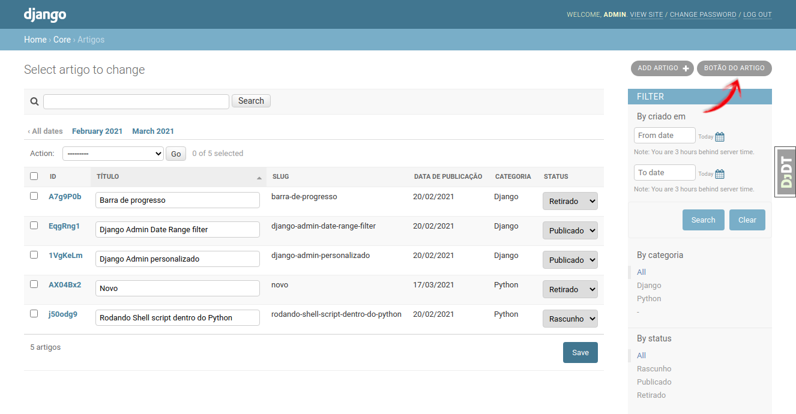
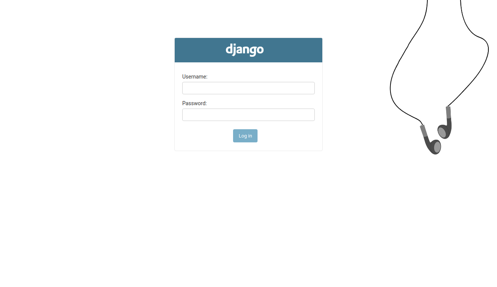
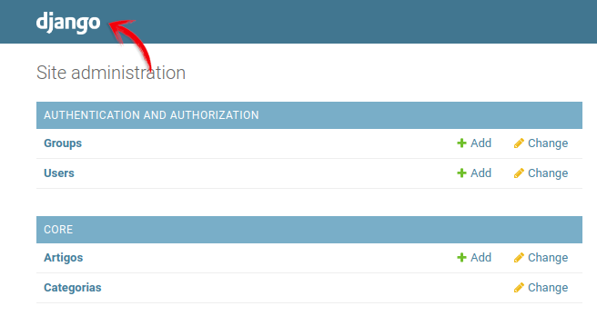

# Dica 32 - Django Admin: Sobreescrevendo os templates do Admin

**Versões usadas no vídeo:** Django 2.2.19 e Python 3.8.
{: .versoes }

<a href="https://youtu.be/0d9VcL8ssTg">
    
</a>

**Importante:** nas versões antigas desta página as tags de template apareciam com uma `\` no meio (`{\%`). Se copiar código de lá, remova a `\`.


Código: [https://github.com/rg3915/dicas-de-django](https://github.com/rg3915/dicas-de-django)

Esta dica foi gravada em três vídeos, todos sobre o mesmo assunto: **sobrescrever os templates do Django Admin**, mudando só o pedaço que nos interessa e mantendo o resto do Admin funcionando.

1. **Parte 1** (vídeo acima): colocar botões novos na lista de registros do Admin (a *changelist*), um para todos os modelos do app e outro só para o modelo `Article`, cada um chamando uma view própria.
2. **Parte 2**: personalizar a tela de login, com um logo e uma imagem de fundo.
3. **Parte 3**: colocar o logo no cabeçalho de todas as páginas do Admin.



## Pré-requisitos

Continuamos o projeto das dicas anteriores do Admin ([Dica 29](029-django-admin-criando-actions-no-admin.md) a [Dica 31](031-django-admin-pegando-usuario-logado-no-admin.md)): um projeto com o app `core` dentro da pasta `myproject` (`myproject/core`), com os modelos `Article` e `Category`. O `settings.py` fica em `myproject/settings.py` e o `BASE_DIR` é a pasta raiz do projeto, onde está o `manage.py`.

## Onde estão os templates do Admin

Todos os templates usados pelo Admin estão no código do Django, em `django/contrib/admin/templates/admin`. Você pode vê-los no GitHub:

[https://github.com/django/django/tree/main/django/contrib/admin/templates/admin](https://github.com/django/django/tree/main/django/contrib/admin/templates/admin)

Ou na pasta da virtualenv do seu projeto, que tem exatamente a versão do Django que você está usando:

```bash
ls -l .venv/lib/python3.8/site-packages/django/contrib/admin/templates/admin/
cat .venv/lib/python3.8/site-packages/django/contrib/admin/templates/admin/change_list.html
```

A lista de registros é o `change_list.html`. Os botões do canto superior direito (o **Add artigo**, por exemplo) ficam num bloco chamado `object-tools-items`. Este é o trecho do `change_list.html` original do Django 2.2:

```html

    <ul class="object-tools">
      
        
      
    </ul>

```

A ideia é **não copiar o template inteiro**: criamos um template nosso que estende o original (``) e sobrescreve só o bloco `object-tools-items`. Tome cuidado ao mexer nesses blocos: se você sobrescrever o bloco errado ou esquecer o `{{ block.super }}`, partes do Admin somem ou a página deixa de renderizar.

## A estrutura de pastas

Na documentação do Django, em [Set up your projects admin template directories](https://docs.djangoproject.com/en/3.1/ref/contrib/admin/#set-up-your-projects-admin-template-directories), vemos que o Admin procura os templates numa pasta `admin`, e que dentro dela podemos ter uma pasta com o nome do app e, dentro dessa, uma pasta com o nome do modelo. No nosso projeto, a estrutura final (das três partes) será:

```
myproject
├── core
│   ├── templates
│   │   ├── admin
│   │   │   ├── base_site.html
│   │   │   ├── login.html
│   │   │   ├── core
│   │   │   │   ├── article
│   │   │   │   │   └── change_list.html
│   │   │   │   └── change_list.html
```

Para montar a lista de um modelo, o Admin procura o `change_list.html` nesta ordem e usa o primeiro que encontrar:

1. `admin/core/article/change_list.html`: só para o modelo `Article` do app `core`;
2. `admin/core/change_list.html`: para todos os modelos do app `core`;
3. `admin/change_list.html`: o padrão, para todo o Admin.

Crie as pastas (o `-p` cria as subpastas de uma vez):

```bash
mkdir -p myproject/core/templates/admin/core/article
```

## Um botão para todos os modelos do app

Crie o primeiro `change_list.html`, o do app `core`:

```bash
touch myproject/core/templates/admin/core/change_list.html
```

E seu conteúdo será:

```html
<!-- myproject/core/templates/admin/core/change_list.html -->



  {{ block.super }}
  <li>
    <a href="botao-da-app/">
      Novo botão
    </a>
  </li>

```

* ``: herda do template original do Admin.
* `{{ block.super }}`: mantém o conteúdo original do bloco (o botão **Add**). Sem ele, o botão de adicionar sumiria.
* O `<li>` com o link é o nosso botão novo. O link é relativo (`botao-da-app/`): na lista de categorias, que fica em `/admin/core/category/`, ele aponta para `/admin/core/category/botao-da-app/`.

Rode o servidor:

```bash
python manage.py runserver
```

O **Novo botão** aparece tanto na lista de artigos quanto na de categorias, porque o template vale para todos os modelos do app `core`.

## Um botão só para o modelo Article

Agora o `change_list.html` específico do modelo `Article`:

```bash
touch myproject/core/templates/admin/core/article/change_list.html
```

Com o conteúdo:

```html
<!-- myproject/core/templates/admin/core/article/change_list.html -->



  {{ block.super }}
  <li>
    <a href="botao-artigo/">
      Botão do Artigo
    </a>
  </li>

```

Agora a lista de artigos usa este template e mostra o **Botão do Artigo**, enquanto a lista de categorias continua com o **Novo botão** do template do app.

## Configurando o `settings.py`

No `TEMPLATES` do `settings.py`, acrescente o `BASE_DIR` e a pasta `templates` em `DIRS`:

```python
# myproject/settings.py
TEMPLATES = [
    {
        'BACKEND': 'django.template.backends.django.DjangoTemplates',
        'DIRS': [
            BASE_DIR,
            os.path.join(BASE_DIR, 'templates')
        ],
        'APP_DIRS': True,
        'OPTIONS': {
            'context_processors': [
                'django.template.context_processors.debug',
                'django.template.context_processors.request',
                'django.contrib.auth.context_processors.auth',
                'django.contrib.messages.context_processors.messages',
            ],
        },
    },
]
```

Com `APP_DIRS: True`, o Django já encontra a pasta `templates` de cada app (`myproject/core/templates`). O `BASE_DIR` em `DIRS` permite usar caminhos a partir da raiz do projeto, como `myproject/core/templates/admin/login.html`, o que vamos usar na Parte 2.

## As views dos botões no `admin.py`

Os botões apontam para `botao-artigo/` e `botao-da-app/`, mas essas URLs ainda não existem. Cada `ModelAdmin` tem um método `get_urls()`, que devolve as URLs daquele modelo no Admin (lista, adicionar, editar etc.). Vamos sobrescrevê-lo para acrescentar as nossas URLs **antes** das URLs padrão.

```python
# myproject/core/admin.py
from django.shortcuts import redirect
from django.urls import path
from django.conf import settings
from django.contrib import admin, messages
from daterange_filter.filter import DateRangeFilter
from .models import Article, Category
# from .forms import ArticleAdminForm


@admin.register(Article)
class ArticleAdmin(admin.ModelAdmin):
    # ... (veja o arquivo completo no GitHub)

    def get_urls(self):
        urls = super().get_urls()
        my_urls = [
            path(
                'botao-artigo/',
                self.admin_site.admin_view(self.minha_funcao, cacheable=True)
            ),
        ]
        return my_urls + urls

    def minha_funcao(self, request):
        print('Ao clicar no botão, faz alguma coisa...')
        messages.add_message(
            request,
            messages.INFO,
            'Ação realizada com sucesso.'
        )
        return redirect('admin:core_article_changelist')


@admin.register(Category)
class CategoryAdmin(admin.ModelAdmin):
    # ... (veja o arquivo completo no GitHub)

    def get_urls(self):
        urls = super().get_urls()
        my_urls = [
            path(
                'botao-da-app/',
                self.admin_site.admin_view(self.minha_funcao_category, cacheable=True)
            ),
        ]
        return my_urls + urls

    def minha_funcao_category(self, request):
        print('Ao clicar no botão, faz alguma coisa em category...')
        messages.add_message(
            request,
            messages.INFO,
            'Ação realizada com sucesso.'
        )
        return redirect('admin:core_category_changelist')
```

Código completo: [myproject/core/admin.py](https://github.com/rg3915/dicas-de-django/blob/95ba6df7d0bda1289b5d9d1a4ae4424bd0d6f350/myproject/core/admin.py)

O que cada parte faz:

* `get_urls()`: pega as URLs padrão (`super().get_urls()`) e devolve `my_urls + urls`. A ordem importa: as nossas vêm primeiro; se viessem depois, a URL padrão de edição (`<object_id>/...`) poderia capturar `botao-artigo/` antes.
* `self.admin_site.admin_view(...)`: envolve a view com as proteções do Admin. Só usuários logados no Admin (com acesso de staff) conseguem acessá-la; os outros vão para a tela de login. O `cacheable=True` desliga a proteção contra cache que o `admin_view` coloca por padrão.
* `minha_funcao` e `minha_funcao_category`: as views dos botões. Aqui elas só imprimem uma mensagem no terminal e mostram uma mensagem de sucesso com o framework de mensagens do Django (`messages.add_message`). No seu projeto, é aqui que entra a ação de verdade (gerar um relatório, importar dados etc.).
* `redirect('admin:core_article_changelist')`: volta para a lista de artigos. O nome da URL segue o padrão `admin:<app>_<modelo>_changelist`.

Os métodos `save_model`, `make_published`, `get_published_date` e `get_category` são das dicas anteriores.

## Testando os botões

Com o servidor rodando, entre em `http://localhost:8000/admin/core/article/` e clique em **Botão do Artigo**. A página volta para a lista de artigos com a mensagem "Ação realizada com sucesso.", e o terminal do `runserver` mostra:

```
Ao clicar no botão, faz alguma coisa...
"GET /admin/core/article/botao-artigo/ HTTP/1.1" 302 0
"GET /admin/core/article/ HTTP/1.1" 200 22364
```

Na lista de categorias, o **Novo botão** faz o mesmo e imprime `Ao clicar no botão, faz alguma coisa em category...`.

## Sobreescrevendo a tela de login do Admin

<a href="https://youtu.be/ci4LtLxDCRM">
    
</a>

Na segunda parte vamos mudar a tela de login: no lugar do texto "Django administration", um logo, e uma imagem de fundo na página.



Primeiro, veja os templates originais:

```bash
cat .venv/lib/python3.8/site-packages/django/contrib/admin/templates/admin/login.html
cat .venv/lib/python3.8/site-packages/django/contrib/admin/templates/admin/base_site.html
```

O `login.html` estende o `admin/base_site.html` e tem o bloco `extrastyle`, onde ficam os CSS da página:

```html
{{ block.super }}<link rel="stylesheet" type="text/css" href="">
{{ form.media }}

```

E o `base_site.html` tem o bloco `branding`, com o título do cabeçalho:

```html

<h1 id="site-name"><a href="">{{ site_header|default:_('Django administration') }}</a></h1>

```

Vamos sobrescrever esses dois blocos.

### As imagens e o CSS

Coloque as imagens na pasta de arquivos estáticos do app:

```
myproject/core/static
├── css
│   └── login.css
└── img
    ├── django-logo-negative.png
    └── headset.jpg
```

O `django-logo-negative.png` é o logo do Django na versão clara (para fundo escuro), e o `headset.jpg` é a imagem de fundo (no vídeo, um fone de ouvido). Use as imagens que quiser, mantendo os nomes ou ajustando nos templates e no CSS.

### O template `login.html`

```bash
touch myproject/core/templates/admin/login.html
```

```html
<!-- myproject/core/templates/admin/login.html -->




  <h1 id="site-name">
    <a href="">
      
    </a>
  </h1>



  {{ block.super }}
  <link rel="stylesheet" type="text/css" href="" />
  {{ form.media }}

```

* ``: necessário para usar a tag ``.
* Bloco `branding`: troca o texto do cabeçalho pela imagem do logo, com 100 px de largura, mantendo o link para a página inicial do Admin.
* Bloco `extrastyle`: mantém os CSS originais (`{{ block.super }}`) e acrescenta o nosso `css/login.css`.

### O CSS

```css
/* myproject/core/static/css/login.css */
body.login {
    background: url("../img/headset.jpg") no-repeat center center;
    background-size: 100% auto;
}

html {
    min-height: 100%;
}
```

A página de login do Admin tem a classe `login` no `<body>`, então `body.login` afeta só essa página. O caminho da imagem é relativo ao arquivo CSS (`static/css/` → `static/img/`).

### Apontando o `login_template`

Se você abrir `/admin/` agora, a tela de login **ainda não muda**. Neste ponto do projeto, o app `core` está depois de `django.contrib.admin` no `INSTALLED_APPS`, então o template `admin/login.html` que o Django encontra primeiro é o original do Admin, e não o nosso.

Em [AdminSite attributes](https://docs.djangoproject.com/en/2.2/ref/contrib/admin/#adminsite-attributes) nós temos o atributo [AdminSite.login_template](https://docs.djangoproject.com/en/2.2/ref/contrib/admin/#django.contrib.admin.AdminSite.login_template), que define qual template o Admin usa na tela de login. No `admin.py`, logo depois dos imports:

```python
# myproject/core/admin.py
admin.site.login_template = 'myproject/core/templates/admin/login.html'
```

O caminho é a partir da raiz do projeto, e funciona porque colocamos o `BASE_DIR` em `DIRS` no `settings.py`. O começo do `admin.py` fica assim:

```python
# myproject/core/admin.py
from django.shortcuts import redirect
from django.urls import path
from django.conf import settings
from django.contrib import admin, messages
from daterange_filter.filter import DateRangeFilter
from .models import Article, Category
# from .forms import ArticleAdminForm


admin.site.login_template = 'myproject/core/templates/admin/login.html'


@admin.register(Article)
class ArticleAdmin(admin.ModelAdmin):
    ...
```

Saia do Admin (**Log out**) e abra `http://localhost:8000/admin/`: a tela de login mostra o logo do Django no cabeçalho e a imagem de fundo.

## Inserindo um logo no header do Admin

<a href="https://youtu.be/7NcghC_eySs">
    
</a>

Na terceira parte, o logo vai para o cabeçalho de **todas** as páginas do Admin, não só do login.



Basta criar `base_site.html`, que é o template base de todas as páginas do Admin:

```bash
touch myproject/core/templates/admin/base_site.html
```

```html
<!-- myproject/core/templates/admin/base_site.html -->




  <h1 id="site-name">
    <a href="">
      
    </a>
  </h1>

```

É o mesmo bloco `branding` do login, com o logo menor (70 px).

**Importante:** mude a ordem das `apps` em `settings.py`. O app `core` tem que vir **antes** de `django.contrib.admin`:

```python
# myproject/settings.py
INSTALLED_APPS = [
    'myproject.core',
    'django.contrib.admin',
    'django.contrib.auth',
    'django.contrib.contenttypes',
    'django.contrib.sessions',
    'django.contrib.messages',
    'django.contrib.staticfiles',
    'debug_toolbar',
    'django_extensions',
    'daterange_filter',
    'django_filters',
]
```

Por quê: as páginas do Admin estendem `admin/base_site.html`, e o Django procura esse template nos apps na ordem do `INSTALLED_APPS`. Se o `django.contrib.admin` vier antes, o `admin/base_site.html` original é encontrado primeiro e o nosso é ignorado. Com o `core` na frente, o nosso é usado, e o `` dentro dele continua funcionando: o Django pula o próprio arquivo e pega o original do Admin.

Agora entre no Admin: a página inicial, as listas e as telas de edição mostram o logo no cabeçalho.

Tome cuidado ao sobrescrever os templates do Admin: qualquer erro num bloco (uma tag não fechada, um bloco com o nome errado) e a página não funciona.

Veja também: [https://books.agiliq.com/projects/django-admin-cookbook/en/latest/logo.html](https://books.agiliq.com/projects/django-admin-cookbook/en/latest/logo.html)

## Conclusão

Para personalizar o Admin sem copiar os templates inteiros:

* crie templates em `templates/admin/` (ou `templates/admin/<app>/` e `templates/admin/<app>/<modelo>/`) que estendem o original e sobrescrevem só o bloco desejado, usando `{{ block.super }}` para manter o conteúdo original;
* use `get_urls()` no `ModelAdmin` para criar views próprias protegidas pelo `admin_view`;
* use `admin.site.login_template` ou a ordem do `INSTALLED_APPS` para que o Django encontre os seus templates antes dos do Admin.
