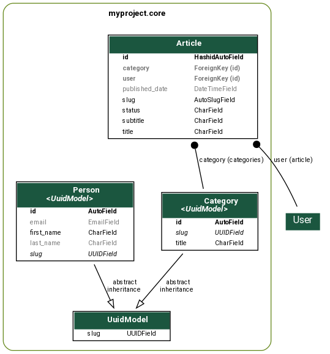
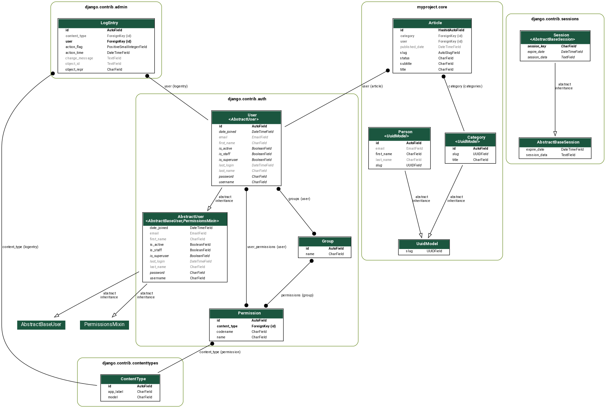

# Dica 36 - Django: visualizando seus modelos com graph models

**Versões usadas no vídeo:** Django 2.2, django-extensions 2.2.9 e Python 3, no Linux (Ubuntu).
{: .versoes }

<a href="https://youtu.be/99dOVsDBUxg">
    
</a>

Quando o projeto cresce, fica difícil enxergar de cabeça como os modelos se relacionam: quem tem `ForeignKey` para quem, quem herda de qual classe abstrata, quais campos cada tabela tem. O comando `graph_models`, do pacote [django-extensions](https://django-extensions.readthedocs.io/en/latest/graph_models.html), lê os seus modelos e gera um diagrama (uma imagem `.png`) com todas essas informações.

Neste tutorial vamos instalar as dependências do Graphviz, configurar o `django_extensions` e gerar dois diagramas: um só da app `core` e outro com todas as apps do projeto.

## Pré-requisitos

* Um projeto Django com pelo menos uma app com modelos. No vídeo foi usado o projeto do repositório [dicas-de-django](https://github.com/rg3915/dicas-de-django), com a app `myproject/core`.
* Linux (Ubuntu/Debian). Em outros sistemas, instale o Graphviz pelo gerenciador de pacotes correspondente (por exemplo, `brew install graphviz` no macOS).

## Instalando o Graphviz e as bibliotecas Python

O `graph_models` usa o [Graphviz](https://graphviz.org/) para desenhar o diagrama. Primeiro instale o Graphviz e os cabeçalhos de desenvolvimento, que são necessários para compilar o `pygraphviz`:

```bash
sudo apt-get install -y graphviz libgraphviz-dev pkg-config
```

Depois crie e ative o ambiente virtual e instale as dependências do projeto:

```bash
python3 -m venv .venv
source .venv/bin/activate
pip install -r requirements.txt
```

Agora instale o `pygraphviz`, que é a ponte entre o Python e o Graphviz:

```bash
pip install pygraphviz
```

Se o `pyparsing` já estiver instalado, desinstale-o e instale a versão 1.5.7, como foi feito no vídeo (na época, essa era a receita para o `pydot` funcionar sem conflito com o `pyparsing`):

```bash
pip uninstall pyparsing
pip install -Iv https://pypi.python.org/packages/source/p/pyparsing/pyparsing-1.5.7.tar.gz#md5=9be0fcdcc595199c646ab317c1d9a709
```

E por fim instale o `pydot` e o próprio `django-extensions`, que é quem fornece o comando `graph_models`:

```bash
pip install pydot
pip install django-extensions
```

## Configurando o django_extensions

Adicione `django_extensions` em `INSTALLED_APPS`:

```python
# myproject/settings.py
INSTALLED_APPS = [
    ...
    'django_extensions',
    ...
]
```

Sem isso o Django não encontra o comando e responde `Unknown command: 'graph_models'`.

## Gerando o diagrama de uma app

Para gerar o diagrama só da app `core`, rode:

```bash
python manage.py graph_models -e -g -l dot -o core.png core  # only app core
```

O que cada opção faz:

* `-e` (`--inheritance`): desenha as setas de herança entre os modelos (por exemplo, de um modelo para a classe abstrata da qual ele herda).
* `-g` (`--group-models`): agrupa os modelos dentro de uma caixa com o nome da app.
* `-l dot` (`--layout`): usa o layout `dot` do Graphviz, que organiza o diagrama em camadas, de cima para baixo.
* `-o core.png` (`--output`): nome do arquivo gerado; a extensão `.png` faz o comando gerar uma imagem.
* `core`: o nome (*label*) da app que entra no diagrama. Você pode passar mais de uma app, separadas por espaço.

O resultado é o arquivo `core.png` na raiz do projeto:

### core



Repare no que o diagrama mostra:

* cada modelo é uma tabela com o nome do campo à esquerda e o tipo à direita (`HashidAutoField`, `ForeignKey (id)`, `AutoSlugField`, `CharField`, `UUIDField` etc.);
* o `Article` tem duas setas de `ForeignKey`: uma para `Category` (`category (categories)`, onde `categories` é o `related_name`) e outra para `User` (`user (article)`). O `User` aparece fora da caixa porque pertence a outra app (`django.contrib.auth`);
* `Person` e `Category` mostram `<UuidModel>` embaixo do nome e têm setas `abstract inheritance` apontando para o `UuidModel`, a classe abstrata que fornece o campo `slug` (um `UUIDField`). É essa herança que a opção `-e` desenha;
* os campos que podem ficar em branco (`blank=True`) aparecem em cinza claro, como o `email` e o `last_name` de `Person` e o `published_date` de `Article`.

## Gerando o diagrama de todas as apps

Se você não informar a app e usar a opção `-a` (`--all-applications`), o comando inclui todas as apps de `INSTALLED_APPS`:

```bash
python manage.py graph_models -a -g -o models.png  # all
```

Agora, além da `core`, o diagrama traz as apps do próprio Django: `django.contrib.admin` (`LogEntry`), `django.contrib.auth` (`User`, `AbstractUser`, `Permission`, `Group` e as relações entre eles), `django.contrib.sessions` (`Session`) e as demais tabelas do projeto, cada app na sua caixa por causa do `-g`.

### models



## Conclusão

Com três pacotes de sistema e um comando, você tem uma documentação visual dos modelos que pode ser gerada de novo a cada mudança. É útil para entender um projeto que você acabou de pegar, para discutir a modelagem com a equipe e para colocar no README do repositório, como foi feito no [dicas-de-django](https://github.com/rg3915/dicas-de-django).

Observação: o `graph_models` também aceita a opção `--dot`, que gera só o arquivo de texto no formato do Graphviz, sem precisar do `pygraphviz` nem do `pydot` (`python manage.py graph_models -a --dot -o models.dot`). Depois é só converter com `dot -Tpng models.dot -o models.png`.
