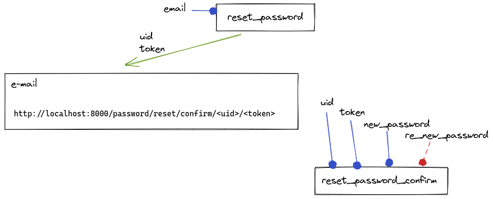

# Dica 48 - DRF: Reset de Senha com djoser - Django REST framework

**Versões usadas no vídeo:** Django 3.2, Django REST framework 3.12, djoser 2.1 e Python 3.9.
{: .versoes }

<a href="https://youtu.be/BilRdaQXX8U">
    
</a>

**Importante:** nas versões antigas desta página as tags de template apareciam com uma `\` no meio (`{\%`), por causa do GitBook. Aqui elas já estão escritas do jeito certo, sem a barra.


Github: [https://github.com/rg3915/drf-example](https://github.com/rg3915/drf-example)

Documentação do djoser: [https://djoser.readthedocs.io/en/latest/](https://djoser.readthedocs.io/en/latest/)

Continuando a série sobre Django REST framework, vamos ver como resetar (redefinir) a senha de um usuário numa API REST usando o [djoser](https://djoser.readthedocs.io/en/latest/), a mesma biblioteca da [Dica 47](047-djoser.md). O djoser já traz os endpoints prontos; o que falta é configurar o envio de e-mail, testar o fluxo completo e, no fim, personalizar o template do e-mail.

Para receber os e-mails de verdade, sem mandar nada para fora da sua máquina, vamos usar o [MailHog](https://github.com/mailhog/MailHog) rodando no Docker.

## Pré-requisitos

* O projeto `drf-example` da dica anterior, com o djoser instalado e configurado (`rest_framework`, `rest_framework.authtoken` e `djoser` no `INSTALLED_APPS`, e as urls do djoser em `api/v1/`). Veja a [Dica 47](047-djoser.md).
* O `python-decouple` instalado (o projeto lê as configurações com `config`).
* Docker, para rodar o MailHog.
* Um cliente HTTP. No vídeo foi usado o Postman.

As dependências do projeto na época (`requirements.txt`):

```
click==8.0.*
django-extensions
Django==3.2.*
djangorestframework==3.12.*
djoser==2.1.*
dr-scaffold==1.4.*
drf-yasg==1.20.*
python-decouple
```

E as urls do djoser, configuradas na dica 47:

```python
# backend/urls.py
# djoser
urlpatterns += [
    path('api/v1/', include('djoser.urls')),
    path('api/v1/auth/', include('djoser.urls.authtoken')),
]
```

## Como funciona o reset de senha

Vamos usar três endpoints do djoser:

```
/api/v1/auth/token/login/
/api/v1/users/reset_password/
/api/v1/users/reset_password_confirm/
```



1. Você faz um POST em `reset_password/` informando apenas o **e-mail** do usuário.
2. O djoser envia um e-mail com um link no formato `http://localhost:8000/password/reset/confirm/<uid>/<token>`.
3. Desse link você tira o `uid` e o `token`, e faz um POST em `reset_password_confirm/` com `uid`, `token` e `new_password` (e, se configurar, também `re_new_password`, a senha repetida).
4. Pronto: a senha foi trocada, e você já consegue fazer login com ela em `auth/token/login/`.

Repare que o link do e-mail **não é para ser clicado** numa API: ele aponta para uma página do seu front-end, que não existe neste exemplo. Ele serve só para você pegar o `uid` e o `token` e montar a requisição de confirmação.

## Configurando o djoser e o e-mail

Edite `backend/settings.py`. Primeiro, o dicionário `DJOSER` com a URL que vai no e-mail. O djoser substitui `{uid}` e `{token}` pelos valores reais:

```python
# backend/settings.py
DJOSER = {
    'PASSWORD_RESET_CONFIRM_URL': 'password/reset/confirm/{uid}/{token}',
}
```

Depois, as configurações de e-mail. Como o projeto usa o `python-decouple`, cada valor é lido do arquivo `.env` se existir lá; se não existir, usa o valor padrão (o segundo argumento do `config`):

```python
# backend/settings.py
EMAIL_BACKEND = 'django.core.mail.backends.smtp.EmailBackend'

DEFAULT_FROM_EMAIL = config('DEFAULT_FROM_EMAIL', 'webmaster@localhost')
EMAIL_HOST = config('EMAIL_HOST', '0.0.0.0')  # localhost
EMAIL_PORT = config('EMAIL_PORT', 1025, cast=int)
EMAIL_HOST_USER = config('EMAIL_HOST_USER', '')
EMAIL_HOST_PASSWORD = config('EMAIL_HOST_PASSWORD', '')
EMAIL_USE_TLS = config('EMAIL_USE_TLS', default=False, cast=bool)
```

* `EMAIL_BACKEND`: envia por SMTP de verdade.
* `DEFAULT_FROM_EMAIL`: o remetente; se não estiver no `.env`, fica `webmaster@localhost`.
* `EMAIL_HOST`: `0.0.0.0` (ou `localhost`, se precisar), onde o MailHog vai escutar.
* `EMAIL_PORT`: `1025`, a porta SMTP do MailHog. Tem que ser inteiro, por isso o `cast=int`.
* `EMAIL_HOST_USER` e `EMAIL_HOST_PASSWORD`: vazios, o MailHog não pede usuário nem senha.
* `EMAIL_USE_TLS`: falso, convertido para booleano com `cast=bool`.

### Página em pt-br

Aproveite e troque o idioma do projeto, para que o e-mail e as mensagens de erro venham em português:

```python
# backend/settings.py
LANGUAGE_CODE = 'pt-br'
```

## Rodando o MailHog

Rode o [MailHog](https://github.com/mailhog/MailHog) usando Docker:

```bash
docker run -d -p 1025:1025 -p 8025:8025 mailhog/mailhog
```

A porta `1025` é o servidor SMTP (para onde o Django manda o e-mail) e a `8025` é a interface web, onde você lê os e-mails recebidos: abra `http://localhost:8025` no navegador.

Rode o servidor do Django:

```bash
python manage.py runserver
```

O usuário precisa ter um e-mail cadastrado. No vídeo, o usuário `regis` não tinha, então foi definido `regis@email.com` pelo Admin do Django.

## Testando no Postman

### Reset

POST: http://localhost:8000/api/v1/users/reset_password/

Em **Body**, escolha **raw** e **JSON**:

```json
{
    "email": "regis@email.com"
}
```

* Não precisa de Token Authorization.
* Coloque a barra no final da URL.

A resposta é `204 No Content`. No MailHog chega o e-mail "Redefinição de senha em localhost:8000":

```
Você está recebendo este email porque solicitou a redefinição da senha da sua conta em localhost:8000.

Por favor, acesse a seguinte página e escolha uma nova senha:
http://localhost:8000/password/reset/confirm/MTA/atqfid-a7f1314e35dd3cc093e9fe1a40b49cc6
Caso tenha esquecido, seu usuário: regis

Obrigado por usar nosso site!

Equipe localhost:8000
```

No link, o pedaço depois de `confirm/` é o `uid` (`MTA`, o id do usuário codificado em base64) e o último pedaço é o `token`.

### Reset Password Confirm

POST: http://localhost:8000/api/v1/users/reset_password_confirm/

Copie o `uid` e o `token` do e-mail (o `uid` exatamente como está, em maiúsculas) e informe a nova senha:

```json
{
    "uid": "MTA",
    "token": "atqfid-a7f1314e35dd3cc093e9fe1a40b49cc6",
    "new_password": "abc12345"
}
```

* Não precisa de Token Authorization.

Os validadores de senha do Django (`AUTH_PASSWORD_VALIDATORS`) continuam valendo. Com `abc12345` a resposta é `400 Bad Request`:

```json
{
    "new_password": [
        "Esta senha é muito comum."
    ]
}
```

Trocando para uma senha aceita, como `lorem12345`, a resposta é `204 No Content`, e a senha foi trocada.

### Login

Para conferir, faça o login com a nova senha.

POST: http://localhost:8000/api/v1/auth/token/login/

```json
{
    "username": "regis",
    "password": "lorem12345"
}
```

Resposta:

```json
{
    "auth_token": "8bd341833c8e43bebce157475467d4af513b3ffc"
}
```

(o seu token será outro).

## Pedindo a senha duas vezes

Se você quiser que o usuário digite a nova senha duas vezes, acrescente `PASSWORD_RESET_CONFIRM_RETYPE` no `DJOSER`:

```python
# backend/settings.py
DJOSER = {
    'PASSWORD_RESET_CONFIRM_URL': 'password/reset/confirm/{uid}/{token}',
    'PASSWORD_RESET_CONFIRM_RETYPE': True,
}
```

Repita o processo: peça um novo e-mail em `reset_password/`, pegue o novo `token` e faça o POST em `reset_password_confirm/` só com `new_password`. A resposta agora é `400 Bad Request`:

```json
{
    "re_new_password": [
        "Este campo é obrigatório."
    ]
}
```

Então você precisa passar também `re_new_password`:

```json
{
    "uid": "MTA",
    "token": "atqfpc-0c6248b62531a140bfe476d47670375a",
    "new_password": "lorem1200",
    "re_new_password": "lorem1200"
}
```

E a resposta volta a ser `204 No Content`.

## E-mail com template personalizado

O e-mail que o djoser manda é o padrão dele. Para mandar a mensagem do seu jeito, vamos criar uma classe de e-mail própria, que aponta para um template nosso.

### settings.py

Em `DJOSER`, acrescente a chave `EMAIL`, dizendo qual classe usar para o e-mail de `password_reset`. E em `TEMPLATES`, acrescente as pastas em `DIRS`:

```python
# backend/settings.py
DJOSER = {
    'PASSWORD_RESET_CONFIRM_URL': 'password/reset/confirm/{uid}/{token}',
    'PASSWORD_RESET_CONFIRM_RETYPE': True,
    'EMAIL': {
        'password_reset': 'accounts.email.PasswordResetEmail'
    }
}

TEMPLATES = [
    {
        'BACKEND': 'django.template.backends.django.DjangoTemplates',
        'DIRS': [
            BASE_DIR,
            BASE_DIR.joinpath('templates'),
        ],
        'APP_DIRS': True,
        'OPTIONS': {
            'context_processors': [
                'django.template.context_processors.debug',
                'django.template.context_processors.request',
                'django.contrib.auth.context_processors.auth',
                'django.contrib.messages.context_processors.messages',
            ],
        },
    },
]
```

### A app accounts

Crie uma nova app e apague os arquivos que não vamos usar:

```bash
python manage.py startapp accounts
rm -f accounts/{admin,models,tests,views}.py
```

Sobram `__init__.py`, `apps.py` e `migrations/`. Adicione a app em `INSTALLED_APPS`:

```python
# backend/settings.py
INSTALLED_APPS = [
    'django.contrib.admin',
    'django.contrib.auth',
    'django.contrib.contenttypes',
    'django.contrib.sessions',
    'django.contrib.messages',
    'django.contrib.staticfiles',
    # 3rd apps
    'rest_framework',
    'rest_framework.authtoken',
    'django_extensions',
    'dr_scaffold',
    'drf_yasg',
    'djoser',
    # my apps
    'accounts',
    'blog',
    'product',
    'ecommerce',
]
```

### A classe de e-mail

Crie o arquivo `accounts/email.py`. A classe herda de `email.PasswordResetEmail` do djoser e só troca o `template_name`:

```python
# accounts/email.py
from djoser import email


class PasswordResetEmail(email.PasswordResetEmail):
    template_name = 'accounts/email/password_reset.html'
```

### O template do e-mail

Crie a pasta e o arquivo do template:

```bash
mkdir -p accounts/templates/accounts/email
touch accounts/templates/accounts/email/password_reset.html
```

Copie o conteúdo do template original do djoser:

[https://github.com/sunscrapers/djoser/blob/master/djoser/templates/email/password_reset.html](https://github.com/sunscrapers/djoser/blob/master/djoser/templates/email/password_reset.html)

e faça as suas alterações. No vídeo, a única alteração foi o `Olá {{ user.first_name }},` no início da mensagem. Atenção: o template tem **dois** corpos, o `text_body` (texto puro) e o `html_body` (HTML), e a alteração tem que ser feita **nos dois**. No vídeo o Regis esqueceu do `html_body` no começo e demorou para achar a diferença.

```html
<!-- accounts/templates/accounts/email/password_reset.html -->



Password reset on {{ site_name }}



Olá {{ user.first_name }},
You're receiving this email because you requested a password reset for your user account at {{ site_name }}.


{{ protocol }}://{{ domain }}/{{ url }}
 {{ user.get_username }}



The {{ site_name }} team



Olá {{ user.first_name }},
<p>You're receiving this email because you requested a password reset for your user account at {{ site_name }}.</p>

<p></p>
<a href="{{ protocol }}://{{ domain }}/{{ url }}">{{ protocol }}://{{ domain }}/{{ url }}</a>
<p> <b>{{ user.get_username }}</b></p>

<p></p>

<p>The {{ site_name }} team</p>

```

Os textos em inglês dentro de `` e `` continuam saindo em português, porque o djoser tem a tradução e o `LANGUAGE_CODE` é `pt-br`.

Rode o servidor de novo, peça outro e-mail em `reset_password/` e veja no MailHog, tanto na aba **HTML** quanto na **Plain text**:

```
Olá Regis,
Você está recebendo este email porque solicitou a redefinição da senha da sua conta em localhost:8000.

Por favor, acesse a seguinte página e escolha uma nova senha:
http://localhost:8000/password/reset/confirm/MTA/atqg0m-017cb689ded862dd87a736e14d45b53a
Caso tenha esquecido, seu usuário: regis

Obrigado por usar nosso site!

Equipe localhost:8000
```

## Resumo dos endpoints

#### Login

POST: http://localhost:8000/api/v1/auth/token/login/

```
{
    "username": "huguinho",
    "password": "d"
}
```

#### Reset

POST: http://localhost:8000/api/v1/users/reset_password/

```
{
    "email": "huguinho@email.com"
}
```

* Não precisa de Token Authorization.


#### Reset Password Confirm

POST: http://localhost:8000/api/v1/users/reset_password_confirm/

```
{
    "uid": "MQ",
    "token": "at61wx-d98ea2d93ae43ba571252177750c4de8",
    "new_password": "my_super_new_password123"
}
```

* Não precisa de Token Authorization.

Se em settings você definir `PASSWORD_RESET_CONFIRM_RETYPE=True` então você precisa passar `re_new_password`.

```
{
    "uid": "MQ",
    "token": "at61wx-d98ea2d93ae43ba571252177750c4de8",
    "new_password": "my_super_new_password123",
    "re_new_password": "my_super_new_password123"
}
```

Com isso você tem o reset de senha completo na sua API: o usuário pede a troca informando o e-mail, recebe o link com `uid` e `token`, e confirma a nova senha, tudo pelos endpoints do djoser.
