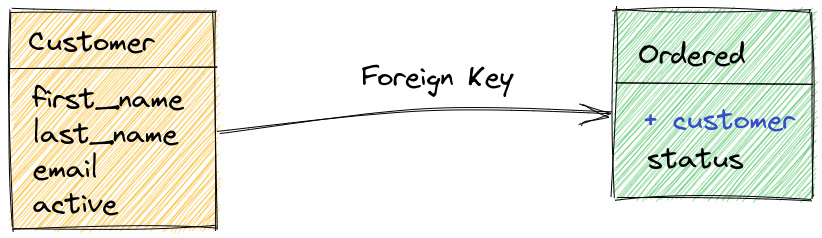
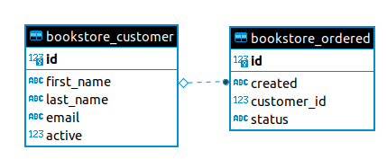

# Dica 19.1 - Modelagem - OneToMany - Um pra Muitos - ForeignKey - Chave Estrangeira

**Versões usadas no vídeo:** Django 4.1.3, Python 3.10, PostgreSQL 14 (no Docker) e django-seed 0.3.1.
{: .versoes }

<a href="https://youtu.be/wGTgSa1EFMw">
    
</a>

Código: [https://github.com/rg3915/dicas-de-django](https://github.com/rg3915/dicas-de-django) (branch `aula19`)

Este vídeo é um corte da live [Segredos do ORM do Django](https://youtu.be/Qu2QTxdYfZ4) e abre a série sobre **modelagem** do *Projeto Dicas de Django*. Nesta primeira parte vamos:

* entender o que é o **ORM** do Django, comparando um `SELECT` feito direto no PostgreSQL com a mesma consulta feita em Python;
* criar um app novo, `bookstore`, onde ficarão os models de todas as dicas de modelagem;
* modelar o relacionamento **OneToMany** (um para muitos) com `ForeignKey`: um cliente pode ter várias ordens de compra;
* popular o banco com o **django-seed** e consultar os dados pelo ORM, pelo `psql` e por três clientes gráficos (CloudBeaver, pgAdmin 4 e DBeaver);
* usar o `shell_plus` dentro do **Jupyter Notebook**.

## Leia

* [https://simpleisbetterthancomplex.com/tutorial/2016/07/22/how-to-extend-django-user-model.html](https://simpleisbetterthancomplex.com/tutorial/2016/07/22/how-to-extend-django-user-model.html)

Esse artigo mostra as formas de estender o model `User` do Django, e usa justamente os relacionamentos que vamos estudar nesta série (por exemplo, o `OneToOneField` da [Dica 19.2](080-19-2-modelagem-onetoone.md)).

## Pré-requisitos

O projeto é o mesmo das dicas anteriores, com o usuário customizado que faz login com e-mail ([Dica 14](074-14-django-custom-user-email.md)) e os contêineres do `docker-compose` da [Dica 07](067-07-docker-compose.md):

* `dicas_de_django_db`: PostgreSQL 14, na porta **5431** do lado de fora (5432 dentro da rede do Docker);
* `dicas_de_django_pgadmin`: pgAdmin 4, na porta 5051;
* `dicas_de_django_mailhog`: MailHog;
* `dicas_de_django_app` e `dicas_de_django_nginx`: o Django com Gunicorn e o Nginx.

No vídeo o Django roda **fora** do contêiner, com `runserver` em `localhost:8000`, mas conectado ao PostgreSQL do contêiner. O Portainer é usado para acompanhar os contêineres.

Suba tudo, aplique as migrações e crie dois usuários:

```bash
source .venv/bin/activate
docker-compose up -d

python manage.py migrate
python manage.py createsuperuser  # admin@email.com
python manage.py createsuperuser  # regis@email.com
python manage.py runserver
```

Como o usuário é customizado, o `createsuperuser` pede só o e-mail e a senha. No admin (`http://localhost:8000/admin/`), preencha o nome do `regis@email.com` como "Regis Santos" e o do `admin@email.com` como "Admin".

## ORM - Object Relational Mapping

### Rodando comandos direto no PostgreSQL

Primeiro, vamos olhar os dados direto no banco, com o `psql` que existe dentro do contêiner do PostgreSQL:

```bash
docker container ls

docker container exec -it dicas_de_django_db psql
```

Dentro do `psql`:

```
\l  # lista os bancos
\c dicas_de_django_db  # conecta em dicas_de_django_db
\dt  # lista as tabelas

SELECT * FROM accounts_user;
SELECT first_name, last_name, email FROM accounts_user;

\q  # sair
```

A tabela `accounts_user` é a do nosso usuário customizado. O segundo `SELECT` retorna:

```
 first_name | last_name |      email
------------+-----------+-----------------
 Regis      | Santos    | regis@email.com
 Admin      |           | admin@email.com
(2 rows)
```

### Rodando comandos pelo Django

O **ORM** (*Object-Relational Mapping*, ou mapeamento objeto-relacional) faz a ponte entre as tabelas do banco e as classes Python: em vez de escrever SQL, trabalhamos com objetos. Para testar, usamos o `shell_plus` do `django-extensions`, que já importa todos os models.

#### Fora do contêiner

```bash
python manage.py shell_plus
```

```python
>>> User.objects.all()
<QuerySet [<User: regis@email.com>, <User: admin@email.com>]>
```

É o mesmo resultado do `SELECT`, mas agora cada linha é um objeto `User`.

#### Dentro do contêiner

Também dá para rodar o Django que está dentro do contêiner `dicas_de_django_app`. Ele se conecta no mesmo banco:

```bash
docker container exec -it dicas_de_django_app \
python manage.py shell_plus
```

```python
>>> User.objects.all()
<QuerySet [<User: regis@email.com>, <User: admin@email.com>]>
```

Caso dê erro no contêiner, reconstrua a imagem e tente de novo:

```bash
docker-compose up --build -d

docker container exec -it dicas_de_django_app python manage.py shell_plus
```

Daqui para frente vamos usar sempre o Django da máquina local.

### Fazendo algumas queries

O `values()` retorna dicionários só com os campos pedidos, e o atributo `query` mostra o SQL que o ORM gerou:

```python
>>> users = User.objects.values('first_name', 'last_name', 'email')
>>> users
<QuerySet [{'first_name': 'Regis', 'last_name': 'Santos', 'email': 'regis@email.com'}, {'first_name': 'Admin', 'last_name': '', 'email': 'admin@email.com'}]>
>>> print(users.query)
SELECT "accounts_user"."first_name", "accounts_user"."last_name", "accounts_user"."email" FROM "accounts_user"
```

Um queryset pode ser percorrido como uma lista de objetos:

```python
>>> users = User.objects.all()
>>> users
<QuerySet [<User: regis@email.com>, <User: admin@email.com>]>
>>> for user in users:
...     print(user)
...
regis@email.com
admin@email.com

>>> for user in users:
...     print(user.first_name, user.email)
...
Regis regis@email.com
Admin admin@email.com
```

E agora vamos aplicar um filtro. O `email__icontains='regis'` significa "o e-mail contém `regis`, sem diferenciar maiúsculas de minúsculas". O `__` (duplo *underline*, ou *dunder*) separa o nome do campo do tipo de busca (*lookup*).

```python
>>> user = User.objects.filter(email__icontains='regis').values('first_name', 'email')
>>> user
<QuerySet [{'first_name': 'Regis', 'email': 'regis@email.com'}]>
>>> print(user.query)
SELECT "accounts_user"."first_name", "accounts_user"."email" FROM "accounts_user" WHERE UPPER("accounts_user"."email"::text) LIKE UPPER(%regis%)
```

Repare que o `icontains` virou um `WHERE UPPER(...) LIKE UPPER(%regis%)` no PostgreSQL.

Leia [QuerySet API reference #icontains](https://docs.djangoproject.com/en/4.1/ref/models/querysets/#icontains).

## Criando uma nova app

Vamos criar uma nova app chamada `bookstore`. Como todas as apps do projeto ficam dentro da pasta `backend`, entramos nela e chamamos o `manage.py` da pasta de cima:

```bash
cd backend
python ../manage.py startapp bookstore
cd ..
```

Adicione em `INSTALLED_APPS`:

```python
# backend/settings.py
INSTALLED_APPS = [
    ...
    # minhas apps
    'backend.core',
    'backend.bookstore',
    'backend.crm',
]
```

Edite `bookstore/apps.py`, acrescentando o `backend.` no `name`:

```python
# backend/bookstore/apps.py
from django.apps import AppConfig


class BookstoreConfig(AppConfig):
    default_auto_field = 'django.db.models.BigAutoField'
    name = 'backend.bookstore'
```

Crie `bookstore/urls.py`, por enquanto sem rotas, só para o `include` funcionar:

```python
# backend/bookstore/urls.py
from django.urls import path

app_name = 'bookstore'

urlpatterns = [

]
```

E inclua as rotas do app no `urls.py` principal:

```python
# backend/urls.py
from django.contrib import admin
from django.urls import include, path

urlpatterns = [
    path('', include('backend.core.urls', namespace='core')),  # noqa E501
    path('accounts/', include('backend.accounts.urls')),  # noqa E501
    path('bookstore/', include('backend.bookstore.urls', namespace='bookstore')),  # noqa E501
    path('crm/', include('backend.crm.urls', namespace='crm')),  # noqa E501
    path('admin/', admin.site.urls),  # noqa E501
]
```

## OneToMany - Um pra Muitos - ForeignKey - Chave Estrangeira

É o relacionamento onde usamos **chave estrangeira**, conhecido como **ForeignKey**.



Ilustração feita com [excalidraw.com](https://excalidraw.com/).

A chave estrangeira é um campo que colocamos na segunda tabela para apontar para um registro da primeira. Aqui temos **cliente** (`Customer`) e **ordem de compra** (`Ordered`), e a pergunta é: de que lado fica a chave?

Pense nas duas possibilidades como uma planilha. Se a chave ficasse no cliente, cada cliente teria **um** pedido, e um mesmo pedido poderia aparecer em dois clientes diferentes, o que não faz sentido:

```
customer | ordered
---------+--------
    1    |   1
    2    |   1
    3    |
```

Com a chave no pedido, cada pedido tem **um** cliente, e um cliente aparece em vários pedidos:

```
ordered | customer_id
--------+------------
   1    |     1
   2    |     1
   3    |     2
```

Essa é a forma natural: **um cliente pode fazer vários pedidos**. Então a `ForeignKey` vai em `Ordered`, apontando para `Customer`. Para reproduzir o esquema acima, usamos o seguinte código:

```python
# backend/bookstore/models.py
from django.db import models


class Customer(models.Model):
    first_name = models.CharField('nome', max_length=100)
    last_name = models.CharField('sobrenome', max_length=255, null=True, blank=True)  # noqa E501
    email = models.EmailField('e-mail', max_length=50, unique=True)
    active = models.BooleanField('ativo', default=True)

    class Meta:
        ordering = ('first_name',)
        verbose_name = 'cliente'
        verbose_name_plural = 'clientes'

    @property
    def full_name(self):
        return f'{self.first_name} {self.last_name or ""}'.strip()

    def __str__(self):
        return self.full_name


STATUS = (
    ('p', 'Pendente'),
    ('a', 'Aprovado'),
    ('c', 'Cancelado'),
)


class Ordered(models.Model):
    status = models.CharField(max_length=1, choices=STATUS, default='p')
    customer = models.ForeignKey(
        Customer,
        on_delete=models.SET_NULL,
        verbose_name='cliente',
        related_name='ordereds',
        null=True,
        blank=True
    )
    created = models.DateTimeField(
        'criado em',
        auto_now_add=True,
        auto_now=False
    )

    class Meta:
        ordering = ('-pk',)
        verbose_name = 'ordem de compra'
        verbose_name_plural = 'ordens de compra'

    def __str__(self):
        if self.customer:
            return f'{str(self.pk).zfill(3)}-{self.customer}'

        return f'{str(self.pk).zfill(3)}'
```

Em `Customer`:

* `last_name` tem `null=True, blank=True`: o sobrenome não é obrigatório (`null` vale para o banco, `blank` para os formulários). O nome é obrigatório.
* `email` tem `unique=True`: não pode haver dois clientes com o mesmo e-mail.
* `active` é um booleano que já começa como `True`.
* `full_name` é uma `@property` que junta nome e sobrenome; o `or ""` evita aparecer `None` quando não há sobrenome. O `__str__` usa essa propriedade.

Em `Ordered`:

* `status` usa `choices=STATUS`: no banco grava só uma letra (`p`, `a` ou `c`), e o padrão é `p`, pendente.
* `customer` é a **chave estrangeira**. O primeiro argumento é o model para o qual ela aponta, `Customer`.
* `on_delete=models.SET_NULL`: se o cliente for apagado, os pedidos dele continuam existindo, com o cliente vazio. Por isso o campo precisa de `null=True` (e `blank=True` para não ser obrigatório no formulário). Existem outras opções, como `CASCADE` (apaga os pedidos junto) e `PROTECT` (impede apagar o cliente que tem pedidos).
* `related_name='ordereds'`: é o nome do caminho de volta, do cliente para os pedidos (`cliente.ordereds.all()`). Vamos usá-lo no fim da dica.
* `created` com `auto_now_add=True` é preenchido automaticamente com a data e hora da criação.
* No `__str__`, o `zfill(3)` completa o id com zeros à esquerda (`001`, `002`...). Se o pedido tem cliente, retorna `001-Nome do Cliente`; senão, só `001`.

O admin:

```python
# backend/bookstore/admin.py
from django.contrib import admin

from .models import Customer, Ordered


@admin.register(Customer)
class CustomerAdmin(admin.ModelAdmin):
    list_display = ('__str__', 'email', 'active')
    search_fields = ('first_name', 'last_name')
    list_filter = ('active',)


@admin.register(Ordered)
class OrderedAdmin(admin.ModelAdmin):
    list_display = ('__str__', 'customer', 'status')
    search_fields = (
        'customer__first_name',
        'customer__last_name',
        'customer__email',
    )
    list_filter = ('status',)
    date_hierarchy = 'created'
```

Repare no `search_fields` do `OrderedAdmin`: com `customer__first_name` a busca atravessa a chave estrangeira e procura no nome do cliente.

Crie e aplique as migrações:

```bash
python manage.py makemigrations
python manage.py migrate
```

```
Migrations for 'bookstore':
  backend/bookstore/migrations/0001_initial.py
    - Create model Customer
    - Create model Ordered
```

### Diagrama ER



De um lado, `bookstore_customer` com `id`, `first_name`, `last_name`, `email` e `active`; do outro, `bookstore_ordered` com `id`, `created`, `status` e `customer_id`, que é a chave estrangeira. No banco, o campo `customer` vira a coluna `customer_id`.

### Inserindo dados com django-seed

Para não cadastrar dados na mão, vamos usar o [django-seed](https://github.com/Brobin/django-seed), que gera registros aleatórios com o Faker.

```bash
pip install django-seed

pip freeze | grep django-seed >> requirements.txt
```

Edite `settings.py`

```python
# backend/settings.py
INSTALLED_APPS = [
    ...
    # apps de terceiros
    'django_extensions',
    'widget_tweaks',
    'django_seed',
    ...
]
```

Gerando os dados:

```bash
python manage.py seed bookstore --number=3
```

```
Seeding 3 Customers
Seeding 3 Ordereds
Model Customer generated record with primary key 1
Model Customer generated record with primary key 2
Model Customer generated record with primary key 3
Model Ordered generated record with primary key 1
Model Ordered generated record with primary key 2
Model Ordered generated record with primary key 3
```

O comando cria 3 registros de cada model do app `bookstore`, já ligando os pedidos a clientes existentes.

### ORM

```bash
python manage.py shell_plus
```

O `shell_plus` já mostra na abertura que importou `from backend.bookstore.models import Customer, Ordered`.

```python
>>> customers = Customer.objects.all()
>>> for customer in customers:
...     print(customer)
...
Blake Estrada
Brian Roberson
Jeffrey Stanley

>>> ordereds = Ordered.objects.all()
>>> for ordered in ordereds:
...     print(ordered)
...
003-Blake Estrada
002-Jeffrey Stanley
001-Jeffrey Stanley
```

Os nomes são aleatórios, então os seus serão outros. Aqui Jeffrey Stanley fez duas compras e Blake Estrada, uma. Os clientes saem em ordem alfabética e os pedidos do mais novo para o mais antigo, por causa do `ordering` de cada `Meta`.

### Vendo os dados no PostgreSQL

Os mesmos dados, direto no banco:

```bash
docker container exec -it dicas_de_django_db psql
```

#### As tabelas

```
\l
\c dicas_de_django_db  # conecta no banco dicas_de_django_db
\dt    # mostra todas as tabelas
```

Agora aparecem as tabelas `bookstore_customer` e `bookstore_ordered`.

#### Os registros

```
SELECT * FROM bookstore_ordered;

 id | status |        created         | customer_id
----+--------+------------------------+-------------
  1 | p      | 1979-12-01 00:43:40+00 |           1
  2 | p      | 1985-03-01 21:37:38+00 |           1
  3 | p      | 1988-10-24 20:56:37+00 |           3
(3 rows)
```

A coluna `customer_id` é a chave estrangeira: guarda o `id` do cliente. As datas são aleatórias porque foram geradas pelo django-seed.

#### Schema

Para ver as colunas e os tipos de dados de uma tabela:

```
SELECT column_name, data_type FROM information_schema.columns WHERE TABLE_NAME = 'bookstore_ordered';

 column_name |        data_type
-------------+--------------------------
 id          | bigint
 created     | timestamp with time zone
 customer_id | bigint
 status      | character varying
(4 rows)
```

O `id` é `bigint` por causa do `BigAutoField` definido no `apps.py`, e a `customer_id` também é `bigint`, porque aponta para o `id` de `bookstore_customer`.

## DBeaver, CloudBeaver e pgAdmin

Além do ORM e do `psql`, podemos ver o banco por clientes gráficos. Vamos ver três opções.

### CloudBeaver

O CloudBeaver é a versão web do DBeaver, e roda num contêiner. Acrescente o serviço no `docker-compose.yml`, junto dos outros:

```yaml
# docker-compose.yml
  cloudbeaver:
    container_name: dicas_de_django_cloudbeaver
    image: dbeaver/cloudbeaver:latest
    volumes:
       - /var/cloudbeaver/workspace:/opt/cloudbeaver/workspace
    ports:
      - 5052:8978
    networks:
      - dicas-de-django-network
```

E rode

```bash
docker-compose up -d
```

Só o contêiner novo é criado (`Creating dicas_de_django_cloudbeaver ... done`). Pelo Portainer, entre no CloudBeaver, que fica em `http://localhost:5052`.

Login e senha:

```
Login: cbadmin
Pass: admin
```

Depois, em **Connection**, crie uma conexão manual do tipo PostgreSQL com `dicas_de_django_db`:

```
Host: dicas_de_django_db
Port: 5432
Database: postgres
Username: postgres
Password: postgres
```

O host é o **nome do contêiner** do banco, e a porta é a **interna**, 5432, porque o CloudBeaver está na mesma rede do Docker (`dicas-de-django-network`). Marque **Show all databases** para aparecer o banco `dicas_de_django_db`. Depois navegue em `dicas_de_django_db` > Schemas > public > Tables, clique com o botão direito em `accounts_user` > Generate SQL > SELECT, copie o comando, cole no editor SQL e execute.

### pgAdmin 4

O pgAdmin já estava no `docker-compose.yml` desde a Dica 07, na porta 5051 (`http://localhost:5051`). O login é o que está no `docker-compose.yml`:

```
Email: admin@admin.com
Password: admin
```

Em **Add New Server**, na aba *Connection*:

```
Host name/address: dicas_de_django_db
Port: 5432
Maintenance database: postgres
Username: postgres
Password: postgres
```

Pelo mesmo motivo do CloudBeaver, o host é o nome do contêiner e a porta é a interna. Depois é só navegar em `dicas_de_django_db` > Schemas > public > Tables e, com o botão direito numa tabela (`accounts_user`, `bookstore_customer`, `bookstore_ordered`), escolher **View/Edit Data**.

### DBeaver

O DBeaver instalado na sua máquina fica **fora** do Docker, então ele usa o endereço e a porta **externa** do contêiner:

```
Host: 0.0.0.0
Port: 5431
Database: dicas_de_django_db
Username: postgres
Password: postgres
```

No vídeo, com a porta 5432 o teste de conexão dá "conexão recusada"; com a 5431, que é a porta publicada pelo contêiner (`5431:5432`), funciona.

## Jupyter Notebook

Para instalar o Jupyter digite

```bash
pip install jupyter
```

E para rodar digite

```bash
python manage.py shell_plus --notebook
```

No navegador, crie um notebook novo com o kernel **Django Shell-Plus**, que já vem com os models importados. Quando você tentar rodar

```python
Customer.objects.all()
```

Você vai ter este erro

```
SynchronousOnlyOperation: You cannot call this from an async context - use a thread or sync_to_async.
```

O Jupyter roda o código dentro de um *event loop* assíncrono, e o Django bloqueia operações de banco nesse contexto. Para liberar, edite o `settings.py`:

```python
# backend/settings.py
import os
from pathlib import Path

...

AUTH_USER_MODEL = 'accounts.User'

os.environ['DJANGO_ALLOW_ASYNC_UNSAFE'] = 'true'
```

Use isso só em desenvolvimento. Volte ao Jupyter, clique em **Kernel > Restart** e rode de novo:

```python
Customer.objects.all()
# <QuerySet [<Customer: Blake Estrada>, <Customer: Brian Roberson>, <Customer: Jeffrey Stanley>]>
```

## Criando registros pelo ORM

Agora, no Jupyter, vamos criar clientes e pedidos pelo código, porque um dia você pode precisar fazer isso pela linha de comando:

```python
adam = Customer.objects.create(first_name='Adam', email='adam@email.com')
james = Customer.objects.create(first_name='James', email='james@email.com')

Customer.objects.all()
# <QuerySet [<Customer: Adam>, <Customer: Blake Estrada>, <Customer: Brian Roberson>, <Customer: James>, <Customer: Jeffrey Stanley>]>
```

Dois pedidos para o Adam e três para o James. Para ligar o pedido ao cliente, basta passar o objeto no campo da chave estrangeira:

```python
Ordered.objects.create(customer=adam)
Ordered.objects.create(customer=adam)
# <Ordered: 005-Adam>

Ordered.objects.create(customer=james)
Ordered.objects.create(customer=james)
Ordered.objects.create(customer=james)
# <Ordered: 008-James>
```

Como o seed já tinha criado os pedidos 1 a 3, os do Adam ficam com os ids 4 e 5, e os do James com 6, 7 e 8. No Jupyter aparece só o resultado da última linha de cada célula.

### Do pedido para o cliente

```python
ordereds = Ordered.objects.all()

for ordered in ordereds:
    print(ordered)
```

```
008-James
007-James
006-James
005-Adam
004-Adam
003-Blake Estrada
002-Jeffrey Stanley
001-Jeffrey Stanley
```

O `status` guarda só a letra. Para ver o texto da opção, o Django cria automaticamente o método `get_status_display()` para todo campo com `choices`:

```python
for ordered in ordereds:
    print(ordered.status)  # p, p, p...

for ordered in ordereds:
    print(ordered.get_status_display())  # Pendente, Pendente, Pendente...
```

E pela chave estrangeira chegamos no cliente e em qualquer campo dele:

```python
for ordered in ordereds:
    print(ordered.customer)

for ordered in ordereds:
    print(ordered.customer.email)
```

```
james@email.com
james@email.com
james@email.com
adam@email.com
adam@email.com
joshua45@example.com
manningdavid@example.org
manningdavid@example.org
```

O código completo, em um bloco só:

```python
from backend.bookstore.models import Customer, Ordered
Customer.objects.all()

adam = Customer.objects.create(first_name='Adam', email='adam@email.com')
james = Customer.objects.create(first_name='James', email='james@email.com')

Customer.objects.all()

Ordered.objects.create(customer=adam)
Ordered.objects.create(customer=adam)
Ordered.objects.create(customer=james)
Ordered.objects.create(customer=james)
Ordered.objects.create(customer=james)

ordereds = Ordered.objects.all()

for ordered in ordereds:
    print(ordered)
    print(ordered.status)
    print(ordered.get_status_display())
    print(ordered.customer)
    print(ordered.customer.email)
```

Ou seja, a partir da ordem de compra conseguimos ver o cliente.

### Do cliente para os pedidos

E como fazemos para, a partir do cliente, ver as ordens de compra dele?

```python
>>> adam.ordereds.all()
<QuerySet [<Ordered: 005-Adam>, <Ordered: 004-Adam>]>
>>> james.ordereds.all()
<QuerySet [<Ordered: 008-James>, <Ordered: 007-James>, <Ordered: 006-James>]>
```

Ou seja, pegamos os dados pelo `related_name`. O `ordereds` é exatamente o `related_name='ordereds'` que definimos na `ForeignKey`. Sem ele, o Django criaria o nome padrão `ordered_set` (`adam.ordered_set.all()`).

Resumindo: a `ForeignKey` fica no lado "muitos" (o pedido), aponta para o lado "um" (o cliente), vira uma coluna `customer_id` no banco e pode ser percorrida nos dois sentidos: `ordered.customer` e `customer.ordereds.all()`.

Próxima dica: [Dica 19.2 - Modelagem - OneToOne](080-19-2-modelagem-onetoone.md).
