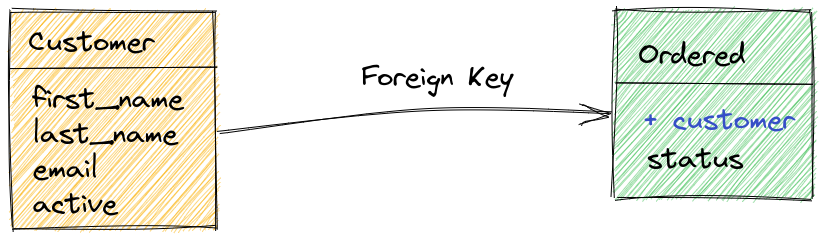
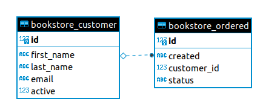

# Dica 19 - Modelagem - OneToMany - Um pra Muitos - ForeignKey - Chave Estrangeira

## Leia

* [https://simpleisbetterthancomplex.com/tutorial/2016/07/22/how-to-extend-django-user-model.html](https://simpleisbetterthancomplex.com/tutorial/2016/07/22/how-to-extend-django-user-model.html)

## ORM - Object Relational Mapping

### Rodando comandos direto no PostgreSQL.

```
docker-compose up -d

docker container exec -it dicas_de_django_db psql

\l  # lista os bancos
\c dicas_de_django_db  # conecta em dicas_de_django_db
\dt  # lista as tabelas

SELECT first_name, last_name, email FROM accounts_user;
SELECT * FROM accounts_user;

\q  # sair
```

### Rodando comandos pelo Django

#### Dentro do container

```
docker container exec -it dicas_de_django_app python manage.py shell_plus

User.objects.all()
```

Caso dê erro no container faça

```
docker-compose up --build  -d

docker container exec -it dicas_de_django_app python manage.py shell_plus

User.objects.all()
```

#### Fora do container

```
python manage.py shell_plus

User.objects.all()
```

Fazendo mais algumas queries.

```python
>>> users = User.objects.values('first_name', 'last_name', 'email')
>>> users
<QuerySet [{'first_name': '', 'last_name': '', 'email': 'admin@email.com'}, {'first_name': 'Regis', 'last_name': 'Santos', 'email': 'regis@email.com'}]>
>>> print(users.query)
SELECT "accounts_user"."first_name", "accounts_user"."last_name", "accounts_user"."email" FROM "accounts_user"

>>> users = User.objects.all()
>>> users
<QuerySet [<User: admin@email.com>, <User: regis@email.com>]>
>>> for user in users:
...     print(user)
... 
admin@email.com
regis@email.com

>>> for user in users:
...     print(user.first_name, user.email)
... 
 admin@email.com
Regis regis@email.com
```

E agora vamos aplicar um filtro.

```python
>>> user = User.objects.filter(email__icontains='regis').values('first_name', 'email')
>>> user
<QuerySet [{'first_name': 'Regis', 'email': 'regis@email.com'}]>
>>> print(user.query)
SELECT "accounts_user"."first_name", "accounts_user"."email" FROM "accounts_user" WHERE UPPER("accounts_user"."email"::text) LIKE UPPER(%regis%)
```

Leia [QuerySet API reference #icontains](https://docs.djangoproject.com/en/4.1/ref/models/querysets/#icontains).


## Criando uma nova app

Vamos criar uma nova app chamada `bookstore`.

```
cd backend
python ../manage.py startapp bookstore
cd ..
```

Adicione em `INSTALLED_APPS`

```python
# settings.py
INSTALLED_APPS = [
    ...
    'backend.bookstore',
]
```

Edite `urls.py`

```python
# urls.py
...
path('', include('backend.bookstore.urls', namespace='bookstore')),
```

Edite `bookstore/apps.py`

```python
# bookstore/apps.py
...
name = 'backend.bookstore'
```

Crie `bookstore/urls.py`

```python
# bookstore/urls.py
from django.urls import path

app_name = 'bookstore'

urlpatterns = [

]
```

## OneToMany - Um pra Muitos - ForeignKey - Chave Estrangeira

É o relacionamento onde usamos **chave estrangeira**, conhecido como **ForeignKey**.



Ilustração feita com [excalidraw.com](https://excalidraw.com/).

Um **cliente** pode fazer vários **pedidos**, então para reproduzir o esquema acima, usamos o seguinte código:


```python
# bookstore/models.py
from django.db import models


class Customer(models.Model):
    first_name = models.CharField('nome', max_length=100)
    last_name = models.CharField('sobrenome', max_length=255, null=True, blank=True)  # noqa E501
    email = models.EmailField('e-mail', max_length=50, unique=True)
    active = models.BooleanField('ativo', default=True)

    class Meta:
        ordering = ('first_name',)
        verbose_name = 'cliente'
        verbose_name_plural = 'clientes'

    @property
    def full_name(self):
        return f'{self.first_name} {self.last_name or ""}'.strip()

    def __str__(self):
        return self.full_name


STATUS = (
    ('p', 'Pendente'),
    ('a', 'Aprovado'),
    ('c', 'Cancelado'),
)


class Ordered(models.Model):
    status = models.CharField(max_length=1, choices=STATUS, default='p')
    customer = models.ForeignKey(
        Customer,
        on_delete=models.SET_NULL,
        verbose_name='cliente',
        related_name='ordereds',
        null=True,
        blank=True
    )
    created = models.DateTimeField(
        'criado em',
        auto_now_add=True,
        auto_now=False
    )

    class Meta:
        ordering = ('-pk',)
        verbose_name = 'ordem de compra'
        verbose_name_plural = 'ordens de compra'

    def __str__(self):
        if self.customer:
            return f'{str(self.pk).zfill(3)}-{self.customer}'

        return f'{str(self.pk).zfill(3)}'
```

```python
# bookstore/admin.py
from django.contrib import admin

from .models import Customer, Ordered


@admin.register(Customer)
class CustomerAdmin(admin.ModelAdmin):
    list_display = ('__str__', 'email', 'active')
    search_fields = ('first_name', 'last_name')
    list_filter = ('active',)


@admin.register(Ordered)
class OrderedAdmin(admin.ModelAdmin):
    list_display = ('__str__', 'customer', 'status')
    search_fields = (
        'customer__first_name',
        'customer__last_name',
        'customer__email',
    )
    list_filter = ('status',)
    date_hierarchy = 'created'
```

```
python manage.py makemigrations
python manage.py migrate
```

### Diagrama ER




### Inserindo dados com django-seed

```
pip install django-seed

pip freeze | grep django-seed >> requirements.txt
```

Edite `settings.py`

```python
# settings.py
INSTALLED_APPS = [
    ...
    'django_seed',
    ...
]
```

Gerando os dados

```
python manage.py seed bookstore --number=3
```

### ORM

```python
python manage.py shell_plus


from backend.bookstore.models import Customer, Ordered

customers = Customer.objects.all()

for customer in customers:
    print(customer)

ordereds = Ordered.objects.all()

for ordered in ordereds:
    print(ordered)
```

### PostgreSQL e pgAdmin no Docker

Vamos usar o PostgreSQL rodando no Docker.

```
docker-compose up -d
```

Podemos ver tudo pelo pgAdmin, ou

```
docker container exec -it dicas_de_django_db psql
```

#### As tabelas

```
\c dicas_de_django_db  # conecta no banco dicas_de_django_db
\dt    # mostra todas as tabelas
```

#### Os registros

```
SELECT * FROM bookstore_ordered;

id | status |        created         | customer_id 
----+--------+------------------------+-------------
  1 | p      | 1976-01-05 07:04:10+00 |           1
  2 | p      | 2021-02-09 06:08:27+00 |           3
  3 | p      | 1986-08-13 02:54:02+00 |           1
```

#### Schema

```
SELECT column_name, data_type FROM information_schema.columns WHERE TABLE_NAME = 'bookstore_ordered';
 column_name |        data_type         
-------------+--------------------------
 id          | bigint
 created     | timestamp with time zone
 customer_id | bigint
 status      | character varying
(4 rows)
```

## DBeaver e CloudBeaver

### CloudBeaver

https://github.com/dbeaver/cloudbeaver/wiki/Run-Docker-Container

https://cloudbeaver.io/doc/cloudbeaver.pdf

Edite o `docker-compose.yml`

```
  cloudbeaver:
    container_name: dicas_de_django_cloudbeaver
    image: dbeaver/cloudbeaver:latest
    volumes:
       - /var/cloudbeaver/workspace:/opt/cloudbeaver/workspace
    ports:
      - 5052:8978
    networks:
      - dicas-de-django-network

```

E rode

```
docker-compose up -d
```

Entre no Portainer e entre no CloudBeaver.

Login e senha

```
Login: cbadmin
Pass: admin
```

Conexão com `dicas_de_django_db`.

### pgAdmin 4

```
User: admin
Password: admin
```

```
Port: 5432
Database: localhost
Username: postgres
Password: postgres
```

### DBeaver

```
Host: 0.0.0.0
Port: 5431
Database: dicas_de_django_db
Username: postgres
Password: postgres
```

### Jupyter Notebook

Para instalar o Jupyter digite

```
pip install jupyter
```

E para rodar digite

```
python manage.py shell_plus --notebook
```

Quando você tentar rodar

```
Customer.objects.all()
```

Você vai ter este erro

```
SynchronousOnlyOperation: You cannot call this from an async context - use a thread or sync_to_async.
```

Então edite o `settings.py`

```python
import os

os.environ["DJANGO_ALLOW_ASYNC_UNSAFE"] = "true"

```

Mas o código completo deve ser

```python
from backend.bookstore.models import Customer, Ordered
Customer.objects.all()

adam = Customer.objects.create(first_name='Adam', email='adam@email.com')
james = Customer.objects.create(first_name='James', email='james@email.com')

Customer.objects.all()

Ordered.objects.create(customer=adam)
Ordered.objects.create(customer=adam)
Ordered.objects.create(customer=james)
Ordered.objects.create(customer=james)
Ordered.objects.create(customer=james)

ordereds = Ordered.objects.all()

for ordered in ordereds:
    print(ordered)
    print(ordered.status)
    print(ordered.get_status_display())
    print(ordered.customer)
    print(ordered.customer.email)
```

Ou seja, a partir da ordem de compra conseguimos ver o cliente.

E como fazemos para a partir do cliente, ver as ordens de compra dele?

```python
adam.ordereds.all()
james.ordereds.all()
```

Ou seja, pegamos os dados pelo `related_name`.

