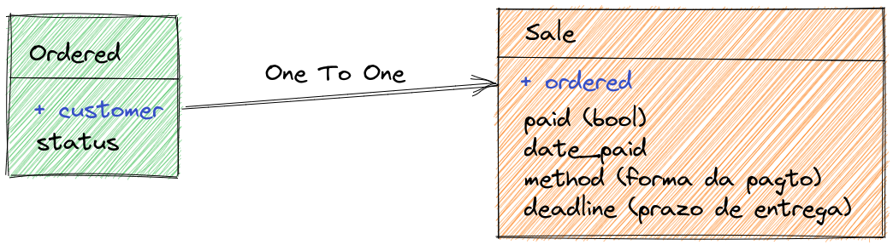
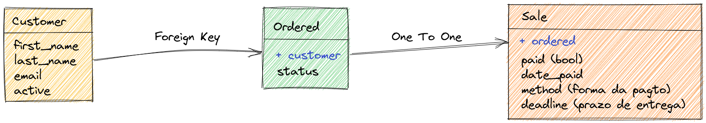
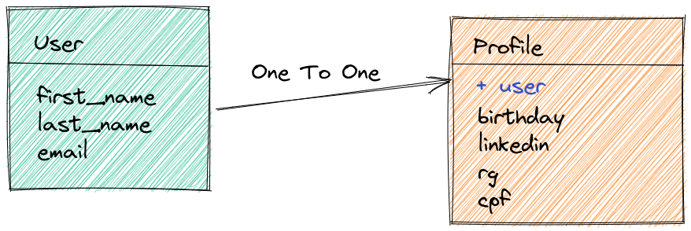

# Dica 19.2 - Modelagem - OneToOne - Um pra Um

**Versões usadas no vídeo:** Django 4.1.3, Python 3.10 e PostgreSQL 14 (no Docker).
{: .versoes }

<a href="https://youtu.be/uqgy9MjOClQ">
    
</a>

Código: [https://github.com/rg3915/dicas-de-django](https://github.com/rg3915/dicas-de-django) (branch `aula20`)

Este vídeo é um corte da live [Segredos do ORM do Django](https://youtu.be/Qu2QTxdYfZ4) e é a segunda parte da série sobre modelagem. Na [Dica 19.1](079-19-1-modelagem-onetomany.md) vimos o **OneToMany** (`ForeignKey`): um cliente tem várias ordens de compra. Agora vamos ver o **OneToOne** (um para um), com dois exemplos:

1. uma **ordem de compra** que vira **uma venda**;
2. um **perfil** (`Profile`) ligado ao **usuário**, para guardar dados extras como RG, CPF e data de nascimento.

A diferença é que, no OneToMany, um registro de um lado pode aparecer em vários do outro. No OneToOne, cada registro de um lado corresponde a **no máximo um** do outro. No banco, o `OneToOneField` é uma chave estrangeira com restrição `UNIQUE`.

## Pré-requisitos

O app `bookstore` com os models `Customer` e `Ordered` da [Dica 19.1](079-19-1-modelagem-onetomany.md), o usuário customizado do app `accounts` ([Dica 14](074-14-django-custom-user-email.md)) e o `Makefile` da [Dica 10](070-10-makefile.md).

## OneToOne - Um pra Um



Uma ordem de compra (`Ordered`), quando é fechada, vira uma venda (`Sale`). Uma ordem gera no máximo uma venda, e cada venda vem de uma única ordem. Acrescente no fim de `bookstore/models.py`:

```python
# backend/bookstore/models.py
...

METHOD_PAYMENT = (
    ('di', 'dinheiro'),
    ('de', 'débito'),
    ('cr', 'crédito'),
    ('pix', 'Pix'),
)


class Sale(models.Model):
    ordered = models.OneToOneField(
        Ordered,
        on_delete=models.CASCADE,
        verbose_name='ordem de compra'
    )
    paid = models.BooleanField('pago', default=False)
    date_paid = models.DateTimeField('data de pagamento', null=True, blank=True)
    method = models.CharField('forma de pagamento', max_length=3, choices=METHOD_PAYMENT)  # noqa E501
    deadline = models.PositiveSmallIntegerField('prazo de entrega', default=15)
    created = models.DateTimeField(
        'criado em',
        auto_now_add=True,
        auto_now=False
    )

    class Meta:
        ordering = ('-pk',)
        verbose_name = 'venda'
        verbose_name_plural = 'vendas'

    def __str__(self):
        if self.ordered:
            return f'{str(self.pk).zfill(3)}-{self.ordered}'

        return f'{str(self.pk).zfill(3)}'
```

* `ordered` é o `OneToOneField` para `Ordered`. Com `on_delete=models.CASCADE`, quando a ordem de compra for apagada, a venda ligada a ela é apagada junto.
* `paid`: se a venda já foi paga; começa como `False`.
* `date_paid`: data do pagamento, não obrigatória.
* `method`: forma de pagamento, com as opções de `METHOD_PAYMENT` (dinheiro, débito, crédito ou Pix). O `max_length=3` é o tamanho da maior chave, `pix`.
* `deadline`: prazo de entrega em dias, um inteiro positivo pequeno, com padrão de 15.
* `created`: data de criação, preenchida automaticamente.
* O `__str__` segue o mesmo padrão do `Ordered`: `001-005-Adam`, ou seja, o número da venda seguido da ordem de compra.

No admin, importe o `Sale` junto dos outros models e registre:

```python
# backend/bookstore/admin.py
from django.contrib import admin

from .models import Customer, Ordered, Sale

...


@admin.register(Sale)
class SaleAdmin(admin.ModelAdmin):
    list_display = ('__str__', 'paid', 'date_paid', 'method', 'deadline')
    list_filter = ('paid', 'method')
    date_hierarchy = 'created'
```

### Arrumando o código com make lint

No vídeo, depois de colar o código, rodamos o `make lint` do `Makefile` (feito na [Dica 10](070-10-makefile.md)), que aplica autopep8, isort e djhtml no projeto inteiro:

```makefile
# Makefile
indenter:
	find backend -name "*.html" | xargs djhtml -t 2 -i

autopep8:
	find backend -name "*.py" | xargs autopep8 --max-line-length 120 --in-place

isort:
	isort -m 3 *

up:
	docker-compose up -d

lint: autopep8 isort indenter
```

```bash
make lint
```

```
find backend -name "*.py" | xargs autopep8 --max-line-length 120 --in-place
isort -m 3 *
Fixing /home/regis/gh/my/dicas-de-django/backend/bookstore/urls.py
Fixing /home/regis/gh/my/dicas-de-django/backend/bookstore/admin.py
Fixing /home/regis/gh/my/dicas-de-django/backend/bookstore/migrations/0001_initial.py
...
find backend -name "*.html" | xargs djhtml -t 2 -i
0 templates have been reindented.
17 templates were already perfect!
```

As linhas `Fixing ...` são os arquivos em que o isort reorganizou as importações. É um bom hábito rodar o `make lint` sempre que colar código de outro lugar.

Resumindo o que temos até aqui: a ordem de compra tem uma `ForeignKey` para o cliente, e a venda tem um `OneToOneField` para a ordem de compra. Um cliente tem várias ordens; cada ordem tem uma venda.



```bash
python manage.py makemigrations
python manage.py migrate
```

(No vídeo, as migrações são criadas uma vez só, depois do `Profile` abaixo.)

## OneToOne entre User e Profile



Outro uso clássico do OneToOne é o **perfil do usuário**. Quando você usa o `User` padrão do Django, não dá para acrescentar campos na tabela dele. A saída é criar uma tabela auxiliar, `Profile`, com um `OneToOneField` para o usuário, e colocar ali os dados extras: data de nascimento, LinkedIn, RG e CPF. (Este é um dos caminhos do artigo [How to Extend Django User Model](https://simpleisbetterthancomplex.com/tutorial/2016/07/22/how-to-extend-django-user-model.html), citado na Dica 19.1.)

No nosso projeto o `User` é o customizado de `backend.accounts.models`, aquele que usa só o e-mail. O `Profile` vai no app `core`:

```python
# backend/core/models.py
from django.db import models
from django.db.models.signals import post_save
from django.dispatch import receiver

from backend.accounts.models import User


class Profile(models.Model):
    user = models.OneToOneField(
        User,
        on_delete=models.PROTECT,
        verbose_name='usuário'
    )
    birthday = models.DateField('data de nascimento', null=True, blank=True)
    linkedin = models.URLField(null=True, blank=True)
    rg = models.CharField(max_length=10, null=True, blank=True)
    cpf = models.CharField(max_length=11, null=True, blank=True)

    class Meta:
        ordering = ('user__first_name',)
        verbose_name = 'perfil'
        verbose_name_plural = 'perfis'

    @property
    def full_name(self):
        return f'{self.user.first_name} {self.user.last_name or ""}'.strip()

    def __str__(self):
        return self.full_name


@receiver(post_save, sender=User)
def create_user_profile(sender, instance, created, **kwargs):
    if created:
        Profile.objects.create(user=instance)


@receiver(post_save, sender=User)
def save_user_profile(sender, instance, **kwargs):
    instance.profile.save()
```

* `user` é o `OneToOneField` para `User`. Com `on_delete=models.PROTECT`, o Django não deixa apagar um usuário que tem perfil.
* `birthday` é um `DateField`; `linkedin` é um `URLField`; `rg` tem até 10 caracteres e `cpf`, 11 (só os números, sem pontos e traço). Todos são opcionais (`null=True, blank=True`).
* `ordering = ('user__first_name',)`: o `__` atravessa o relacionamento, então os perfis são ordenados pelo primeiro nome do usuário.
* `full_name` monta o nome a partir do usuário, e é o que aparece no `__str__`.

As duas funções no fim são **signals** (vamos falar deles com mais calma numa próxima dica). Em resumo, o `post_save` dispara toda vez que um `User` é salvo:

* `create_user_profile`: se o usuário acabou de ser criado (`created=True`), cria o perfil dele automaticamente;
* `save_user_profile`: salva o perfil sempre que o usuário é salvo.

O admin do perfil:

```python
# backend/core/admin.py
from django.contrib import admin

from backend.core.models import Profile


@admin.register(Profile)
class ProfileAdmin(admin.ModelAdmin):
    list_display = ('__str__', 'birthday', 'linkedin', 'rg', 'cpf')
    search_fields = (
        'customer__first_name',
        'customer__last_name',
        'customer__email',
        'linkedin',
        'rg',
        'cpf'
    )
```

Atenção: o `search_fields` acima é o do vídeo, mas o `Profile` não tem campo `customer`. A tela de lista abre normalmente; o erro (`FieldError`) só aparece quando alguém faz uma busca. O certo seria `'user__first_name'`, `'user__last_name'` e `'user__email'`.

Rode `make lint` de novo e crie as migrações:

```bash
make lint
python manage.py makemigrations
python manage.py migrate
```

```
Migrations for 'bookstore':
  backend/bookstore/migrations/0002_sale.py
    - Create model Sale
Migrations for 'core':
  backend/core/migrations/0001_initial.py
    - Create model Profile
Operations to perform:
  Apply all migrations: accounts, admin, auth, bookstore, contenttypes, core, sessions
Running migrations:
  Applying bookstore.0002_sale... OK
  Applying core.0001_initial... OK
```

Uma observação sobre esses comandos: o `makemigrations` só é necessário quando você altera um `models.py`. Se não mudou nenhum model, rode só o `migrate`, se for preciso.

## Usuários antigos sem perfil

Os usuários criados **antes** do `Profile` existir não têm perfil, porque o signal só roda dali para frente. Como o `save_user_profile` chama `instance.profile.save()` a cada `save()` do usuário, e o login salva o usuário (atualiza o `last_login`), você pode ter este **erro** ao entrar no admin:

```
RelatedObjectDoesNotExist at /admin/login/

User has no profile.
```

No vídeo o erro não apareceu, porque já estávamos logados. Se aparecer para você, entre no shell e crie os perfis que faltam:

```bash
python manage.py shell_plus
```

```python
from backend.accounts.models import User
from backend.core.models import Profile

users = User.objects.all()

for user in users:
    try:
        user.profile
    except Profile.DoesNotExist:
        profile = Profile(user=user)
        profile.save()
```

O `user.profile` é o caminho de volta do `OneToOneField`: diferente da `ForeignKey`, que gera um `ordered_set` (um queryset), aqui o acesso devolve **um objeto** só, ou levanta `Profile.DoesNotExist` se ele não existir.

## Testando

Pelo admin é fácil: em **Core > Perfis > Adicionar**, escolha o usuário (`regis@email.com`), preencha data de nascimento, LinkedIn, RG e CPF e salve. A lista mostra o perfil "Regis Santos".

Mas o importante é saber fazer isso pelo código. No Jupyter Notebook (ou no `shell_plus`), crie um usuário novo:

```python
paul = User.objects.create(email='paul@email.com', first_name='Paul')
paul.profile
# <Profile: Paul>
```

O perfil já existe, criado pelo signal no momento em que o usuário foi salvo. Agora é só preencher e salvar:

```python
paul.profile.cpf = '6789098'
paul.profile.save()
```

Na lista de perfis do admin, o Paul aparece com o CPF preenchido.

Resumindo: use `OneToOneField` quando cada registro de um lado tiver no máximo um correspondente do outro, como a venda de uma ordem de compra ou o perfil de um usuário. O acesso funciona nos dois sentidos, sempre devolvendo um objeto: `sale.ordered`, `ordered.sale`, `profile.user` e `user.profile`.

Próxima dica: [Dica 19.3 - Modelagem - ManyToMany](081-19-3-modelagem-manytomany.md).
