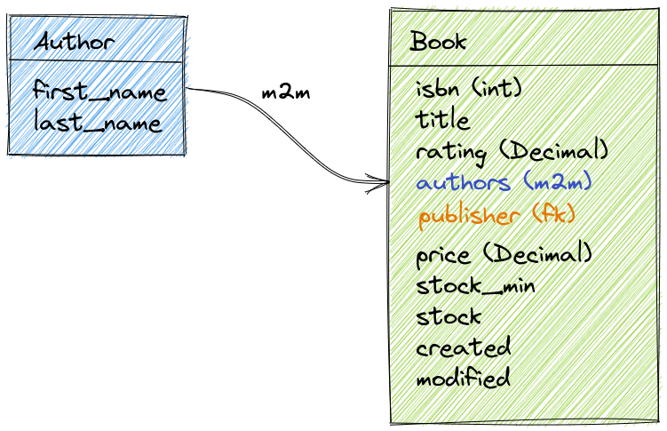
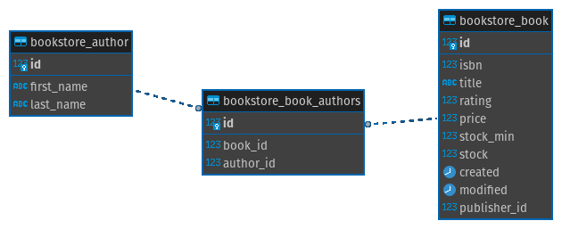
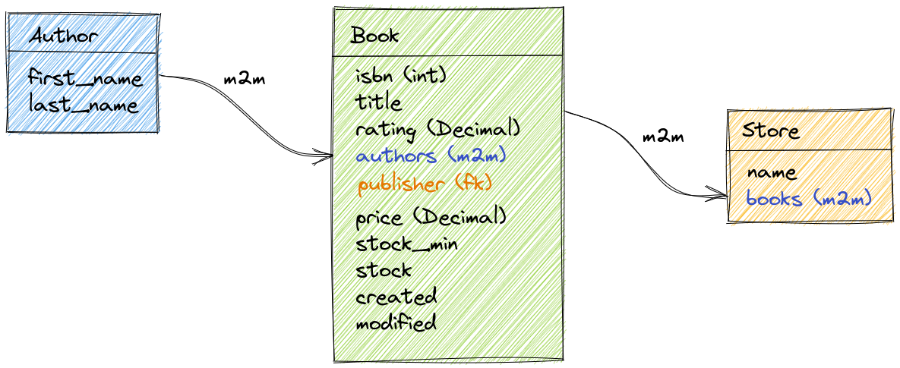
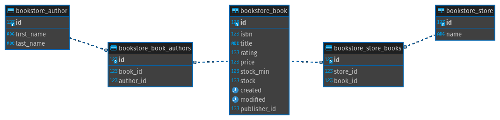
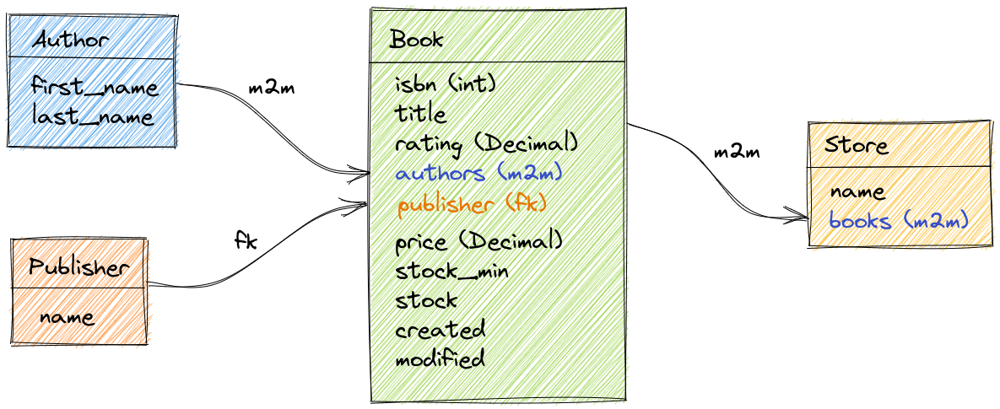
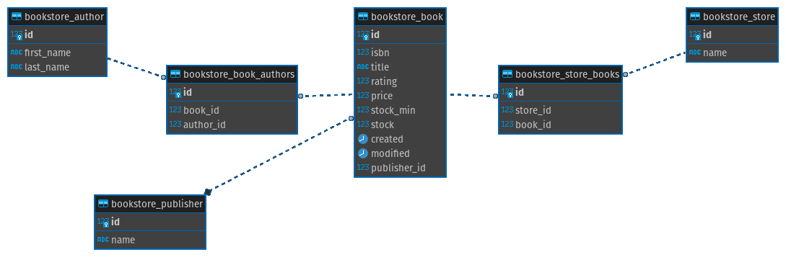
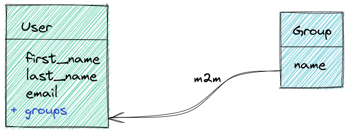
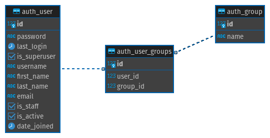

# Dica 19.3 - Modelagem - ManyToMany - Muitos pra Muitos

**Versões usadas no vídeo:** Django 4.1.3, Python 3.10 e PostgreSQL 14 (no Docker).
{: .versoes }

<a href="https://youtu.be/nbynxIa8RNs">
    
</a>

Código: [https://github.com/rg3915/dicas-de-django](https://github.com/rg3915/dicas-de-django) (branch `aula21`)

Este vídeo é um corte da live [Segredos do ORM do Django](https://youtu.be/Qu2QTxdYfZ4) e é a terceira parte da série sobre modelagem. Depois do OneToMany ([Dica 19.1](079-19-1-modelagem-onetomany.md)) e do OneToOne ([Dica 19.2](080-19-2-modelagem-onetoone.md)), agora é a vez do **ManyToMany** (muitos para muitos), com três exemplos:

1. **autor e livro**: um autor pode escrever vários livros, e um livro pode ser escrito por vários autores;
2. **livro e loja**: uma loja vende vários livros, e um livro está em várias lojas; e, no mesmo exemplo, uma **editora** ligada ao livro por `ForeignKey`;
3. **usuário e grupo**: o relacionamento que o próprio Django já traz pronto.

## Pré-requisitos

O app `bookstore` das dicas anteriores, com `Customer`, `Ordered` e `Sale`, e o Jupyter Notebook com o `shell_plus --notebook` da [Dica 19.1](079-19-1-modelagem-onetomany.md).

## ManyToMany entre autor e livro



O autor tem nome e sobrenome. O livro tem ISBN, título, pontuação (`rating`), os autores (o ManyToMany), o preço, o estoque mínimo, o estoque e as datas de criação e modificação.

Acrescente em `bookstore/models.py`:

```python
# backend/bookstore/models.py
...


class Author(models.Model):
    first_name = models.CharField('nome', max_length=100)
    last_name = models.CharField('sobrenome', max_length=255, null=True, blank=True)  # noqa E501

    class Meta:
        ordering = ('first_name',)
        verbose_name = 'autor'
        verbose_name_plural = 'autores'

    @property
    def full_name(self):
        return f'{self.first_name} {self.last_name or ""}'.strip()

    def __str__(self):
        return self.full_name


class Book(models.Model):
    isbn = models.CharField(max_length=13, unique=True)
    title = models.CharField('título', max_length=255)
    rating = models.DecimalField('pontuação', max_digits=5, decimal_places=2, default=5)
    authors = models.ManyToManyField(
        Author,
        verbose_name='autores',
        blank=True
    )
    price = models.DecimalField('preço', max_digits=5, decimal_places=2)
    stock_min = models.PositiveSmallIntegerField(default=0)
    stock = models.PositiveSmallIntegerField(default=0)
    created = models.DateTimeField(
        'criado em',
        auto_now_add=True,
        auto_now=False
    )
    modified = models.DateTimeField(
        'modificado em',
        auto_now_add=False,
        auto_now=True
    )

    class Meta:
        ordering = ('title',)
        verbose_name = 'livro'
        verbose_name_plural = 'livros'

    def __str__(self):
        return f'{self.title}'
```

A novidade é o `authors = models.ManyToManyField(Author, ...)`:

* O nome do campo costuma ficar **no plural**, porque guarda vários objetos.
* Tanto faz em qual dos dois models o `ManyToManyField` fica; daria para colocar um `books` em `Author`. Aqui ele fica em `Book` porque fica mais fácil de entender: "o livro tem autores".
* O `blank=True` deixa cadastrar um livro sem autor no admin. Em ManyToMany não se usa `null=True`, porque não existe coluna nas tabelas dos dois models.
* `isbn` tem `unique=True` e até 13 caracteres; `price` e `rating` são `DecimalField`; `modified` usa `auto_now=True`, que atualiza a data a cada `save()`.

No admin, acrescente os imports e os dois registros:

```python
# backend/bookstore/admin.py
from django.contrib import admin

from .models import Author, Book, Customer, Ordered, Sale

...


@admin.register(Author)
class AuthorAdmin(admin.ModelAdmin):
    list_display = ('__str__',)
    search_fields = ('first_name', 'last_name')


@admin.register(Book)
class BookAdmin(admin.ModelAdmin):
    list_display = (
        'isbn',
        '__str__',
        'rating',
        'price',
        'stock_min',
        'stock',
    )
    list_display_links = ('__str__',)
    search_fields = ('isbn', 'title')
```

O `list_display_links` faz o link para a edição ficar no título, e não na primeira coluna (o ISBN).

```bash
python manage.py makemigrations
python manage.py migrate
```

```
Migrations for 'bookstore':
  backend/bookstore/migrations/0003_author_book.py
    - Create model Author
    - Create model Book
...
  Applying bookstore.0003_author_book... OK
```

### A tabela intermediária



Olhando o banco pelo pgAdmin, apareceram **três** tabelas novas: `bookstore_author`, `bookstore_book` e `bookstore_book_authors`. A terceira é a **tabela intermediária**, criada automaticamente pelo Django: cada linha tem um `book_id` e um `author_id`, ou seja, liga um livro a um autor. É assim que um relacionamento muitos para muitos é guardado num banco relacional.

### Jupyter Notebook

Rode `python manage.py shell_plus --notebook`. Se o notebook já estava aberto, reinicie o kernel (**Kernel > Restart**) para ele enxergar os models novos; senão você recebe `NameError: name 'Author' is not defined`.

```python
# Criando os autores
daniel = Author.objects.create(first_name='Daniel', last_name='Greenfeld')
audrey = Author.objects.create(first_name='Audrey', last_name='Greenfeld')

# Criando o livro
book = Book.objects.create(
    title='Two Scoops of Django',
    isbn='9780981467344',
    price=44.95
)

book
# <Book: Two Scoops of Django>
```

(O ISBN e o preço são só de exemplo.) Para associar os autores ao livro, use o `add()` do campo ManyToMany. Cada `add()` cria uma linha na tabela intermediária:

```python
# Associando os autores ao livro
book.authors.add(daniel)
book.authors.add(audrey)

# Retornando os autores do livro
book.authors.all()
# <QuerySet [<Author: Audrey Greenfeld>, <Author: Daniel Greenfeld>]>
```

O Daniel e a Audrey Greenfeld são os dois autores do Two Scoops of Django. (O `add()` também aceita vários objetos de uma vez: `book.authors.add(daniel, audrey)`.)

Agora o caminho contrário: todos os livros de um autor. O `authors__last_name` atravessa o relacionamento e filtra pelo sobrenome do autor:

```python
# Buscando por todos os livros do autor informado
Book.objects.filter(authors__last_name='Greenfeld')
# <QuerySet [<Book: Two Scoops of Django>, <Book: Two Scoops of Django>]>
```

O livro veio **duplicado**: como os dois autores têm o sobrenome Greenfeld, o `JOIN` com a tabela intermediária devolve uma linha para cada autor. O `distinct()` resolve:

```python
Book.objects.filter(authors__last_name='Greenfeld').distinct()
# <QuerySet [<Book: Two Scoops of Django>]>
```

Fica a dica: sempre que filtrar por um campo de um relacionamento "para muitos", lembre do `distinct()`.

E os autores de um livro pelo título. Repare que, a partir de `Author`, o caminho para o livro se chama `book`: como não definimos `related_name` no `ManyToManyField`, o Django usa o nome do model em minúsculo nas buscas (e `book_set` no acesso pelo objeto, como em `daniel.book_set.all()`):

```python
# Buscando pelo autor cujo livro se chama 'Two Scoops of Django'
Author.objects.filter(book__title='Two Scoops of Django')
# <QuerySet [<Author: Audrey Greenfeld>, <Author: Daniel Greenfeld>]>
```

## Exemplo: livro e loja



Outro ManyToMany: cada loja tem vários livros, e um livro pode estar em várias lojas.

```python
# backend/bookstore/models.py
class Store(models.Model):
    name = models.CharField('nome', max_length=255)
    books = models.ManyToManyField(
        Book,
        verbose_name='livros',
        blank=True
    )

    class Meta:
        ordering = ('name',)
        verbose_name = 'loja'
        verbose_name_plural = 'lojas'

    def __str__(self):
        return f'{self.name}'
```

```python
# backend/bookstore/admin.py
from .models import Store


@admin.register(Store)
class StoreAdmin(admin.ModelAdmin):
    list_display = ('__str__',)
    search_fields = ('name',)
```

Junte o `Store` no import que já existe e rode o `make lint` para o isort organizar as importações.

```bash
python manage.py makemigrations
python manage.py migrate
```

```
Migrations for 'bookstore':
  backend/bookstore/migrations/0004_store.py
    - Create model Store
...
  Applying bookstore.0004_store... OK
```



Agora são duas tabelas intermediárias: `bookstore_book_authors` (livro e autor) e `bookstore_store_books` (loja e livro).

## Exemplo: editora com ForeignKey





Para completar, cada livro tem **uma** editora, e uma editora publica vários livros. Isso é um OneToMany, então é uma `ForeignKey` em `Book`, como fizemos na Dica 19.1:

```python
# backend/bookstore/models.py
class Book(models.Model):
    ...
    stock = models.PositiveSmallIntegerField(default=0)
    publisher = models.ForeignKey(
        'Publisher',
        on_delete=models.SET_NULL,
        verbose_name='editora',
        related_name='books',
        null=True,
        blank=True
    )
    created = models.DateTimeField(
    ...


class Publisher(models.Model):
    name = models.CharField('nome', max_length=255)

    class Meta:
        ordering = ('name',)
        verbose_name = 'editora'
        verbose_name_plural = 'editoras'

    def __str__(self):
        return f'{self.name}'
```

O `'Publisher'` está entre aspas porque a classe `Publisher` é definida **depois** de `Book` no arquivo. Com o nome em texto, o Django resolve a referência depois de carregar todos os models.

```python
# backend/bookstore/admin.py
from .models import Publisher


@admin.register(Publisher)
class PublisherAdmin(admin.ModelAdmin):
    list_display = ('__str__',)
    search_fields = ('name',)
```

E adicione `publisher` no `list_display` de `BookAdmin`. Depois do `make lint`, o `admin.py` fica assim (trecho; o arquivo completo está no link logo abaixo):

```python
# backend/bookstore/admin.py
from django.contrib import admin

from .models import Author, Book, Customer, Ordered, Publisher, Sale, Store

# ... (veja o arquivo completo no GitHub)


@admin.register(Book)
class BookAdmin(admin.ModelAdmin):
    list_display = (
        'isbn',
        '__str__',
        'rating',
        'price',
        'stock_min',
        'stock',
        'publisher',
    )
    list_display_links = ('__str__',)
    search_fields = ('isbn', 'title')

# ... (veja o arquivo completo no GitHub)


@admin.register(Publisher)
class PublisherAdmin(admin.ModelAdmin):
    list_display = ('__str__',)
    search_fields = ('name',)
```

Código completo: [backend/bookstore/admin.py](https://github.com/rg3915/dicas-de-django/blob/307a89f949cf63b05b70192ba9068551fd13fdf8/backend/bookstore/admin.py)

```bash
python manage.py makemigrations
python manage.py migrate
```

```
Migrations for 'bookstore':
  backend/bookstore/migrations/0005_publisher_book_publisher.py
    - Create model Publisher
    - Add field publisher to book
```

Se você esquecer as migrações (como aconteceu no vídeo), ao rodar as consultas do notebook o PostgreSQL reclama que a coluna `publisher_id` não existe na tabela `bookstore_book`. Rode `makemigrations` e `migrate` e reinicie o kernel.

### Jupyter Notebook

No vídeo, antes deste passo foi cadastrado pelo admin um segundo livro com o mesmo título (e outro ISBN, já que o campo é único). Por isso o filtro devolve dois livros:

```python
book = Book.objects.filter(title__icontains='two scoops')
book
# <QuerySet [<Book: Two Scoops of Django>, <Book: Two Scoops of Django>]>
```

O `filter()` sempre devolve um queryset. Para pegar um objeto só, use o `first()`:

```python
book = Book.objects.filter(title__icontains='two scoops').first()
book
# <Book: Two Scoops of Django>

publisher = Publisher.objects.create(name='Feldroy')

book.publisher = publisher
book.save()

# Conferindo
book.publisher
# <Publisher: Feldroy>
```

Diferente do ManyToMany, na `ForeignKey` não existe `add()`: basta atribuir o objeto ao campo e salvar o livro.

## Exemplo: usuário e grupo





O Django já traz um ManyToMany pronto: o usuário e os **grupos** de permissão. O campo `groups` vem do `PermissionsMixin`, que o nosso usuário customizado herda. No pgAdmin dá para ver a tabela intermediária `accounts_user_groups`, entre `accounts_user` e `auth_group` (no `User` padrão do Django ela se chama `auth_user_groups`, como no diagrama).

### Jupyter Notebook

No `shell_plus` o model `Group` já vem importado.

```python
# Cria grupos
grupos = ['gerente', 'vendedor', 'comprador', 'entregador']

[Group.objects.create(name=grupo) for grupo in grupos]
# [<Group: gerente>, <Group: vendedor>, <Group: comprador>, <Group: entregador>]

Group.objects.count()
# 4

Group.objects.all()
# <QuerySet [<Group: gerente>, <Group: vendedor>, <Group: comprador>, <Group: entregador>]>
```

Escrever a lista antes e criar os grupos com uma *list comprehension* ajuda a não se perder.

```python
# Cria usuário
gerson = User.objects.create(email='gerson@email.com', first_name='Gerson')

# Associa usuário a um grupo
vendedor = Group.objects.get(name='vendedor')
gerson.groups.add(vendedor)

# Retorna os grupos do usuário
gerson.groups.all()
# <QuerySet [<Group: vendedor>]>

# Cria usuário
jeremias = User.objects.create(email='jeremias@email.com', first_name='Jeremias')

# Associa usuário a um grupo
jeremias.groups.add(vendedor)

# Retorna todos os usuários do grupo 'vendedor'
User.objects.filter(groups__name='vendedor')
# <QuerySet [<User: gerson@email.com>, <User: jeremias@email.com>]>
```

O `get()` devolve um objeto só (e dá erro se não achar ou se achar mais de um), enquanto o `filter()` devolve um queryset. No admin, em **Usuários**, o Gerson e o Jeremias aparecem com o grupo vendedor.

Resumindo: o `ManyToManyField` cria uma tabela intermediária com as chaves dos dois lados; ligamos os objetos com `add()` e consultamos nos dois sentidos com `__` nos filtros, lembrando do `distinct()` para evitar resultados repetidos.

Próxima dica: [Dica 19.4 - Modelagem - Abstract Inheritance](082-19-4-modelagem-abstract-inheritance.md).
