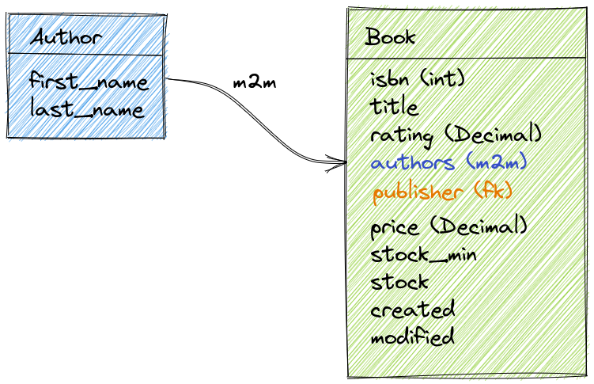
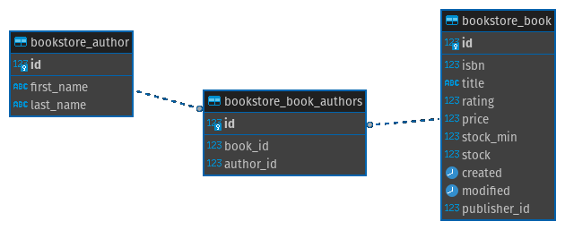
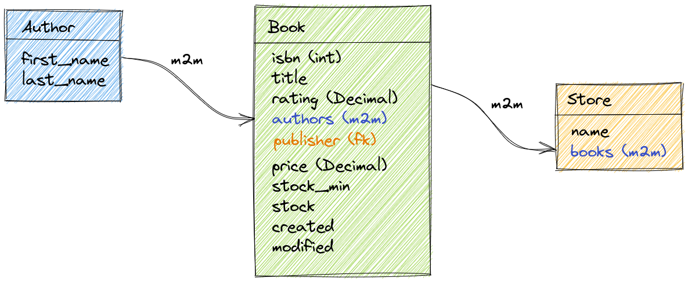
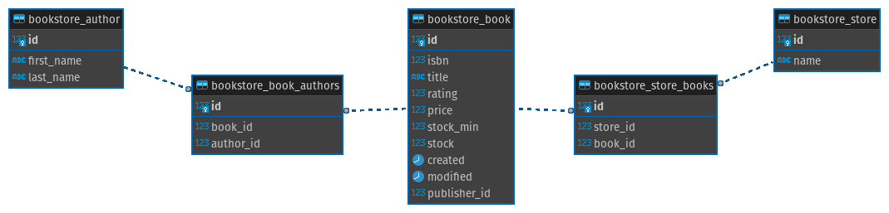
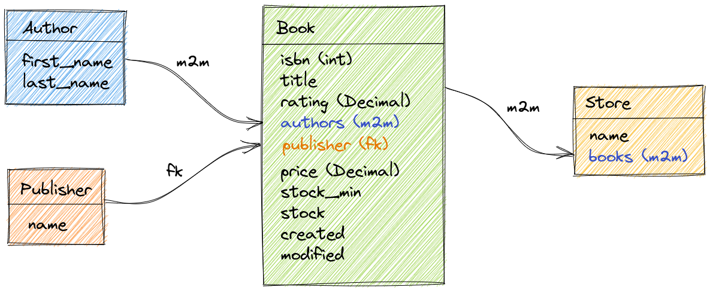
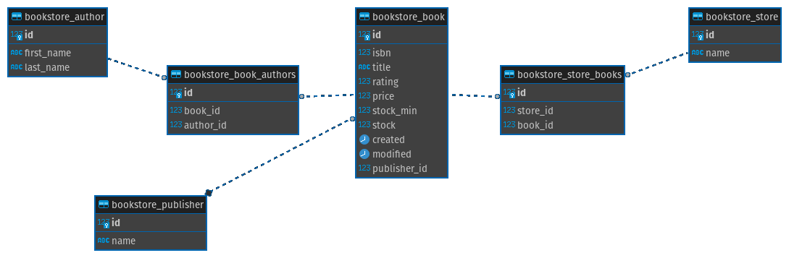
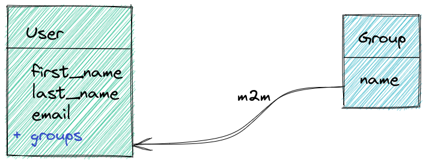
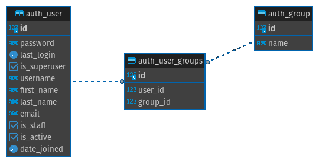

# Dica 21 - Modelagem - ManyToMany - Muitos pra Muitos



```python
# bookstore/models.py
class Author(models.Model):
    first_name = models.CharField('nome', max_length=100)
    last_name = models.CharField('sobrenome', max_length=255, null=True, blank=True)  # noqa E501

    class Meta:
        ordering = ('first_name',)
        verbose_name = 'autor'
        verbose_name_plural = 'autores'

    @property
    def full_name(self):
        return f'{self.first_name} {self.last_name or ""}'.strip()

    def __str__(self):
        return self.full_name


class Book(models.Model):
    isbn = models.CharField(max_length=13, unique=True)
    title = models.CharField('título', max_length=255)
    rating = models.DecimalField('pontuação', max_digits=5, decimal_places=2, default=5)
    authors = models.ManyToManyField(
        Author,
        verbose_name='autores',
        blank=True
    )
    price = models.DecimalField('preço', max_digits=5, decimal_places=2)
    stock_min = models.PositiveSmallIntegerField(default=0)
    stock = models.PositiveSmallIntegerField(default=0)
    created = models.DateTimeField(
        'criado em',
        auto_now_add=True,
        auto_now=False
    )
    modified = models.DateTimeField(
        'modificado em',
        auto_now_add=False,
        auto_now=True
    )

    class Meta:
        ordering = ('title',)
        verbose_name = 'livro'
        verbose_name_plural = 'livros'

    def __str__(self):
        return f'{self.title}'
```

```python
# bookstore/admin.py
from .models import Author, Book


@admin.register(Author)
class AuthorAdmin(admin.ModelAdmin):
    list_display = ('__str__',)
    search_fields = ('first_name', 'last_name')


@admin.register(Book)
class BookAdmin(admin.ModelAdmin):
    list_display = (
        'isbn',
        '__str__',
        'rating',
        'price',
        'stock_min',
        'stock',
    )
    list_display_links = ('__str__',)
    search_fields = ('isbn', 'title')
```

```
python manage.py makemigrations
python manage.py migrate
```




### Jupyter Notebook

```python
# Criando os autores
daniel = Author.objects.create(first_name='Daniel', last_name='Greenfeld')
audrey = Author.objects.create(first_name='Audrey', last_name='Greenfeld')

# Criando o livro
book = Book.objects.create(
    title='Two Scoops of Django',
    isbn='9780981467344',
    price=44.95
)

# Associando os autores ao livro
book.authors.add(daniel)
book.authors.add(audrey)

# Retornando os autores do livro
book.authors.all()

# Buscando por todos os livros do autor informado
Book.objects.filter(authors__last_name='Greenfeld').distinct()

# Buscando pelo autor cujo livro se chama 'Two Scoops of Django'
Author.objects.filter(book__title='Two Scoops of Django')
```

### Exemplo



```python
# bookstore/models.py
class Store(models.Model):
    name = models.CharField('nome', max_length=255)
    books = models.ManyToManyField(
        Book,
        verbose_name='livros',
        blank=True
    )

    class Meta:
        ordering = ('name',)
        verbose_name = 'loja'
        verbose_name_plural = 'lojas'

    def __str__(self):
        return f'{self.name}'
```

```python
# bookstore/admin.py
from .models import Store

@admin.register(Store)
class StoreAdmin(admin.ModelAdmin):
    list_display = ('__str__',)
    search_fields = ('name',)
```

```
python manage.py makemigrations
python manage.py migrate
```



### Exemplo





```python
# bookstore/models.py
class Book(models.Model):
    ...
    publisher = models.ForeignKey(
        'Publisher',
        on_delete=models.SET_NULL,
        verbose_name='editora',
        related_name='books',
        null=True,
        blank=True
    )

class Publisher(models.Model):
    name = models.CharField('nome', max_length=255)

    class Meta:
        ordering = ('name',)
        verbose_name = 'editora'
        verbose_name_plural = 'editoras'

    def __str__(self):
        return f'{self.name}'
```

```python
# bookstore/admin.py
from .models import Publisher


@admin.register(Publisher)
class PublisherAdmin(admin.ModelAdmin):
    list_display = ('__str__',)
    search_fields = ('name',)
```

> Adicione `publisher` no `list_display` de `BookAdmin`.

```
python manage.py makemigrations
python manage.py migrate
```


### Jupyter Notebook

```python
book = Book.objects.filter(title__icontains='two scoops').first()
publisher = Publisher.objects.create(name='Feldroy')

book.publisher = publisher
book.save()

# Conferindo
book.publisher
```


### Exemplo







### Jupyter Notebook

```python
# Cria grupos
grupos = ['gerente', 'vendedor', 'comprador', 'entregador']

[Group.objects.create(name=grupo) for grupo in grupos]

Group.objects.count()
Group.objects.all()

# Cria usuário
gerson = User.objects.create(email='gerson@email.com', first_name='Gerson')

# Associa usuário a um grupo
vendedor = Group.objects.get(name='vendedor')
gerson.groups.add(vendedor)

# Retorna os grupos do usuário
gerson.groups.all()

# Cria usuário
jeremias = User.objects.create(email='jeremias@email.com', first_name='Jeremias')

# Associa usuário a um grupo
jeremias.groups.add(vendedor)

# Retorna todos os usuários do grupo 'vendedor'
User.objects.filter(groups__name='vendedor')
```
