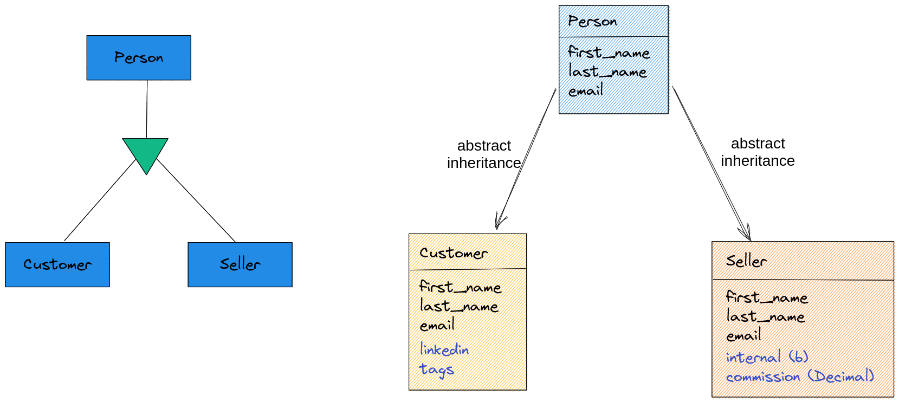
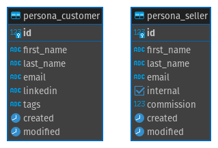
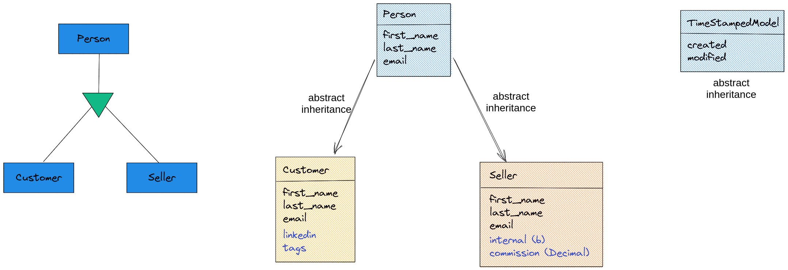

# Dica 19.4 - Modelagem - Abstract Inheritance - Herança Abstrata

**Versões usadas no vídeo:** Django 4.1.3, Python 3.10, PostgreSQL 14 (no Docker) e django-seed 0.3.1.
{: .versoes }

<a href="https://youtu.be/0o-Zy1TgI0E">
    
</a>

Código: [https://github.com/rg3915/dicas-de-django](https://github.com/rg3915/dicas-de-django) (branch `aula22`)

Este vídeo é um corte da live [Segredos do ORM do Django](https://youtu.be/Qu2QTxdYfZ4) e é a quarta parte da série sobre modelagem. Agora não é mais um relacionamento entre tabelas, e sim **herança** entre models. Começamos pela **herança abstrata** (*abstract inheritance*): um model base, marcado como `abstract = True`, que não vira tabela; os campos dele são **copiados** para cada model que herda dele.

## Pré-requisitos

O projeto das dicas anteriores ([Dica 19.1](079-19-1-modelagem-onetomany.md) a [Dica 19.3](081-19-3-modelagem-manytomany.md)), com o app `crm` já criado e registrado em `INSTALLED_APPS` (`'backend.crm'`), mas ainda sem models, e o django-seed instalado.

## Abstract Inheritance - Herança Abstrata



Temos dois tipos de pessoa no CRM: o **cliente** (`Customer`) e o **vendedor** (`Seller`). Os dois têm nome, sobrenome e e-mail. Além disso, o cliente tem LinkedIn e *tags*, e o vendedor tem um booleano que diz se ele é interno e um `DecimalField` com a comissão.

Em vez de repetir os três campos comuns nos dois models, criamos um model `Person` com eles e colocamos `abstract = True` na `class Meta`. Só isso. O `Person` não vira tabela no banco; os campos dele são copiados para as tabelas `crm_customer` e `crm_seller`:



```python
# backend/crm/models.py
from django.db import models


class Person(models.Model):
    first_name = models.CharField('nome', max_length=100)
    last_name = models.CharField('sobrenome', max_length=255, null=True, blank=True)  # noqa E501
    email = models.EmailField('e-mail', max_length=50, unique=True)

    class Meta:
        abstract = True
        ordering = ('first_name',)

    @property
    def full_name(self):
        return f'{self.first_name} {self.last_name or ""}'.strip()

    def __str__(self):
        return self.full_name


class Customer(Person):
    linkedin = models.URLField(max_length=255, null=True, blank=True)
    tags = models.TextField(null=True, blank=True)

    class Meta:
        verbose_name = 'cliente'
        verbose_name_plural = 'clientes'


class Seller(Person):
    internal = models.BooleanField('interno', default=True)
    commission = models.DecimalField('comissão', max_digits=7, decimal_places=2, default=0)  # noqa E501

    class Meta:
        verbose_name = 'vendedor'
        verbose_name_plural = 'vendedores'
```

* `Customer` e `Seller` herdam de `Person` em vez de `models.Model`, e acrescentam só os campos próprios.
* Além dos campos, eles herdam a propriedade `full_name` e o `__str__`.
* Repare que o `email` com `unique=True` vale para cada tabela separadamente: o mesmo e-mail pode existir uma vez em `crm_customer` e outra em `crm_seller`.

O admin:

```python
# backend/crm/admin.py
from django.contrib import admin

from .models import Customer, Seller


@admin.register(Customer)
class CustomerAdmin(admin.ModelAdmin):
    list_display = ('__str__', 'email', 'linkedin')
    search_fields = ('first_name', 'last_name', 'email')


@admin.register(Seller)
class SellerAdmin(admin.ModelAdmin):
    list_display = ('__str__', 'email', 'internal', 'commission')
    search_fields = ('first_name', 'last_name', 'email')
    list_filter = ('internal',)
```

```bash
python manage.py makemigrations
python manage.py migrate
```

```
Migrations for 'crm':
  backend/crm/migrations/0001_initial.py
    - Create model Customer
    - Create model Seller
...
  Applying crm.0001_initial... OK
```

Não existe `Create model Person`: o model abstrato não gera tabela.

## TimeStampedModel

Um `abstract` muito comum é o `TimeStampedModel`, que acrescenta em qualquer model as datas de criação (`created`) e de modificação (`modified`), como as que já usamos em `Book`.



Como ele vai ser usado em vários apps, ele fica no app principal, o `core`, no início do `core/models.py` (antes do `Profile` da [Dica 19.2](080-19-2-modelagem-onetoone.md)):

```python
# backend/core/models.py
from django.db import models
from django.db.models.signals import post_save
from django.dispatch import receiver

from backend.accounts.models import User


class TimeStampedModel(models.Model):
    created = models.DateTimeField(
        'criado em',
        auto_now_add=True,
        auto_now=False
    )
    modified = models.DateTimeField(
        'modificado em',
        auto_now_add=False,
        auto_now=True
    )

    class Meta:
        abstract = True


class Profile(models.Model):
    ...
```

* `auto_now_add=True`: preenche `created` com a data e hora no momento da criação.
* `auto_now=True`: atualiza `modified` toda vez que o objeto é salvo.

E podemos herdar, por exemplo, em `crm` nos models `Customer` e `Seller`. Um model pode herdar de mais de um model abstrato:

```python
# backend/crm/models.py
from django.db import models

from backend.core.models import TimeStampedModel


class Person(models.Model):
    ...


class Customer(Person, TimeStampedModel):
    ...


class Seller(Person, TimeStampedModel):
    ...
```

```bash
python manage.py makemigrations
```

Como as tabelas já existem, o Django pergunta que valor colocar no `created` dos registros existentes (o `auto_now_add` não tem `default`):

```
It is impossible to add the field 'created' with 'auto_now_add=True' to customer without providing a default. This is because the database needs something to populate existing rows.
 1) Provide a one-off default now which will be set on all existing rows
 2) Quit and manually define a default value in models.py.
Select an option: 1
Please enter the default value as valid Python.
Accept the default 'timezone.now' by pressing 'Enter' or provide another value.
The datetime and django.utils.timezone modules are available, so it is possible to provide e.g. timezone.now as a value.
Type 'exit' to exit this prompt
[default: timezone.now] >>>
```

Escolha a opção `1` e aperte Enter para aceitar o `timezone.now`, ou seja, a data e hora de agora. A mesma pergunta aparece de novo para o `seller`; responda do mesmo jeito. (O `modified` não pergunta nada, porque com `auto_now=True` o Django já sabe preencher.)

```
Migrations for 'crm':
  backend/crm/migrations/0002_customer_created_customer_modified_seller_created_and_more.py
    - Add field created to customer
    - Add field modified to customer
    - Add field created to seller
    - Add field modified to seller
```

```bash
python manage.py migrate
```

## Django seed

Vamos gerar 5 clientes e 5 vendedores com o django-seed (instalado na [Dica 19.1](079-19-1-modelagem-onetomany.md)):

```bash
python manage.py seed crm --number=5
```

```
Seeding 5 Customers
Seeding 5 Sellers
Model Customer generated record with primary key 1
...
Model Seller generated record with primary key 5
```

No `shell_plus` (ou no Jupyter Notebook, reiniciando o kernel):

```bash
python manage.py shell_plus
```

```python
Customer.objects.all()
# <QuerySet [<Customer: Justin Farley>, <Customer: Shari Morales>, <Customer: Timothy Prince>, <Customer: Jennifer Morales>, <Customer: John Hill>]>

sellers = Seller.objects.all()

for seller in sellers:
    print(seller.first_name, seller.created)
```

```
Bryan 2008-09-13 20:06:49+00:00
Patrick 2005-07-15 22:12:00+00:00
Heather 2000-02-14 10:39:39+00:00
Kelly 1990-02-16 17:26:53+00:00
Stephanie 1998-01-03 06:16:29+00:00
```

Mas o `django-seed` altera o campo `created` também: ele preenche todos os campos com valores aleatórios, inclusive as datas, que não têm nada a ver com hoje. Então façamos os registros na mão, com uma pausa entre um e outro para as datas ficarem diferentes:

```python
from time import sleep

names = ['Huguinho', 'Zezinho', 'Luizinho']

for name in names:
    Seller.objects.create(
        first_name=name,
        last_name='Donald',
        email=f'{name.lower()}@email.com'
    )
    sleep(1.2)  # Só um testezinho de delay

sellers = Seller.objects.filter(last_name='Donald')

for seller in sellers:
    print(seller.first_name, seller.created)
```

```
Huguinho 2022-12-19 16:09:37.591917+00:00
Zezinho 2022-12-19 16:09:38.804876+00:00
Luizinho 2022-12-19 16:09:40.016960+00:00
```

Agora o `created` tem a data e hora reais da criação de cada registro, com pouco mais de um segundo de diferença entre eles.

## Uma pegadinha: o `ordering` do model abstrato

Repare que nem os clientes nem os vendedores saíram em ordem alfabética, embora o `Person` tenha `ordering = ('first_name',)`. Isso acontece porque `Customer` e `Seller` declaram a **própria** `class Meta`, e ela substitui a `Meta` do `Person`. Só os campos, métodos e propriedades são herdados; para herdar também as opções da `Meta`, a `Meta` do filho precisa herdar da `Meta` do pai:

```python
class Customer(Person, TimeStampedModel):
    ...

    class Meta(Person.Meta):
        verbose_name = 'cliente'
        verbose_name_plural = 'clientes'
```

O Django tira o `abstract = True` da `Meta` herdada, então o `Customer` continua sendo um model normal, agora ordenado por `first_name`. O vídeo e o repositório mantêm a versão sem `(Person.Meta)`.

Resumindo: use a herança abstrata quando vários models compartilham os mesmos campos, mas cada um deve ter a sua tabela. O model abstrato não existe no banco e não pode ser consultado (não existe `Person.objects`). Se você precisar de uma tabela para a classe base, o caminho é a herança multi-tabela, assunto da próxima dica.

Próxima dica: [Dica 19.5 - Modelagem - Multi-table Inheritance](083-19-5-modelagem-multi-table-inheritance.md).
