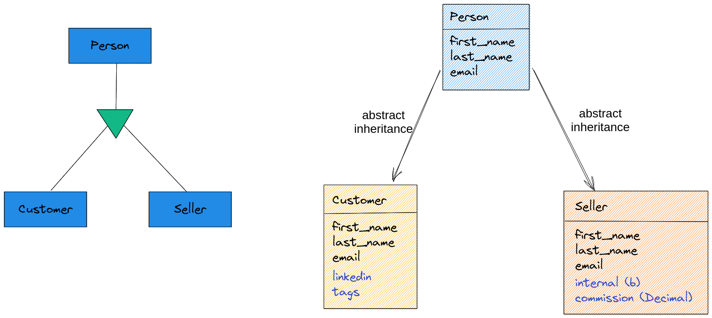
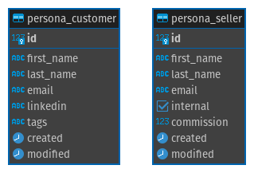
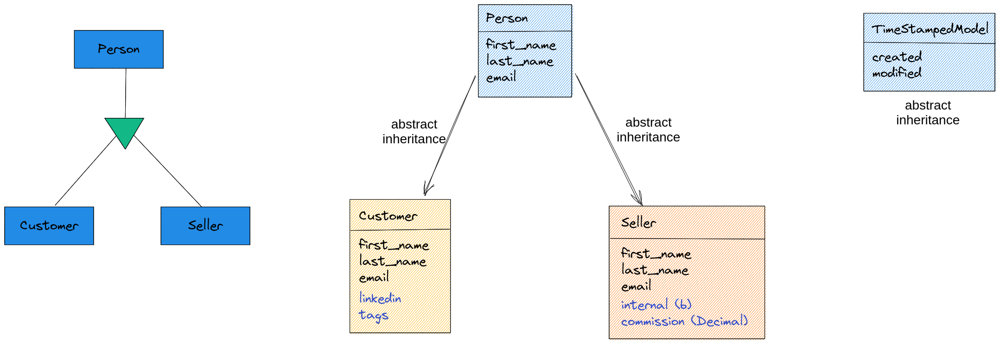

# Dica 22 - Modelagem - Abstract Inheritance - Herança Abstrata

## Abstract Inheritance - Herança Abstrata






```python
# crm/models.py
from django.db import models


class Person(models.Model):
    first_name = models.CharField('nome', max_length=100)
    last_name = models.CharField('sobrenome', max_length=255, null=True, blank=True)  # noqa E501
    email = models.EmailField('e-mail', max_length=50, unique=True)

    class Meta:
        abstract = True
        ordering = ('first_name',)

    @property
    def full_name(self):
        return f'{self.first_name} {self.last_name or ""}'.strip()

    def __str__(self):
        return self.full_name


class Customer(Person):
    linkedin = models.URLField(max_length=255, null=True, blank=True)
    tags = models.TextField(null=True, blank=True)

    class Meta:
        verbose_name = 'cliente'
        verbose_name_plural = 'clientes'


class Seller(Person):
    internal = models.BooleanField('interno', default=True)
    commission = models.DecimalField('comissão', max_digits=7, decimal_places=2, default=0)  # noqa E501

    class Meta:
        verbose_name = 'vendedor'
        verbose_name_plural = 'vendedores'

```

```python
# crm/admin.py
from django.contrib import admin

from .models import Customer, Seller


@admin.register(Customer)
class CustomerAdmin(admin.ModelAdmin):
    list_display = ('__str__', 'email', 'linkedin')
    search_fields = ('first_name', 'last_name', 'email')


@admin.register(Seller)
class SellerAdmin(admin.ModelAdmin):
    list_display = ('__str__', 'email', 'internal', 'commission')
    search_fields = ('first_name', 'last_name', 'email')
    list_filter = ('internal',)

```


```
python manage.py makemigrations
python manage.py migrate
```

### TimeStampedModel

Um `abstract` muito comum é o `TimeStampedModel`.




```python
# core/models.py
class TimeStampedModel(models.Model):
    created = models.DateTimeField(
        'criado em',
        auto_now_add=True,
        auto_now=False
    )
    modified = models.DateTimeField(
        'modificado em',
        auto_now_add=False,
        auto_now=True
    )

    class Meta:
        abstract = True
```

E podemos herdar, por exemplo, em `crm` nos models `Customer` e `Seller`.

```python
# crm/models.py
from backend.core.models import TimeStampedModel

class Customer(Person, TimeStampedModel):
    ...

class Seller(Person, TimeStampedModel):
    ...

```


```
python manage.py makemigrations
python manage.py migrate
```

### Django seed

```
python manage.py seed crm --number=5
```

```python
python manage.py shell_plus

Customer.objects.all()

sellers = Seller.objects.all()

for seller in sellers:
    print(seller.first_name, seller.created)
```

Mas o `django-seed` altera o campo `created` também, então façamos

```python
from time import sleep

names = ['Huguinho', 'Zezinho', 'Luizinho']

for name in names:
    Seller.objects.create(
        first_name=name,
        last_name='Donald',
        email=f'{name.lower()}@email.com'
    )
    sleep(1.2)  # Só um testezinho de delay

sellers = Seller.objects.filter(last_name='Donald')

for seller in sellers:
    print(seller.first_name, seller.created)

```
