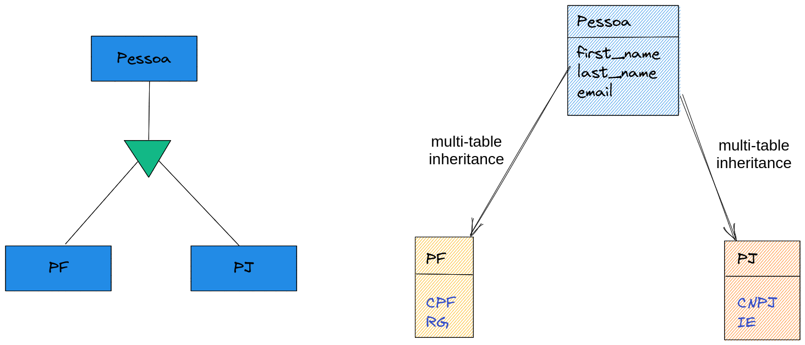
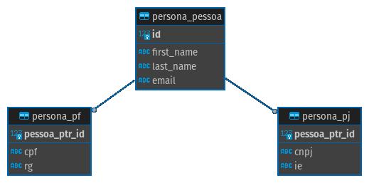

# Dica 19.5 - Modelagem - Multi-table Inheritance - Herança Multi-tabela

**Versões usadas no vídeo:** Django 4.1.3, Python 3.10 e PostgreSQL 14 (no Docker).
{: .versoes }

<a href="https://youtu.be/p_BQe6tWhxY">
    
</a>

Código: [https://github.com/rg3915/dicas-de-django](https://github.com/rg3915/dicas-de-django) (commit "MTI. close #114", na branch `aula23`)

Este vídeo é um corte da live [Segredos do ORM do Django](https://youtu.be/Qu2QTxdYfZ4) e é a quinta parte da série sobre modelagem. Na [Dica 19.4](082-19-4-modelagem-abstract-inheritance.md) vimos a herança abstrata, em que a classe base não vira tabela. Agora vamos ver a **herança multi-tabela** (*multi-table inheritance*, que dá para abreviar como **MTI**): a classe base **também** é uma tabela, e cada filha tem a sua própria tabela, ligada à da base por um `OneToOneField` criado automaticamente.

## Pré-requisitos

O app `crm` da [Dica 19.4](082-19-4-modelagem-abstract-inheritance.md) e o Jupyter Notebook com o `shell_plus --notebook` da [Dica 19.1](079-19-1-modelagem-onetomany.md).

## Multi-table Inheritance - Herança Multi-tabela



Temos uma **pessoa** (`Pessoa`) com nome, sobrenome e e-mail. Uma **pessoa física** (`PF`) acrescenta CPF e RG; uma **pessoa jurídica** (`PJ`) acrescenta CNPJ e inscrição estadual.

O código é quase igual ao da herança abstrata. A única diferença é que a `class Meta` de `Pessoa` **não tem** `abstract = True`. Como a classe pai não é abstrata, quando `PF` e `PJ` herdam dela, temos uma herança multi-tabela. Acrescente no fim de `crm/models.py`:

```python
# backend/crm/models.py
...


class Pessoa(models.Model):
    first_name = models.CharField('nome', max_length=100)
    last_name = models.CharField('sobrenome', max_length=255, null=True, blank=True)  # noqa E501
    email = models.EmailField('e-mail', max_length=50, unique=True)

    class Meta:
        ordering = ('first_name',)

    @property
    def full_name(self):
        return f'{self.first_name} {self.last_name or ""}'.strip()

    def __str__(self):
        return self.full_name


class PF(Pessoa):
    '''
    Pessoa Física.
    É um multi-table inheritance (herança multi-tabela)
    porque a classe pai não tem abstract.
    '''
    cpf = models.CharField(max_length=11, null=True, blank=True)
    rg = models.CharField(max_length=10, null=True, blank=True)

    class Meta:
        verbose_name = 'Pessoa Física'
        verbose_name_plural = 'Pessoas Físicas'


class PJ(Pessoa):
    '''
    Pessoa Jurídica.
    '''
    cnpj = models.CharField(max_length=14, null=True, blank=True)
    ie = models.CharField('inscrição estadual', max_length=14, null=True, blank=True)  # noqa E501

    class Meta:
        verbose_name = 'Pessoa Jurídica'
        verbose_name_plural = 'Pessoas Jurídicas'
```

O `cpf` tem 11 caracteres e o `cnpj`, 14: só os números, sem pontuação.

No admin, registre os três models. Junte os novos no import que já existe (no vídeo, o editor colocou um segundo `from .models import Pessoa, PF, PJ` no topo do arquivo ao salvar; o efeito é o mesmo):

```python
# backend/crm/admin.py
from django.contrib import admin

from .models import PF, PJ, Customer, Pessoa, Seller

...


@admin.register(Pessoa)
class PessoaAdmin(admin.ModelAdmin):
    list_display = ('__str__', 'email')
    search_fields = ('first_name', 'last_name', 'email')


@admin.register(PF)
class PFAdmin(admin.ModelAdmin):
    list_display = ('__str__', 'email', 'cpf', 'rg')
    search_fields = ('first_name', 'last_name', 'email')


@admin.register(PJ)
class PJAdmin(admin.ModelAdmin):
    list_display = ('__str__', 'email', 'cnpj', 'ie')
    search_fields = ('first_name', 'last_name', 'email')
```

Repare que `PFAdmin` e `PJAdmin` usam `first_name` e `email` no `list_display` e no `search_fields`, embora esses campos estejam na tabela de `Pessoa`: o Django faz o `JOIN` sozinho.

```bash
python manage.py makemigrations
python manage.py migrate
```

```
Migrations for 'crm':
  backend/crm/migrations/0003_pessoa_pf_pj.py
    - Create model Pessoa
    - Create model PF
    - Create model PJ
```

## As tabelas no banco



Agora as **três** tabelas existem no banco:

* `crm_pessoa`, com `id`, `first_name`, `last_name` e `email`;
* `crm_pf`, com `pessoa_ptr_id`, `cpf` e `rg`;
* `crm_pj`, com `pessoa_ptr_id`, `cnpj` e `ie`.

O `pessoa_ptr_id` (*pointer*, ponteiro para a pessoa) é um `OneToOneField` que o Django cria sozinho em cada filha, apontando para `crm_pessoa`. Ele é ao mesmo tempo a chave primária da filha. Ou seja, a herança multi-tabela é, no banco, um relacionamento um para um, como o da [Dica 19.2](080-19-2-modelagem-onetoone.md).

## Jupyter Notebook

Reinicie o kernel do notebook (**Kernel > Restart**) para ele enxergar os models novos e crie uma pessoa de cada tipo:

```python
Pessoa.objects.create(first_name='Agnes', email='agnes@email.com')
# <Pessoa: Agnes>

PF.objects.create(first_name='James', email='james@email.com', cpf='72387711017')
# <PF: James>

PJ.objects.create(first_name='Zen', email='zen@email.com', cnpj='98980077000170')
# <PJ: Zen>
```

(O CPF e o CNPJ são números quaisquer, só de exemplo.) Criar uma `PF` grava **duas** linhas: uma em `crm_pessoa`, com nome e e-mail, e outra em `crm_pf`, com o CPF e o RG. Por isso todas as três aparecem quando consultamos `Pessoa`:

```python
Pessoa.objects.all().count()
# 3

Pessoa.objects.all()
# <QuerySet [<Pessoa: Agnes>, <Pessoa: James>, <Pessoa: Zen>]>
```

E consultando as filhas, vêm os campos da pessoa junto com os próprios, além do `pessoa_ptr_id`:

```python
PF.objects.all().values()
# <QuerySet [{'id': 2, 'first_name': 'James', 'last_name': None, 'email': 'james@email.com', 'pessoa_ptr_id': 2, 'cpf': '72387711017', 'rg': None}]>

PJ.objects.all().values()
# <QuerySet [{'id': 3, 'first_name': 'Zen', 'last_name': None, 'email': 'zen@email.com', 'pessoa_ptr_id': 3, 'cnpj': '98980077000170', 'ie': None}]>
```

O `id` do James é 2 porque o id vem de `crm_pessoa`, onde a Agnes já ocupava o 1.

No pgAdmin, depois de atualizar a lista de tabelas, dá para conferir: `crm_pessoa` tem 3 registros, `crm_pf` tem 1 (com o `pessoa_ptr_id` 2) e `crm_pj` tem 1 (com o `pessoa_ptr_id` 3).

Para ir da pessoa para a filha, use o nome do model em minúsculo, que é o caminho de volta do `OneToOneField`: `Pessoa.objects.get(first_name='James').pf` devolve a `PF`. Se a pessoa não for daquele tipo (como a Agnes), o acesso levanta `Pessoa.pf.RelatedObjectDoesNotExist`.

Resumindo, a diferença entre as duas heranças:

| | Herança abstrata | Herança multi-tabela |
| --- | --- | --- |
| `Meta` da classe base | `abstract = True` | sem `abstract` |
| Tabela da classe base | não existe | existe |
| Campos da base | copiados para a tabela de cada filha | ficam só na tabela da base |
| Ligação entre as tabelas | nenhuma | `OneToOneField` (`pessoa_ptr`) |
| Consultar a base (`Pessoa.objects`) | não dá | dá, e traz todas as filhas |

A herança multi-tabela é útil quando você precisa consultar todos os tipos juntos (todas as pessoas, físicas e jurídicas), com o custo de um `JOIN` a cada consulta das filhas.
