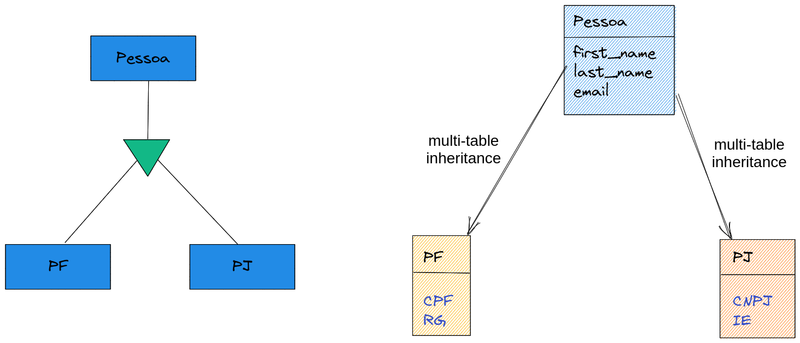
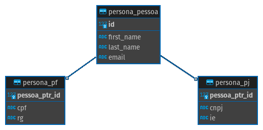

# Dica 23 - Modelagem - Multi-table Inheritance - Herança Multi-tabela





```python
# crm/models.py
class Pessoa(models.Model):
    first_name = models.CharField('nome', max_length=100)
    last_name = models.CharField('sobrenome', max_length=255, null=True, blank=True)  # noqa E501
    email = models.EmailField('e-mail', max_length=50, unique=True)

    class Meta:
        ordering = ('first_name',)

    @property
    def full_name(self):
        return f'{self.first_name} {self.last_name or ""}'.strip()

    def __str__(self):
        return self.full_name


class PF(Pessoa):
    '''
    Pessoa Física.
    É um multi-table inheritance (herança multi-tabela)
    porque a classe pai não tem abstract.
    '''
    cpf = models.CharField(max_length=11, null=True, blank=True)
    rg = models.CharField(max_length=10, null=True, blank=True)

    class Meta:
        verbose_name = 'Pessoa Física'
        verbose_name_plural = 'Pessoas Físicas'


class PJ(Pessoa):
    '''
    Pessoa Jurídica.
    '''
    cnpj = models.CharField(max_length=14, null=True, blank=True)
    ie = models.CharField('inscrição estadual', max_length=14, null=True, blank=True)  # noqa E501

    class Meta:
        verbose_name = 'Pessoa Jurídica'
        verbose_name_plural = 'Pessoas Jurídicas'

```


```python
# crm/admin.py
from .models import Pessoa, PF, PJ


@admin.register(Pessoa)
class PessoaAdmin(admin.ModelAdmin):
    list_display = ('__str__', 'email')
    search_fields = ('first_name', 'last_name', 'email')


@admin.register(PF)
class PFAdmin(admin.ModelAdmin):
    list_display = ('__str__', 'email', 'cpf', 'rg')
    search_fields = ('first_name', 'last_name', 'email')


@admin.register(PJ)
class PJAdmin(admin.ModelAdmin):
    list_display = ('__str__', 'email', 'cnpj', 'ie')
    search_fields = ('first_name', 'last_name', 'email')

```

```
python manage.py makemigrations
python manage.py migrate
```

### Jupyter Notebook

```python
Pessoa.objects.create(first_name='Agnes', email='agnes@email.com')

PF.objects.create(first_name='James', email='james@email.com', cpf='72387711017')
PJ.objects.create(first_name='Zen', email='zen@email.com', cnpj='98980077000170')

Pessoa.objects.all().count()
Pessoa.objects.all()

PF.objects.all().values()
PJ.objects.all().values()
```
