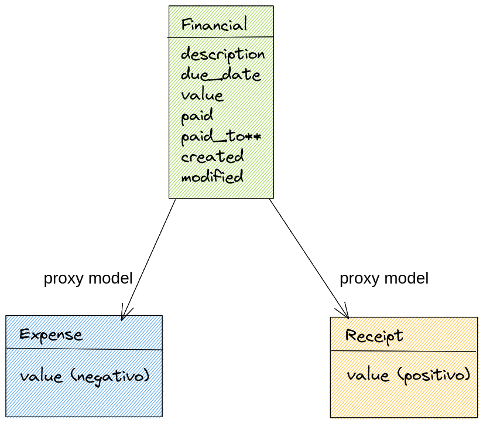
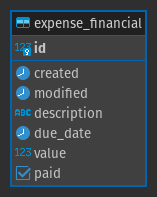

# Dica 19.6 - Modelagem - Proxy Model

**Versões usadas no vídeo:** Django 4.1.3, Python 3.10, PostgreSQL (no Docker), django-extensions 3.2.1 e Jupyter Notebook.
{: .versoes }

<a href="https://youtu.be/jjxuoC_uoiU">
    
</a>

Este vídeo é um corte do vídeo [Segredos do ORM do Django: Proxy Model](https://youtu.be/Qu2QTxdYfZ4) e fecha a série de modelagem de banco de dados do projeto **Dicas de Django**.

Código da aula: [https://github.com/rg3915/dicas-de-django/tree/aula23](https://github.com/rg3915/dicas-de-django/tree/aula23)





## O que é um Proxy Model

Um **proxy model** é uma classe que herda de outro model, mas **não cria tabela nova** no banco. Ela usa a mesma tabela do model pai e muda apenas o **comportamento** em Python: o manager padrão, o `save()`, os métodos, o nome no admin.

O exemplo é uma parte financeira:

* No banco existe **uma única tabela**, `expense_financial`, com descrição, data de vencimento, valor, pago, criado em e modificado em.
* Em cima dela criamos dois proxy models:
    * `Expense` (despesas): todo dinheiro que **sai** da conta, sempre com valor **negativo**.
    * `Receipt` (recebimentos): todo dinheiro que **entra** na conta, sempre com valor **positivo**.

Para o Django são duas classes diferentes (e duas telas diferentes no admin), mas os dados ficam todos na mesma tabela. Com isso, para tirar um extrato ou o saldo da conta, basta somar a coluna `value` da tabela `Financial`.

## Pré-requisitos

* O projeto das dicas anteriores (pasta `backend` com as apps dentro dela, PostgreSQL rodando no Docker).
* O model abstrato `TimeStampedModel` em `backend/core/models.py`, visto na [Dica 19.4 - Abstract Inheritance](082-19-4-modelagem-abstract-inheritance.md):

```python
# core/models.py
from django.db import models


class TimeStampedModel(models.Model):
    created = models.DateTimeField(
        'criado em',
        auto_now_add=True,
        auto_now=False
    )
    modified = models.DateTimeField(
        'modificado em',
        auto_now_add=False,
        auto_now=True
    )

    class Meta:
        abstract = True
```

* Jupyter Notebook com o kernel do `shell_plus` do django-extensions (veja a [Dica 19.1](079-19-1-modelagem-onetomany.md)): `python manage.py shell_plus --notebook`.
* O `Faker` instalado (ele já vem como dependência do `django-seed`, que está no `requirements.txt` do projeto).

## Criando a app expense

Vamos criar uma nova app chamada `expense`, dentro da pasta `backend`.

```bash
cd backend
python ../manage.py startapp expense
cd ..
```

Adicione a app em `INSTALLED_APPS`:

```python
# settings.py
INSTALLED_APPS = [
    ...
    # minhas apps
    'backend.core',
    'backend.bookstore',
    'backend.crm',
    'backend.expense',
]
```

Como a app está dentro de `backend`, edite o `name` em `expense/apps.py`:

```python
# expense/apps.py
from django.apps import AppConfig


class ExpenseConfig(AppConfig):
    default_auto_field = 'django.db.models.BigAutoField'
    name = 'backend.expense'
```

Inclua as urls da app no `urls.py` principal:

```python
# urls.py
from django.contrib import admin
from django.urls import include, path

urlpatterns = [
    path('', include('backend.core.urls', namespace='core')),  # noqa E501
    path('accounts/', include('backend.accounts.urls')),  # noqa E501
    path('bookstore/', include('backend.bookstore.urls', namespace='bookstore')),  # noqa E501
    path('crm/', include('backend.crm.urls', namespace='crm')),  # noqa E501
    path('expense/', include('backend.expense.urls', namespace='expense')),  # noqa E501
    path('admin/', admin.site.urls),  # noqa E501
]
```

E crie `expense/urls.py`, por enquanto sem rotas (o `app_name` é necessário porque usamos `namespace` no `include`):

```python
# expense/urls.py
from django.urls import path

app_name = 'expense'


urlpatterns = [
]
```

## Os models

```python
# expense/models.py
from django.db import models

from backend.core.models import TimeStampedModel

from .managers import ExpenseManager, ReceiptManager


class Financial(TimeStampedModel):
    description = models.CharField('descrição', max_length=300)
    due_date = models.DateField('data de vencimento', null=True, blank=True)
    value = models.DecimalField('valor', max_digits=7, decimal_places=2)
    paid = models.BooleanField('pago?', default=False)
    # paid_to = models.ForeignKey()

    class Meta:
        ordering = ('-pk',)

    def __str__(self):
        return f'{self.description}'


class Expense(Financial):

    objects = ExpenseManager()

    class Meta:
        proxy = True
        verbose_name = 'Despesa'
        verbose_name_plural = 'Despesas'

    def save(self, *args, **kwargs):
        ''' Despesa é NEGATIVO. '''
        self.value = -1 * abs(self.value)
        super(Expense, self).save(*args, **kwargs)


class Receipt(Financial):

    objects = ReceiptManager()

    class Meta:
        proxy = True
        verbose_name = 'Recebimento'
        verbose_name_plural = 'Recebimentos'

    def save(self, *args, **kwargs):
        ''' Recebimento é POSITIVO. '''
        self.value = abs(self.value)
        super(Receipt, self).save(*args, **kwargs)
```

Pontos importantes:

* `Financial` é um model **concreto** (é ele que vira a tabela `expense_financial`). Ele herda de `TimeStampedModel`, que é abstrato, para ganhar os campos `created` e `modified`.
* `Expense` e `Receipt` herdam de `Financial` e têm `proxy = True` no `Meta`. É isso que faz o Django **não** criar uma tabela para eles.
* Cada proxy tem o seu próprio manager (`objects`), que filtra só as linhas que pertencem a ele.
* O `save()` garante o sinal do valor:
    * na despesa, `abs()` deixa o valor positivo e a multiplicação por `-1` o torna negativo. Não importa se você digitou `1000` ou `-1000`, a despesa é gravada como `-1000`;
    * no recebimento, `abs()` garante que o valor será sempre positivo.

## Os managers

Crie o arquivo `expense/managers.py`:

```python
# expense/managers.py
from django.db import models


class ExpenseManager(models.Manager):

    def get_queryset(self):
        return super(ExpenseManager, self).get_queryset().filter(value__lt=0)


class ReceiptManager(models.Manager):

    def get_queryset(self):
        return super(ReceiptManager, self).get_queryset().filter(value__gte=0)
```

Esse é o grande segredo do exemplo: o `get_queryset()` de cada manager pega o queryset original e aplica um filtro.

* `ExpenseManager`: `value__lt=0` (menor que zero), ou seja, só as despesas.
* `ReceiptManager`: `value__gte=0` (maior ou igual a zero), ou seja, só os recebimentos.

Assim, `Expense.objects.all()` devolve só as linhas negativas e `Receipt.objects.all()` só as positivas, embora as duas leiam a mesma tabela.

## O admin

Um admin básico, um para cada proxy model:

```python
# expense/admin.py
from django.contrib import admin

from .models import Expense, Receipt


@admin.register(Expense)
class ExpenseAdmin(admin.ModelAdmin):
    list_display = ('__str__', 'value', 'due_date', 'paid')
    search_fields = ('description',)
    list_filter = ('paid',)
    date_hierarchy = 'created'


@admin.register(Receipt)
class ReceiptAdmin(admin.ModelAdmin):
    list_display = ('__str__', 'value', 'due_date', 'paid')
    search_fields = ('description',)
    list_filter = ('paid',)
    date_hierarchy = 'created'
```

No admin aparecem duas entradas na seção **Expense**: **Despesas** e **Recebimentos**. Repare que não registramos o `Financial`: o usuário só trabalha com despesas e recebimentos.

## Migrations

```bash
python manage.py makemigrations
python manage.py migrate
```

O `makemigrations` mostra que só uma tabela é criada; os proxies entram na migration apenas como "proxy model" (saída numa app nova):

```
Migrations for 'expense':
  backend/expense/migrations/0001_initial.py
    - Create model Financial
    - Create proxy model Expense
    - Create proxy model Receipt
```

No pgAdmin4 você pode conferir que existe só a tabela `expense_financial`, com as colunas `id`, `created`, `modified`, `description`, `due_date`, `value` e `paid`. Não há tabela para `Expense` nem para `Receipt`.

## Testando no Jupyter Notebook

Abra o Jupyter com o kernel do Django (`python manage.py shell_plus --notebook`) e escolha o kernel **Django Shell-Plus**. Se ele já estava aberto, reinicie o kernel para que os novos models sejam carregados. O `shell_plus` já importa todos os models automaticamente.

### Criando uma despesa e um recebimento

```python
from pprint import pprint

Expense.objects.create(description='Fatura', value=1000)
# <Expense: Fatura>

Receipt.objects.create(description='Pagamento', value=1600)
# <Receipt: Pagamento>
```

Repare que passamos `value=1000` para a despesa, positivo. Vamos ver como ficou na tabela:

```python
financials = Financial.objects.all().values()

for financial in financials:
    pprint(financial)
```

Saída (as datas serão as do momento em que você rodar):

```
{'created': datetime.datetime(2022, 12, 19, 16, 21, 22, 350845, tzinfo=datetime.timezone.utc),
 'description': 'Pagamento',
 'due_date': None,
 'id': 2,
 'modified': datetime.datetime(2022, 12, 19, 16, 21, 22, 350872, tzinfo=datetime.timezone.utc),
 'paid': False,
 'value': Decimal('1600.00')}
{'created': datetime.datetime(2022, 12, 19, 16, 21, 16, 971371, tzinfo=datetime.timezone.utc),
 'description': 'Fatura',
 'due_date': None,
 'id': 1,
 'modified': datetime.datetime(2022, 12, 19, 16, 21, 16, 971396, tzinfo=datetime.timezone.utc),
 'paid': False,
 'value': Decimal('-1000.00')}
```

O pagamento ficou com `1600.00` positivo e a fatura com `-1000.00` negativo, por causa do `save()` de cada proxy. A ordem é decrescente por causa do `ordering = ('-pk',)`.

Se você listar só as despesas, o `ExpenseManager` entra em ação e só a fatura aparece:

```python
expenses = Expense.objects.all().values()

for expense in expenses:
    pprint(expense)
```

### Extrato

Para fazer um extrato, basta percorrer a tabela `Financial` ordenando pela data de criação:

```python
# Extrato
financials = Financial.objects.all()

for financial in financials.order_by('created'):
    print(financial.id, financial.created.isoformat()[:10], financial.value, financial.description[:30])
```

```
1 2022-12-19 -1000.00 Fatura
2 2022-12-19 1600.00 Pagamento
```

Primeiro pagamos uma fatura de R$ 1.000 e depois recebemos um pagamento de R$ 1.600.

### Saldo

Como os valores já estão com o sinal certo, o saldo é só a soma da coluna `value`, com `aggregate` e `Sum`:

```python
from django.db.models import Sum

saldo = Financial.objects.aggregate(Sum('value'))

saldo
```

```
{'value__sum': Decimal('600.00')}
```

Recebemos 1.600, gastamos 1.000, sobraram 600.

### Gerando mais dados com o Faker

Antes de continuar, no vídeo a fatura e o pagamento foram apagados pelo admin (em **Despesas** e **Recebimentos**), para trabalhar só com os dados gerados a seguir.

Vamos criar duas funções auxiliares: uma que gera uma data aleatória entre 30 dias atrás e 30 dias à frente, e outra que gera uma frase para a descrição.

```python
from datetime import date, timedelta
from random import randint
from faker import Faker

fake = Faker()

def gen_date_between(start_date='-30d', end_date='30d'):
    today = date.today()
    _start_date = int(start_date[:-1])
    _end_date = int(end_date[:-1])
    date_start = today + timedelta(days=_start_date)
    date_end = today + timedelta(days=_end_date)
    return fake.date_between_dates(date_start=date_start, date_end=date_end)


def gen_title():
    return fake.sentence()
```

`start_date[:-1]` tira o `d` do final (`'-30d'` vira `'-30'`), e o `int()` transforma em número de dias.

Agora criamos 10 lançamentos com valores aleatórios entre -2000 e 2000. Repare que usamos o `Financial` direto: o valor negativo cai automaticamente em **Despesas** e o positivo em **Recebimentos**, porque os managers filtram pelo sinal.

```python
# Criando mais dados fake
for i in range(10):
    Financial.objects.create(
        description=gen_title(),
        value=randint(-2000,2000),
        due_date=gen_date_between()
    )
```

Extrato ordenado pela data de vencimento:

```python
# Extrato
financials = Financial.objects.all()

for financial in financials.order_by('due_date'):
    print(financial.id, financial.due_date.isoformat()[:10], financial.value, financial.description[:30])
```

### Saldo por mês com TruncMonth

O `TruncMonth` trunca a data no mês. Agrupando por mês (`values('month')`) e somando (`annotate(saldo=Sum('value'))`), temos o saldo de cada mês:

```python
from django.db.models.functions import TruncMonth

saldos = Financial.objects \
    .annotate(month=TruncMonth('due_date')) \
    .values('month') \
    .annotate(saldo=Sum('value')) \
    .order_by('month')

for saldo in saldos:
    print(saldo['month'].month, saldo['saldo'])
```

Saída no vídeo (os valores são aleatórios, os seus serão outros):

```
11 -1171.00
12 550.00
1 4128.00
```

E o saldo total:

```python
saldo = Financial.objects.aggregate(Sum('value'))

saldo
```

```
{'value__sum': Decimal('3507.00')}
```

### Conferindo na planilha

Para conferir, no vídeo os valores das telas **Recebimentos** e **Despesas** do admin foram copiados para o LibreOffice Calc, com o mês de vencimento ao lado de cada valor. Ordenando pela coluna do mês e somando cada grupo, chegamos aos mesmos números: -1171 em novembro, 550 em dezembro, 4128 em janeiro e 3507 no total.

> Confira no LibreOffice ou Excel.

## Conclusão

Com o proxy model temos uma única tabela no banco e várias "visões" dela no Django, cada uma com o seu comportamento: o manager filtra as linhas, o `save()` aplica a regra de negócio (despesa negativa, recebimento positivo) e o admin mostra cada uma separadamente. E como tudo está na mesma tabela, extrato e saldo saem de uma única consulta com `aggregate` e `annotate`.
