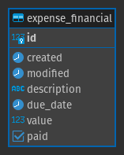

# Dica 24 - Modelagem - Proxy Model




## Criando app expense

Vamos criar uma nova app chamada `expense`.

```
cd backend
python ../manage.py startapp expense
cd ..
```

Adicione em `INSTALLED_APPS`

```python
# settings.py
INSTALLED_APPS = [
    ...
    'backend.expense',
]
```

Edite `urls.py`

```python
# urls.py
...
path('', include('backend.expense.urls', namespace='expense')),
```

Edite `expense/apps.py`

```python
# expense/apps.py
...
name = 'backend.expense'
```

Crie `expense/urls.py`

```python
# expense/urls.py
from django.urls import path

app_name = 'expense'


urlpatterns = [
]

```


```python
# expense/models.py
from django.db import models

from backend.core.models import TimeStampedModel

from .managers import ExpenseManager, ReceiptManager


class Financial(TimeStampedModel):
    description = models.CharField('descrição', max_length=300)
    due_date = models.DateField('data de vencimento', null=True, blank=True)
    value = models.DecimalField('valor', max_digits=7, decimal_places=2)
    paid = models.BooleanField('pago?', default=False)
    # paid_to = models.ForeignKey()

    class Meta:
        ordering = ('-pk',)

    def __str__(self):
        return f'{self.description}'


class Expense(Financial):

    objects = ExpenseManager()

    class Meta:
        proxy = True
        verbose_name = 'Despesa'
        verbose_name_plural = 'Despesas'

    def save(self, *args, **kwargs):
        ''' Despesa é NEGATIVO. '''
        self.value = -1 * abs(self.value)
        super(Expense, self).save(*args, **kwargs)


class Receipt(Financial):

    objects = ReceiptManager()

    class Meta:
        proxy = True
        verbose_name = 'Recebimento'
        verbose_name_plural = 'Recebimentos'

    def save(self, *args, **kwargs):
        ''' Recebimento é POSITIVO. '''
        self.value = abs(self.value)
        super(Receipt, self).save(*args, **kwargs)

```

```python
# expense/managers.py
from django.db import models


class ExpenseManager(models.Manager):

    def get_queryset(self):
        return super(ExpenseManager, self).get_queryset().filter(value__lt=0)


class ReceiptManager(models.Manager):

    def get_queryset(self):
        return super(ReceiptManager, self).get_queryset().filter(value__gte=0)

```

```python
# expense/admin.py
from django.contrib import admin

from .models import Expense, Receipt


@admin.register(Expense)
class ExpenseAdmin(admin.ModelAdmin):
    list_display = ('__str__', 'value', 'due_date', 'paid')
    search_fields = ('description',)
    list_filter = ('paid',)
    date_hierarchy = 'created'


@admin.register(Receipt)
class ReceiptAdmin(admin.ModelAdmin):
    list_display = ('__str__', 'value', 'due_date', 'paid')
    search_fields = ('description',)
    list_filter = ('paid',)
    date_hierarchy = 'created'

```


```
python manage.py makemigrations
python manage.py migrate
```

> Mostrar as tabelas no pgAdmin4.


### Jupyter Notebook

```python
from pprint import pprint

Expense.objects.create(description='Fatura', value=1000)
Receipt.objects.create(description='Pagamento', value=1600)

financials = Financial.objects.all().values()

for financial in financials:
    pprint(financial)

expenses = Expense.objects.all().values()

for expense in expenses:
    pprint(expense)

# Extrato
financials = Financial.objects.all()

for financial in financials.order_by('created'):
    print(financial.id, financial.created.isoformat()[:10], financial.value, financial.description[:30])

from django.db.models import Sum

saldo = Financial.objects.aggregate(Sum('value'))

saldo

from datetime import date, timedelta
from random import randint
from faker import Faker

fake = Faker()

def gen_date_between(start_date='-30d', end_date='30d'):
    today = date.today()
    _start_date = int(start_date[:-1])
    _end_date = int(end_date[:-1])
    date_start = today + timedelta(days=_start_date)
    date_end = today + timedelta(days=_end_date)
    return fake.date_between_dates(date_start=date_start, date_end=date_end)


def gen_title():
    return fake.sentence()

# Criando mais dados fake
for i in range(10):
    Financial.objects.create(
        description=gen_title(),
        value=randint(-2000,2000),
        due_date=gen_date_between()
    )

# Extrato
financials = Financial.objects.all()

for financial in financials.order_by('due_date'):
    print(financial.id, financial.due_date.isoformat()[:10], financial.value, financial.description[:30])

from django.db.models.functions import TruncMonth

saldos = Financial.objects \
    .annotate(month=TruncMonth('due_date')) \
    .values('month') \
    .annotate(saldo=Sum('value')) \
    .order_by('month')

for saldo in saldos:
    print(saldo['month'].month, saldo['saldo'])

saldo = Financial.objects.aggregate(Sum('value'))

saldo
```

> Confira no LibreOffice ou Excel.

