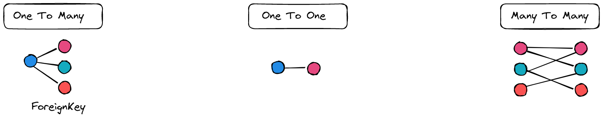
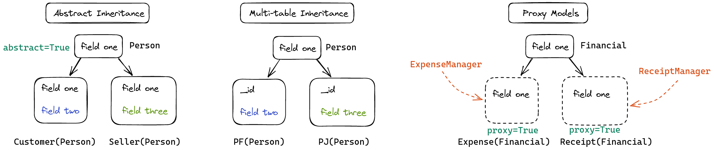

# Dica 19.7 - Modelagem - Resumo

**Versões usadas no vídeo:** Django 4.1.3, Python 3.10, Pillow 9.3.0 e PostgreSQL (no Docker).
{: .versoes }

<a href="https://youtu.be/m8RqKi47wf4">
    
</a>

Este vídeo é um corte do vídeo [Segredos do ORM do Django: Resumo](https://youtu.be/Qu2QTxdYfZ4). Nas dicas 19.1 a 19.6 vimos seis recursos de modelagem do ORM do Django. Aqui fazemos um resumo de todos eles e, para fixar, aplicamos de novo cada um no projeto **Dicas de Django**:

* movemos o `Profile` (OneToOne) da app `core` para a app `accounts`;
* criamos `Document`, com ForeignKey para o usuário e herdando de um model abstrato;
* criamos a app `product`, com categorias, produtos e várias fotos por produto;
* criamos a app `realty` (imóveis), com dois proxy models: aluguel e venda.

## Resumo dos tipos de modelagem



* **One To Many** (um para muitos, a famosa `ForeignKey`): de um lado temos um item e do outro, vários. Ex.: um usuário tem vários documentos. Veja a [Dica 19.1](079-19-1-modelagem-onetomany.md).
* **One To One** (um para um, `OneToOneField`): o relacionamento mais simples, um item ligado a exatamente um outro. Ex.: um usuário tem um perfil. Veja a [Dica 19.2](080-19-2-modelagem-onetoone.md).
* **Many To Many** (muitos para muitos, `ManyToManyField`): vários itens de um lado ligados a vários do outro. Veja a [Dica 19.3](081-19-3-modelagem-manytomany.md).



* **Abstract Inheritance** (`abstract = True`): o model `Person` serve só de **molde**. Quando `Customer` e `Seller` herdam de `Person`, os campos de `Person` (o *field one*) são **copiados** para as tabelas deles, e cada um pode acrescentar os seus (*field two*, *field three*). `Person` não vira tabela. Veja a [Dica 19.4](082-19-4-modelagem-abstract-inheritance.md).
* **Multi-table Inheritance** (MTI): `Person` vira tabela, e `PF` (pessoa física) e `PJ` (pessoa jurídica) também. Os campos de `Person` **não** são copiados: as tabelas filhas têm um `_id` apontando para `Person`, uma espécie de OneToOne escondido. Veja a [Dica 19.5](083-19-5-modelagem-multi-table-inheritance.md).
* **Proxy Models** (`proxy = True`): no banco existe uma única tabela (`Financial`). `Expense` e `Receipt` são só representações dela em Python, cada uma com o seu manager (`ExpenseManager` e `ReceiptManager`) filtrando os dados. Veja a [Dica 19.6](084-19-6-modelagem-proxy-model.md).

## Pré-requisitos

* O projeto das dicas anteriores, com as apps dentro da pasta `backend` (`backend.core`, `backend.accounts`, `backend.bookstore`, `backend.crm` e `backend.expense`) e o PostgreSQL rodando no Docker.
* O `Makefile` do projeto, com o comando `make lint` (autopep8, isort e djhtml), visto na [Dica 10](070-10-makefile.md).

## Movendo o Profile para a app accounts

Até aqui o `Profile` estava em `core/models.py`. A app `core` é para coisas **genéricas** (como o `TimeStampedModel`), e o perfil é específico do usuário, então ele vai para a app `accounts`.

Recorte de `core/models.py` a classe `Profile` e os dois receivers, e apague de lá os imports que não serão mais usados (`post_save`, `receiver` e `User`). O `core/models.py` fica só com o `TimeStampedModel` (e, mais adiante, o `Active`).

Em `accounts/models.py`, acrescente os imports e cole o código no final do arquivo, depois do model `User`:

```python
# accounts/models.py
from django.db.models.signals import post_save
from django.dispatch import receiver

...


class Profile(models.Model):
    user = models.OneToOneField(
        User,
        on_delete=models.PROTECT,
        verbose_name='usuário'
    )
    birthday = models.DateField('data de nascimento', null=True, blank=True)
    linkedin = models.URLField(null=True, blank=True)
    rg = models.CharField(max_length=10, null=True, blank=True)
    cpf = models.CharField(max_length=11, null=True, blank=True)

    class Meta:
        ordering = ('user__first_name',)
        verbose_name = 'perfil'
        verbose_name_plural = 'perfis'

    @property
    def full_name(self):
        return f'{self.user.first_name} {self.user.last_name or ""}'.strip()

    def __str__(self):
        return self.full_name


@receiver(post_save, sender=User)
def create_user_profile(sender, instance, created, **kwargs):
    if created:
        Profile.objects.create(user=instance)


@receiver(post_save, sender=User)
def save_user_profile(sender, instance, **kwargs):
    instance.profile.save()
```

Os dois receivers garantem que todo usuário novo ganhe um perfil automaticamente (signal `post_save` do `User`).

Faça o mesmo com o admin: recorte o `ProfileAdmin` de `core/admin.py` e cole em `accounts/admin.py`, importando o `Profile` de `.models`:

```python
# accounts/admin.py
from .models import Profile, User


@admin.register(Profile)
class ProfileAdmin(admin.ModelAdmin):
    list_display = ('__str__', 'birthday', 'linkedin', 'rg', 'cpf')
    search_fields = (
        'customer__first_name',
        'customer__last_name',
        'customer__email',
        'linkedin',
        'rg',
        'cpf'
    )
```

Depois de colar, rode o lint do projeto, que arruma a indentação e a ordem dos imports:

```bash
make lint
```

```
find backend -name "*.py" | xargs autopep8 --max-line-length 120 --in-place
isort -m 3 *
Fixing /home/regis/gh/my/dicas-de-django/backend/accounts/models.py
Fixing /home/regis/gh/my/dicas-de-django/backend/accounts/admin.py
find backend -name "*.html" | xargs djhtml -t 2 -i
0 templates have been reindented.
17 templates were already perfect!
```

Observação: o `search_fields` usa `customer__...`, que veio de um exemplo anterior; para buscar pelo nome do usuário o correto seria `user__first_name` etc. O código foi mantido como no vídeo.

## Documentos (ForeignKey + Abstract)

Agora, em `accounts`, vamos criar um model `Document`: cada usuário pode enviar vários documentos (One To Many). Ele herda de `TimeStampedModel`, que é abstrato (`abstract = True`), então ganha os campos `created` e `modified` sem criar uma tabela para o `TimeStampedModel`.

```python
# accounts/models.py
from backend.core.models import TimeStampedModel

...


class Document(TimeStampedModel):
    document = models.FileField(upload_to='')
    user = models.ForeignKey(User, on_delete=models.CASCADE)

    class Meta:
        ordering = ('pk',)
        verbose_name = 'Documento'
        verbose_name_plural = 'Documentos'

    def __str__(self):
        return f'{self.pk}'
```

* `FileField(upload_to='')`: o arquivo é salvo na raiz de `MEDIA_ROOT`.
* `on_delete=models.CASCADE`: se o usuário for apagado, os documentos dele também são.

Registre no admin (o import agora traz `Document`, `Profile` e `User`):

```python
# accounts/admin.py
from .models import Document, Profile, User

...


@admin.register(Document)
class DocumentAdmin(admin.ModelAdmin):
    list_display = ('__str__', 'user')
```

## Produtos

Vamos criar uma nova app chamada `product`. Como as apps ficam dentro da pasta `backend`, entramos nela e chamamos o `manage.py` da pasta de cima:

```bash
cd backend
python ../manage.py startapp product
cd ..
```

Edite `product/apps.py`:

```python
# product/apps.py
from django.apps import AppConfig


class ProductConfig(AppConfig):
    default_auto_field = 'django.db.models.BigAutoField'
    name = 'backend.product'
```

E adicione em `INSTALLED_APPS`:

```python
# settings.py
INSTALLED_APPS = [
    ...
    'backend.product',
]
```

### Um model abstrato Active

Em `core/models.py` vamos criar mais um model abstrato, `Active`, com um booleano `active`. Qualquer model que precise do campo "ativo" pode herdar dele.

```python
# core/models.py
class Active(models.Model):
    active = models.BooleanField('ativo', default=True)

    class Meta:
        abstract = True
```

### Categoria e produto (ForeignKey)

Uma categoria tem vários produtos: ForeignKey em `Product` apontando para `Category`.

```python
# product/models.py
from django.db import models

from backend.core.models import TimeStampedModel


class Category(models.Model):
    title = models.CharField('título', max_length=255, unique=True)

    class Meta:
        ordering = ('title',)
        verbose_name = 'categoria'
        verbose_name_plural = 'categorias'

    def __str__(self):
        return f'{self.title}'


class Product(models.Model):
    title = models.CharField('título', max_length=255, unique=True)
    description = models.TextField('descrição', null=True, blank=True)
    category = models.ForeignKey(
        Category,
        on_delete=models.SET_NULL,
        verbose_name='categoria',
        related_name='products',
        null=True,
        blank=True,
    )

    class Meta:
        ordering = ('title',)
        verbose_name = 'produto'
        verbose_name_plural = 'produtos'

    def __str__(self):
        return f'{self.title}'
```

* `on_delete=models.SET_NULL`: se a categoria for apagada, o produto continua existindo, só fica sem categoria. Por isso o campo precisa de `null=True`.
* `related_name='products'`: a partir de uma categoria acessamos os produtos com `category.products.all()`.

### Fotos (várias por produto)

Cada produto pode ter várias fotos: mais uma ForeignKey, agora de `Photo` para `Product`, e `Photo` herda de `TimeStampedModel`.

```python
# product/models.py
class Photo(TimeStampedModel):
    photo = models.ImageField(upload_to='')
    product = models.ForeignKey(Product, on_delete=models.CASCADE)

    class Meta:
        ordering = ('pk',)
        verbose_name = 'foto'
        verbose_name_plural = 'fotos'

    def __str__(self):
        return f'{self.pk}'
```

### Admin com TabularInline

No admin usamos um `TabularInline` para cadastrar as fotos **dentro** da tela do produto:

```python
# product/admin.py
from django.contrib import admin

from .models import Category, Photo, Product


@admin.register(Category)
class CategoryAdmin(admin.ModelAdmin):
    list_display = ('__str__',)
    search_fields = ('title',)


class PhotoInline(admin.TabularInline):
    model = Photo
    extra = 0


@admin.register(Product)
class ProductAdmin(admin.ModelAdmin):
    inlines = (PhotoInline,)
    list_display = ('__str__', 'category')
    search_fields = ('title',)
    list_filter = ('category',)
    # date_hierarchy = 'created'
```

`extra = 0` faz o inline não mostrar linhas vazias extras; você clica em "Adicionar outro(a) Foto" quando quiser.

### Pillow e o erro do date_hierarchy

Ao rodar o `makemigrations`, o Django acusa dois erros:

```bash
python manage.py makemigrations
```

```
SystemCheckError: System check identified some issues:

ERRORS:
<class 'backend.product.admin.ProductAdmin'>: (admin.E127) The value of 'date_hierarchy' refers to 'created', which does not refer to a Field.
product.Photo.photo: (fields.E210) Cannot use ImageField because Pillow is not installed.
	HINT: Get Pillow at https://pypi.org/project/Pillow/ or run command "python -m pip install Pillow".
```

O `ImageField` precisa do Pillow, a biblioteca de imagens do Python. Instale e acrescente no `requirements.txt`:

```bash
python -m pip install Pillow

pip freeze | grep Pillow >> requirements.txt
```

No vídeo foi instalado o `Pillow==9.3.0`.

O outro erro é porque o passo a passo previa `date_hierarchy = 'created'` no `ProductAdmin`, mas o `Product` que escrevemos herda de `models.Model` e não tem o campo `created`. No vídeo a linha foi comentada, como está no código acima. Se você quiser manter o `date_hierarchy`, faça o `Product` herdar dos dois models abstratos do `core`, como estava no passo a passo original:

```python
# product/models.py
from backend.core.models import Active, TimeStampedModel


class Product(TimeStampedModel, Active):
    ...
```

### Migrations e teste no admin

```bash
python manage.py makemigrations
python manage.py migrate
```

No vídeo o `migrate` falhou com `django.db.utils.ProgrammingError: relation "accounts_profile" already exists`, porque o banco tinha sido preparado antes da gravação e os containers não estavam no estado esperado. A solução foi recomeçar o banco do zero: remover os volumes do Docker (`docker volume prune -f`), subir de novo os containers e recriar tudo:

```bash
docker-compose up -d
python manage.py migrate
python manage.py createsuperuser
```

Atenção: apagar o volume apaga **todos** os dados do banco. Só faça isso em ambiente de desenvolvimento.

Agora, no admin, ao cadastrar um produto (por exemplo, "Tênis"), aparece o bloco de **Fotos** logo abaixo, onde dá para enviar várias imagens para o mesmo produto.

## Imóveis (Proxy Model)

Para revisar o proxy model, vamos criar uma app de imóveis, `realty`. Imagine que queremos uma "tabela" só de aluguéis e outra só de vendas. Os campos são sempre os mesmos (nome, tipo de negociação e preço), então no banco basta **uma** tabela; aluguel e venda serão proxies dela.

```bash
cd backend
python ../manage.py startapp realty
cd ..
```

```python
# realty/apps.py
from django.apps import AppConfig


class RealtyConfig(AppConfig):
    default_auto_field = 'django.db.models.BigAutoField'
    name = 'backend.realty'
```

```python
# settings.py
INSTALLED_APPS = [
    ...
    'backend.product',
    'backend.realty',
]
```

### Os models

```python
# realty/models.py
from django.db import models

from .managers import RentManager, SaleManager

TYPE_OF_NEGOTIATION = (
    ('a', 'aluguel'),
    ('v', 'venda'),
)


class Realty(models.Model):
    name = models.CharField('nome', max_length=255)
    type_of_negotiation = models.CharField(
        'tipo de negociação',
        max_length=1,
        choices=TYPE_OF_NEGOTIATION,
    )
    price = models.DecimalField('preço', max_digits=12, decimal_places=2)

    class Meta:
        ordering = ('name',)
        verbose_name = 'imóvel'
        verbose_name_plural = 'imóveis'

    def __str__(self):
        return f'{self.name}'


class PropertyRent(Realty):

    objects = RentManager()

    class Meta:
        proxy = True
        verbose_name = 'aluguel'
        verbose_name_plural = 'aluguéis'

    def save(self, *args, **kwargs):
        self.type_of_negotiation = 'a'
        super(PropertyRent, self).save(*args, **kwargs)


class PropertySale(Realty):

    objects = SaleManager()

    class Meta:
        proxy = True
        verbose_name = 'venda'
        verbose_name_plural = 'vendas'

    def save(self, *args, **kwargs):
        self.type_of_negotiation = 'v'
        super(PropertySale, self).save(*args, **kwargs)
```

* `TYPE_OF_NEGOTIATION` limita o campo a duas opções: `a` (aluguel) e `v` (venda). Por isso `max_length=1`.
* `PropertyRent` e `PropertySale` têm `proxy = True`: não criam tabela.
* O `save()` de cada proxy **força** o tipo de negociação. Mesmo que o usuário escolha "venda" na tela de aluguel, o registro é salvo como aluguel.

Cuidado ao copiar e colar o `save()` de uma classe para a outra: no vídeo, o `PropertySale` ficou com `super(PropertyRent, self)` e, ao salvar uma venda, o Django deu `TypeError: super(type, obj): obj must be an instance or subtype of type`. Cada classe tem que chamar o `super` com o seu próprio nome.

### Os managers

```python
# realty/managers.py
from django.db import models


class RentManager(models.Manager):

    def get_queryset(self):
        return super(RentManager, self).get_queryset().filter(type_of_negotiation='a')


class SaleManager(models.Manager):

    def get_queryset(self):
        return super(SaleManager, self).get_queryset().filter(type_of_negotiation='v')
```

Cada manager filtra a tabela pelo tipo de negociação, então `PropertyRent.objects.all()` só traz aluguéis e `PropertySale.objects.all()` só vendas.

### O admin

```python
# realty/admin.py
from django.contrib import admin

from .models import PropertyRent, PropertySale


@admin.register(PropertyRent)
class PropertyRentAdmin(admin.ModelAdmin):
    list_display = ('__str__', 'type_of_negotiation', 'price')
    search_fields = ('name',)
    list_filter = ('type_of_negotiation',)


@admin.register(PropertySale)
class PropertySaleAdmin(admin.ModelAdmin):
    list_display = ('__str__', 'type_of_negotiation', 'price')
    search_fields = ('name',)
    list_filter = ('type_of_negotiation',)
```

```bash
python manage.py makemigrations
python manage.py migrate
python manage.py runserver
```

### Testando

No admin aparece a seção **Realty** com **Aluguéis** e **Vendas**.

* Em **Aluguéis**, cadastre "Casa na praia", escolha de propósito o tipo **venda** e preço 200 (a diária). Ao salvar, o registro fica como **aluguel**, por causa do `save()`.
* Em **Vendas**, cadastre "Apto na praia", escolha de propósito **aluguel**. Ao salvar, ele fica como **venda**.

E no banco? No pgAdmin, dentro do schema `public`, só existe a tabela `realty_realty`. Não há tabela de aluguel nem de venda:

```sql
SELECT * FROM public.realty_realty
ORDER BY id ASC;
```

| id | name          | type_of_negotiation | price     |
|----|---------------|---------------------|-----------|
| 1  | Casa na Praia | a                   | 200.00    |
| 2  | Apto na praia | v                   | 450000.00 |

O banco guarda tudo junto, com `a` ou `v`; quem separa aluguéis e vendas é o Django, por causa dos proxy models.

## Conclusão

Revisamos os seis recursos de modelagem do ORM do Django: ForeignKey (`Document`, `Product`, `Photo`), OneToOne (`Profile`), ManyToMany (dica 19.3), herança abstrata (`TimeStampedModel` e `Active`), herança multi-tabela (dica 19.5) e proxy model (`PropertyRent` e `PropertySale`).
