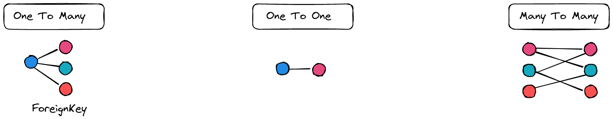
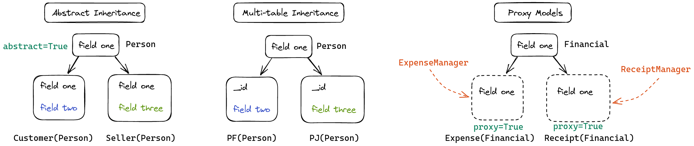

# Dica 25 - Modelagem - Resumo





Vamos mover `Profile` para a app `Accounts`.

```python
# accounts/models.py
from django.db.models.signals import post_save
from django.dispatch import receiver


class Profile(models.Model):
    user = models.OneToOneField(
        User,
        on_delete=models.PROTECT,
        verbose_name='usuário'
    )
    birthday = models.DateField('data de nascimento', null=True, blank=True)
    linkedin = models.URLField(null=True, blank=True)
    rg = models.CharField(max_length=10, null=True, blank=True)
    cpf = models.CharField(max_length=11, null=True, blank=True)

    class Meta:
        ordering = ('user__first_name',)
        verbose_name = 'perfil'
        verbose_name_plural = 'perfis'

    @property
    def full_name(self):
        return f'{self.user.first_name} {self.user.last_name or ""}'.strip()

    def __str__(self):
        return self.full_name


@receiver(post_save, sender=User)
def create_user_profile(sender, instance, created, **kwargs):
    if created:
        Profile.objects.create(user=instance)


@receiver(post_save, sender=User)
def save_user_profile(sender, instance, **kwargs):
    instance.profile.save()

```

Edite admin.

```python
# accounts/admin.py
from .models import Profile, User


@admin.register(Profile)
class ProfileAdmin(admin.ModelAdmin):
    list_display = ('__str__', 'birthday', 'linkedin', 'rg', 'cpf')
    search_fields = (
        'customer__first_name',
        'customer__last_name',
        'customer__email',
        'linkedin',
        'rg',
        'cpf'
    )

```

## Documentos

Agora, em `Accounts`, vamos criar um model chamado `Document`.

```python
# accounts/models.py
from backend.core.models import TimeStampedModel

class Document(TimeStampedModel):
    document = models.FileField(upload_to='')
    user = models.ForeignKey(User, on_delete=models.CASCADE)

    class Meta:
        ordering = ('pk',)
        verbose_name = 'Documento'
        verbose_name_plural = 'Documentos'

    def __str__(self):
        return f'{self.pk}'

```

Edite admin.py

```python
# accounts/admin.py
from .models import Document, Profile, User

@admin.register(Document)
class DocumentAdmin(admin.ModelAdmin):
    list_display = ('__str__', 'user')
```

## Produtos

Vamos criar uma nova app chamada `product`.

```
cd backend
python ../manage.py startapp product
cd ..
```

Edite `core/models.py`

```python
# core/models.py
class Active(models.Model):
    active = models.BooleanField('ativo', default=True)

    class Meta:
        abstract = True
```

Edite `settings.py`

```python
# settings.py
INSTALLED_APPS = [
    ...
    'backend.product',
]
```

Edite `product/apps.py`

```python
# product/apps.py
from django.apps import AppConfig


class ProductConfig(AppConfig):
    default_auto_field = 'django.db.models.BigAutoField'
    name = 'backend.product'

```

Edite `product/models.py`

```python
# product/models.py
from django.db import models

from backend.core.models import Active, TimeStampedModel


class Category(models.Model):
    title = models.CharField('título', max_length=255, unique=True)

    class Meta:
        ordering = ('title',)
        verbose_name = 'categoria'
        verbose_name_plural = 'categorias'

    def __str__(self):
        return f'{self.title}'


class Product(TimeStampedModel, Active):
    title = models.CharField('título', max_length=255, unique=True)
    description = models.TextField('descrição', null=True, blank=True)
    category = models.ForeignKey(
        Category,
        on_delete=models.SET_NULL,
        verbose_name='categoria',
        related_name='products',
        null=True,
        blank=True
    )

    class Meta:
        ordering = ('title',)
        verbose_name = 'produto'
        verbose_name_plural = 'produtos'

    def __str__(self):
        return f'{self.title}'

```


Edite `product/admin.py`

```python
# product/admin.py
from django.contrib import admin

from .models import Category, Product


@admin.register(Category)
class CategoryAdmin(admin.ModelAdmin):
    list_display = ('__str__',)
    search_fields = ('title',)


@admin.register(Product)
class ProductAdmin(admin.ModelAdmin):
    list_display = ('__str__', 'category')
    search_fields = ('title',)
    list_filter = ('category',)
    date_hierarchy = 'created'

```

### Fotos

Edite `product/models.py`

```python
# product/models.py

class Photo(TimeStampedModel):
    photo = models.ImageField(upload_to='')
    product = models.ForeignKey(Product, on_delete=models.CASCADE)

    class Meta:
        ordering = ('pk',)
        verbose_name = 'Foto'
        verbose_name_plural = 'Fotos'

    def __str__(self):
        return f'{self.pk}'

```

Edite `product/admin.py`

```python
# product/admin.py
from .models import Category, Photo, Product


class PhotoInline(admin.TabularInline):
    model = Photo
    extra = 0


@admin.register(Product)
class ProductAdmin(admin.ModelAdmin):
    inlines = (PhotoInline,)
    list_display = ('__str__', 'category')
    search_fields = ('title',)
    list_filter = ('category',)
    date_hierarchy = 'created'
```

É necessário instalar o `Pillow`.

```
pip install Pillow

pip freeze | grep Pillow >> requirements.txt
```

## Imóveis

Vamos criar uma app chamada `realty`.

```
cd backend
python ../manage.py startapp realty
cd ..
```

Edite `settings.py`

```python
# settings.py
INSTALLED_APPS = [
    ...
    'backend.realty',
]
```

Edite `realty/apps.py`

```python
# realty/apps.py
from django.apps import AppConfig


class RealtyConfig(AppConfig):
    default_auto_field = 'django.db.models.BigAutoField'
    name = 'backend.realty'

```

Edite `realty/models.py`

```python
# realty/models.py
from django.db import models

from .managers import RentManager, SaleManager

TYPE_OF_NEGOTIATION = (
    ('a', 'aluguel'),
    ('v', 'venda'),
)


class Realty(models.Model):
    name = models.CharField('nome', max_length=255)
    type_of_negotiation = models.CharField(
        'tipo de negociação',
        max_length=1,
        choices=TYPE_OF_NEGOTIATION,
    )
    price = models.DecimalField('preço', max_digits=12, decimal_places=2)

    class Meta:
        ordering = ('name',)
        verbose_name = 'imóvel'
        verbose_name_plural = 'imóveis'

    def __str__(self):
        return f'{self.name}'


class PropertyRent(Realty):

    objects = RentManager()

    class Meta:
        proxy = True
        verbose_name = 'aluguel'
        verbose_name_plural = 'aluguéis'

    def save(self, *args, **kwargs):
        self.type_of_negotiation = 'a'
        super(PropertyRent, self).save(*args, **kwargs)


class PropertySale(Realty):

    objects = SaleManager()

    class Meta:
        proxy = True
        verbose_name = 'venda'
        verbose_name_plural = 'vendas'

    def save(self, *args, **kwargs):
        self.type_of_negotiation = 'v'
        super(PropertySale, self).save(*args, **kwargs)

```

Edite `realty/managers.py`

```python
# realty/managers.py
from django.db import models


class RentManager(models.Manager):

    def get_queryset(self):
        return super(RentManager, self).get_queryset().filter(type_of_negotiation='a')


class SaleManager(models.Manager):

    def get_queryset(self):
        return super(SaleManager, self).get_queryset().filter(type_of_negotiation='v')

```

Edite `realty/admin.py`

```python
# realty/admin.py
from django.contrib import admin

from .models import PropertyRent, PropertySale


@admin.register(PropertyRent)
class PropertyRentAdmin(admin.ModelAdmin):
    list_display = ('__str__', 'type_of_negotiation', 'price')
    search_fields = ('name',)
    list_filter = ('type_of_negotiation',)


@admin.register(PropertySale)
class PropertySaleAdmin(admin.ModelAdmin):
    list_display = ('__str__', 'type_of_negotiation', 'price')
    search_fields = ('name',)
    list_filter = ('type_of_negotiation',)

```

