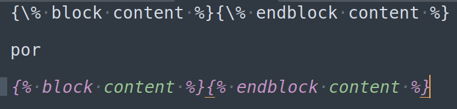

# Dica 26 - Paginação e Breadcrumb

**Versões usadas no vídeo:** Django 4.1.3, Python 3.10 e Tailwind CSS.
{: .versoes }

<a href="https://youtu.be/wuTJQSwF9gw">
    
</a>

Github: [https://github.com/rg3915/dicas-de-django](https://github.com/rg3915/dicas-de-django)

Nesta dica vamos fazer alguns ajustes nos templates da lista de produtos do projeto:

* **paginação** da lista de produtos com o `Paginator`, mantendo a busca entre as páginas;
* botões de navegação (Anterior/Próximo) e um **contador** de páginas e itens no rodapé da tabela;
* um **breadcrumb** genérico (Home > Produtos > Lista/Detalhe/Editar/Adicionar), que fica na app `core` e serve para qualquer app.

## Pré-requisitos

Continuamos o projeto do repositório [dicas-de-django](https://github.com/rg3915/dicas-de-django), com o CRUD de produtos da [Dica 23](089-23-crud-produtos.md) e o campo de busca da [Dica 25](091-25-dica-queryset.md). A view `product_list` estava assim:

```python
# backend/product/views.py
def product_list(request):
    template_name = 'product/product_list.html'
    object_list = Product.objects.all()

    search = request.GET.get('search')

    if search:
        object_list = object_list.filter(
            Q(title__icontains=search)
            | Q(description__icontains=search)
            | Q(category__title__icontains=search)
        )

    context = {'object_list': object_list}
    return render(request, template_name, context)
```

Os includes `breadcrumb.html`, `search.html` e `navigation_buttons.html` ficavam em `backend/product/templates/product/includes/`, com links fixos (`href="#"` e `href=""`).

**Importante:** numa versão antiga desta página as tags de template tinham uma `\` no meio (`{\%`), por causa do GitBook. Se você encontrar `{\%` em algum lugar, troque por `{%`.



## Paginação com ListView (o jeito mais curto)

Se você usar uma view baseada em classe, a paginação é só um atributo:

```python
# backend/product/views.py
from django.views.generic import ListView


class ProductListView(ListView):
    model = Product
    paginate_by = 5
```

```python
# backend/product/urls.py
path('', v.ProductListView.as_view(), name='product_list'),  # noqa E501
```

Com isso a lista já volta paginada, cinco itens por página. É um jeito muito simples, mas no vídeo deixamos esse código **comentado** e fizemos a paginação na view baseada em função, que é a que já temos.

## Paginação na view baseada em função

Seguimos a documentação: [Using Paginator in a view function](https://docs.djangoproject.com/en/4.1/topics/pagination/#using-paginator-in-a-view-function).

Edite `product/views.py`:

```python
# backend/product/views.py
# from django.views.generic import ListView
from django.core.paginator import Paginator
from django.db.models import Q
from django.shortcuts import get_object_or_404, redirect, render

from .forms import ProductForm
from .models import Product

# class ProductListView(ListView):
#     model = Product
#     paginate_by = 5


def product_list(request):
    template_name = 'product/product_list.html'
    object_list = Product.objects.all()

    search = request.GET.get('search')

    if search:
        object_list = object_list.filter(
            Q(title__icontains=search)
            | Q(description__icontains=search)
            | Q(category__title__icontains=search)
        )

    # https://docs.djangoproject.com/en/4.1/topics/pagination/#using-paginator-in-a-view-function
    items_per_page = 10
    paginator = Paginator(object_list, items_per_page)
    page_number = request.GET.get('page')
    page_obj = paginator.get_page(page_number)

    context = {
        'page_obj': page_obj,
        'items_count': page_obj.object_list.count(),
    }
    return render(request, template_name, context)
```

* O `Paginator` recebe o QuerySet (já filtrado pela busca, se houver) e a quantidade de itens por página.
* O número da página vem da query string: `?page=2`.
* `paginator.get_page(page_number)` devolve a página pedida. Se `page` não vier, ou for inválido, ele devolve a primeira; se passar do fim, a última.
* No contexto, trocamos `object_list` por `page_obj`. Também colocamos `items_count`, a quantidade de itens **desta** página, que vamos usar no contador. No vídeo, tentar calcular isso direto no template não funcionou, por isso ele foi para o contexto.

Para testar, durante o vídeo trocamos `items_per_page` para 3 e 4 e depois voltamos para 10.

No `urls.py` a rota continua apontando para a função; a linha da `ListView` fica comentada:

```python
# backend/product/urls.py
from django.urls import include, path

from backend.product import views as v

app_name = 'product'

# A ordem das urls é importante por causa do slug, quando existir.
product_patterns = [
    # path('', v.ProductListView.as_view(), name='product_list'),  # noqa E501
    path('', v.product_list, name='product_list'),  # noqa E501
    path('create/', v.product_create, name='product_create'),  # noqa E501
    path('<int:pk>/', v.product_detail, name='product_detail'),  # noqa E501
    path('<int:pk>/update/', v.product_update, name='product_update'),  # noqa E501
    path('<int:pk>/delete/', v.product_delete, name='product_delete'),  # noqa E501
]

urlpatterns = [
    path('', include(product_patterns)),
]
```

No template `product_list.html`, o laço passa a percorrer a página:

```html

```

Ao percorrer `page_obj`, você recebe só os itens da página atual.

## Botões da paginação

O `page_obj` tem os atributos que precisamos para navegar (veja a documentação):

* `page_obj.has_previous` e `page_obj.has_next`: se existe página anterior/próxima;
* `page_obj.previous_page_number` e `page_obj.next_page_number`: o número dessas páginas;
* `page_obj.number`: o número da página atual;
* `page_obj.paginator.num_pages`: o total de páginas;
* `page_obj.paginator.count`: o total de itens.

Os botões **Anterior** e **Próximo** ficam no arquivo `navigation_buttons.html`. A estrutura é esta:

```html
<!-- navigation_buttons.html -->
<div class="flex items-center space-x-3">
  
    <a href="?page={{ page_obj.previous_page_number }}&search={{ request.GET.search }}"
  
  
    <a href="?page={{ page_obj.next_page_number }}&search={{ request.GET.search }}"
  
</div>
```

O `&search={{ request.GET.search }}` mantém a **busca paginada**: se você buscou "calça" e há cinco resultados, com três por página, o link "Próximo" leva para `?page=2&search=calça`, ou seja, a segunda página **da busca**, e não da lista inteira.

O arquivo completo (já na pasta `core`, veja abaixo):

```html
<!-- backend/core/templates/includes/navigation_buttons.html -->
<div class="flex items-center space-x-3">
  
    <a
      href="?page={{ page_obj.previous_page_number }}&search={{ request.GET.search }}"
      class="flex-1 text-white bg-cyan-600 hover:bg-cyan-700 focus:ring-4 focus:ring-cyan-200 font-medium inline-flex items-center justify-center rounded-lg text-sm px-3 py-2 text-center"
    >
      <svg class="-ml-1 mr-1 h-5 w-5"" fill="currentColor" viewBox="0 0 20 20" xmlns="http://www.w3.org/2000/svg"> <path fill-rule="evenodd" d="M12.707 5.293a1 1 0 010 1.414L9.414 10l3.293 3.293a1 1 0 01-1.414 1.414l-4-4a1 1 0 010-1.414l4-4a1 1 0 011.414 0z" clip-rule="evenodd"></path>
        </svg>
        Anterior
        </a>
  
  
    <a href="?page={{ page_obj.next_page_number }}&search={{ request.GET.search }}" class="flex-1 text-white bg-cyan-600 hover:bg-cyan-700 focus:ring-4 focus:ring-cyan-200 font-medium inline-flex items-center justify-center rounded-lg text-sm px-3 py-2 text-center">
      Próximo
      <svg class="-mr-1 ml-1 h-5 w-5" fill="currentColor" viewBox="0 0 20 20" xmlns="http://www.w3.org/2000/svg">
        <path fill-rule="evenodd" d="M7.293 14.707a1 1 0 010-1.414L10.586 10 7.293 6.707a1 1 0 011.414-1.414l4 4a1 1 0 010 1.414l-4 4a1 1 0 01-1.414 0z" clip-rule="evenodd"></path>
          </svg>
          </a>
  
  </div>
```

O botão "Anterior" só aparece se houver página anterior; na primeira página só aparece "Próximo", e na última só "Anterior".

## Setas e contador no rodapé da tabela

No rodapé da tabela do `product_list.html` também há duas setinhas. Elas recebem a mesma lógica dos botões, e o texto fixo "Mostrando 1-20 de 2290" vira um contador de verdade:

```html
<!-- backend/product/templates/product/product_list.html -->
  <!-- START: footer of table -->
  <div class="bg-white sticky sm:flex items-center w-full sm:justify-between bottom-0 right-0 border-t border-gray-200 p-4">
    <div class="flex items-center mb-4 sm:mb-0">
      
        <a href="?page={{ page_obj.previous_page_number }}&search={{ request.GET.search }}" class="text-gray-500 hover:text-gray-900 cursor-pointer p-1 hover:bg-gray-100 rounded inline-flex justify-center">
          <svg class="w-7 h-7" fill="currentColor" viewBox="0 0 20 20" xmlns="http://www.w3.org/2000/svg"><path fill-rule="evenodd" d="M12.707 5.293a1 1 0 010 1.414L9.414 10l3.293 3.293a1 1 0 01-1.414 1.414l-4-4a1 1 0 010-1.414l4-4a1 1 0 011.414 0z" clip-rule="evenodd"></path></svg>
        </a>
      
      
        <a href="?page={{ page_obj.next_page_number }}&search={{ request.GET.search }}" class="text-gray-500 hover:text-gray-900 cursor-pointer p-1 hover:bg-gray-100 rounded inline-flex justify-center mr-2">
          <svg class="w-7 h-7" fill="currentColor" viewBox="0 0 20 20" xmlns="http://www.w3.org/2000/svg"><path fill-rule="evenodd" d="M7.293 14.707a1 1 0 010-1.414L10.586 10 7.293 6.707a1 1 0 011.414-1.414l4 4a1 1 0 010 1.414l-4 4a1 1 0 01-1.414 0z" clip-rule="evenodd"></path></svg>
        </a>
      
      <span class="text-sm font-normal text-gray-500">Mostrando <span class="text-gray-900 font-semibold">Página {{ page_obj.number }} de {{ page_obj.paginator.num_pages }}</span> - Mostrando <span class="text-gray-900 font-semibold">{{ items_count }}</span> de <span class="text-gray-900 font-semibold">{{ page_obj.paginator.count }}</span> items</span>
    </div>
    
  </div>
  <!-- END: footer of table -->
```

Com 1.004 produtos e 3 por página, o rodapé mostra: "Mostrando Página 1 de 335 - Mostrando 3 de 1004 items". Com 400 por página: "Página 1 de 3 - Mostrando 400 de 1004 items", e na última, "Página 3 de 3 - Mostrando 204 de 1004 items".

## Movendo os includes para a pasta core

Para que a paginação, a busca e o breadcrumb sirvam para qualquer app, movemos os três includes para `core/templates/includes/`:

```bash
mv backend/product/templates/product/includes/navigation_buttons.html backend/core/templates/includes/
mv backend/product/templates/product/includes/search.html backend/core/templates/includes/
mv backend/product/templates/product/includes/breadcrumb.html backend/core/templates/includes/
```

E trocamos os caminhos relativos (`"./includes/..."`) por caminhos a partir da pasta de templates:

```html
<!-- backend/product/templates/product/product_list.html -->



```

O `delete_modal.html` continua em `product/includes/` (``).

O `product_list.html` ficou assim (trecho; o arquivo completo está no link logo abaixo):

```html
<!-- backend/product/templates/product/product_list.html -->



  <!-- START: header -->
  <div class="p-4 bg-white block sm:flex items-center justify-between border-b border-gray-200 lg:mt-1.5">
    <div class="mb-1 w-full">
      <div class="mb-4">
        
        <h1 class="text-xl sm:text-2xl font-semibold text-gray-900">Produtos</h1>
      </div>
      <div class="sm:flex">
        
        <!-- ... -->
            <tbody class="bg-white divide-y divide-gray-200">
              
                <!-- ... -->
              
            </tbody>
          <!-- ... -->
  <!-- START: footer of table -->
  <div class="bg-white sticky sm:flex items-center w-full sm:justify-between bottom-0 right-0 border-t border-gray-200 p-4">
    <div class="flex items-center mb-4 sm:mb-0">
      
        <a href="?page={{ page_obj.previous_page_number }}&search={{ request.GET.search }}" class="text-gray-500 hover:text-gray-900 cursor-pointer p-1 hover:bg-gray-100 rounded inline-flex justify-center">
          <svg class="w-7 h-7" fill="currentColor" viewBox="0 0 20 20" xmlns="http://www.w3.org/2000/svg"><path fill-rule="evenodd" d="M12.707 5.293a1 1 0 010 1.414L9.414 10l3.293 3.293a1 1 0 01-1.414 1.414l-4-4a1 1 0 010-1.414l4-4a1 1 0 011.414 0z" clip-rule="evenodd"></path></svg>
        </a>
      
      
        <a href="?page={{ page_obj.next_page_number }}&search={{ request.GET.search }}" class="text-gray-500 hover:text-gray-900 cursor-pointer p-1 hover:bg-gray-100 rounded inline-flex justify-center mr-2">
          <svg class="w-7 h-7" fill="currentColor" viewBox="0 0 20 20" xmlns="http://www.w3.org/2000/svg"><path fill-rule="evenodd" d="M7.293 14.707a1 1 0 010-1.414L10.586 10 7.293 6.707a1 1 0 011.414-1.414l4 4a1 1 0 010 1.414l-4 4a1 1 0 01-1.414 0z" clip-rule="evenodd"></path></svg>
        </a>
      
      <span class="text-sm font-normal text-gray-500">Mostrando <span class="text-gray-900 font-semibold">Página {{ page_obj.number }} de {{ page_obj.paginator.num_pages }}</span> - Mostrando <span class="text-gray-900 font-semibold">{{ items_count }}</span> de <span class="text-gray-900 font-semibold">{{ page_obj.paginator.count }}</span> items</span>
    </div>
    
  </div>
  <!-- END: footer of table -->

  
<!-- ... -->
```

Código completo: [backend/product/templates/product/product_list.html](https://github.com/rg3915/dicas-de-django/blob/3b14c4dc8c3bda8b6aa6fb2224e39d63b87dd13d/backend/product/templates/product/product_list.html)

## Breadcrumb

O breadcrumb agora é genérico. Ele precisa saber, para qualquer model:

* o link da lista;
* o nome do model no plural ("produtos");
* em que tela estamos: lista, detalhe, edição ou cadastro.

### O model

Em `product/models.py`, acrescente no `Product` um método com a URL da lista e duas propriedades que expõem o `verbose_name` e o `verbose_name_plural` do `Meta`. O template não consegue acessar `object._meta` diretamente (atributos que começam com `_` não são acessíveis no template), por isso as propriedades.

```python
# backend/product/models.py
class Product(TimeStampedModel):
    ...

    def get_absolute_url(self):
        return reverse_lazy('product:product_detail', kwargs={'pk': self.pk})

    def list_url(self):
        return reverse_lazy('product:product_list')

    @property
    def verbose_name(self):
        return self._meta.verbose_name

    @property
    def verbose_name_plural(self):
        return self._meta.verbose_name_plural
```

### A view de cadastro

No detalhe e na edição temos o `object` no contexto, então o breadcrumb usa `object.list_url` e `object.verbose_name_plural`. No cadastro, o objeto ainda não existe, então pegamos o nome pelo `form.instance` (a instância vazia do model que o `ModelForm` cria) e mandamos no contexto:

```python
# backend/product/views.py
def product_create(request):
    template_name = 'product/product_form.html'
    form = ProductForm(request.POST or None)

    if request.method == 'POST' and form.is_valid():
        form.save()
        return redirect('product:product_list')

    verbose_name_plural = form.instance._meta.verbose_name_plural
    context = {
        'form': form,
        'verbose_name_plural': verbose_name_plural,
    }
    return render(request, template_name, context)
```

As views `product_detail` e `product_update` não mudam; elas já mandam `object` no contexto.

### O template do breadcrumb

```html
<!-- backend/core/templates/includes/breadcrumb.html -->
<nav class="flex mb-5" aria-label="Breadcrumb">
  <ol class="inline-flex items-center space-x-1 md:space-x-2">
    <li class="inline-flex items-center">
      <a href="" class="text-gray-700 hover:text-gray-900 inline-flex items-center">
        <svg class="w-5 h-5 mr-2.5" fill="currentColor" viewBox="0 0 20 20" xmlns="http://www.w3.org/2000/svg"><path d="M10.707 2.293a1 1 0 00-1.414 0l-7 7a1 1 0 001.414 1.414L4 10.414V17a1 1 0 001 1h2a1 1 0 001-1v-2a1 1 0 011-1h2a1 1 0 011 1v2a1 1 0 001 1h2a1 1 0 001-1v-6.586l.293.293a1 1 0 001.414-1.414l-7-7z"></path></svg>
        Home
      </a>
    </li>
    <li>
      <div class="flex items-center">
        <svg class="w-6 h-6 text-gray-400" fill="currentColor" viewBox="0 0 20 20" xmlns="http://www.w3.org/2000/svg"><path fill-rule="evenodd" d="M7.293 14.707a1 1 0 010-1.414L10.586 10 7.293 6.707a1 1 0 011.414-1.414l4 4a1 1 0 010 1.414l-4 4a1 1 0 01-1.414 0z" clip-rule="evenodd"></path></svg>
        
          <a href="{{ object.list_url }}" class="text-gray-700 hover:text-gray-900 ml-1 md:ml-2 text-sm font-medium">{{ object.verbose_name_plural }}</a>
        
          <a href="javascript:window.history.go(-1)" class="text-gray-700 hover:text-gray-900 ml-1 md:ml-2 text-sm font-medium">{{ verbose_name_plural }}</a>
        
          <a href="{{ page_obj.0.list_url }}" class="text-gray-700 hover:text-gray-900 ml-1 md:ml-2 text-sm font-medium">
            {{ page_obj.0.verbose_name_plural }}
          </a>
        
      </div>
    </li>
    <li>
      <div class="flex items-center">
        <svg class="w-6 h-6 text-gray-400" fill="currentColor" viewBox="0 0 20 20" xmlns="http://www.w3.org/2000/svg"><path fill-rule="evenodd" d="M7.293 14.707a1 1 0 010-1.414L10.586 10 7.293 6.707a1 1 0 011.414-1.414l4 4a1 1 0 010 1.414l-4 4a1 1 0 01-1.414 0z" clip-rule="evenodd"></path></svg>
        <span class="text-gray-400 ml-1 md:ml-2 text-sm font-medium" aria-current="page">
          
            Adicionar
          
            Editar
          
            Detalhe
          
            Lista
          
        </span>
      </div>
    </li>
  </ol>
</nav>
```

* **Home** aponta para `core:dashboard`.
* O segundo item:
  * se existe `object.pk` (detalhe ou edição), usa `object.list_url` e `object.verbose_name_plural`;
  * se a URL tem `create` (cadastro), volta para a página anterior com `javascript:window.history.go(-1)` e usa o `verbose_name_plural` do contexto;
  * senão estamos na lista: pegamos o primeiro item da página, `page_obj.0`, e usamos o `list_url` e o `verbose_name_plural` dele. No vídeo, primeiro escrevemos `object_list.0`, mas não aparecia nada, porque o contexto agora só tem `page_obj`.
* O último item diz onde estamos: **Adicionar** (URL com `create`), **Editar** (tem `object.pk` e a URL tem `update`), **Detalhe** (tem `object.pk`) ou **Lista**.

### Incluindo o breadcrumb nas páginas

Inclua o breadcrumb no `product_list.html` (já mostrado acima), no `product_detail.html` e no `product_form.html`:

```html
<!-- backend/product/templates/product/product_detail.html -->



  <div class="bg-white shadow rounded-lg p-4 sm:p-6 xl:p-8 ">
    <div class="mb-4">
      
      <h1 class="text-xl sm:text-2xl font-semibold text-gray-900">Detalhes: {{ object }}</h1>
    </div>
    ...
```

```html
<!-- backend/product/templates/product/product_form.html -->




  <div class="mx-auto md:h-screen flex flex-col px-6 pt-8 pt:mt-0">
    
    <!-- Card -->
    ...
```

## Testando

* Em `/product/`, a lista mostra 10 produtos por página; os botões e as setas navegam entre as páginas, e o rodapé mostra a página e a quantidade de itens.
* Busque um termo: a paginação continua dentro do resultado da busca.
* O breadcrumb mostra **Home > produtos > Lista**. Clique num produto: **Home > produtos > Detalhe**; em Editar: **Home > produtos > Editar**; em Adicionar: **Home > produtos > Adicionar**. O link "produtos" volta para a lista.

Pronto: paginação com busca, contador no rodapé e um breadcrumb que pode ser reaproveitado pelas outras apps, bastando que os models tenham `list_url`, `verbose_name` e `verbose_name_plural`.
