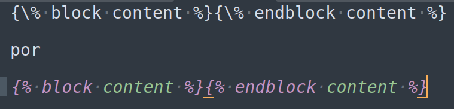

# Dica 33 - Importando XLSX com OpenPyXL

VIDEO EM BREVE.

**Importante:** remova a `\` no meio das tags.



```python
import openpyxl

wb = openpyxl.load_workbook("/home/regis/Documentos/products.xlsx", data_only=True)

ws = wb.active

max_row = ws.max_row
max_col = ws.max_column

for row in ws.iter_rows(max_row=max_row, max_col=max_col):
    print(row[0].value, row[1].value)

Product.objects.all().delete()

def save_data(data):
    '''
    Salva os dados no banco.
    '''
    aux = []
    for item in data:
        title = item.get('title')
        price = item.get('price')
        obj = Product(
            title=title,
            price=price,
        )
        aux.append(obj)

    Product.objects.bulk_create(aux)

data = []

for row in ws.iter_rows(min_row=2, max_row=max_row, max_col=max_col):
    _dict = dict(title=row[0].value, price=row[1].value)
    data.append(_dict)

save_data(data)

Product.objects.all().count()
```

## Importando XLSX InMemoryUploadedFile

```html
<!-- import_modal.html -->
<form action="{\% url 'product:import_view' %}" method="POST" enctype="multipart/form-data">

<input type="file" name="filename">
```

```python
# product/urls.py
path('import/', v.import_view, name='import_view'),  # noqa E501
```

```python
# product/views.py
@require_http_methods(['POST'])
def import_view(request):
    filename = request.FILES.get('filename')

    if filename.name.endswith('.csv'):
        data = csv_to_list_in_memory(filename)
    else:
        wb = openpyxl.load_workbook(filename, data_only=True)
        ws = wb.active

        max_row = ws.max_row
        max_col = ws.max_column

        data = []

        for row in ws.iter_rows(min_row=2, max_row=max_row, max_col=max_col):
            _dict = dict(title=row[0].value, price=row[1].value)
            data.append(_dict)

    save_data(data)
    return redirect('product:product_list')
```
