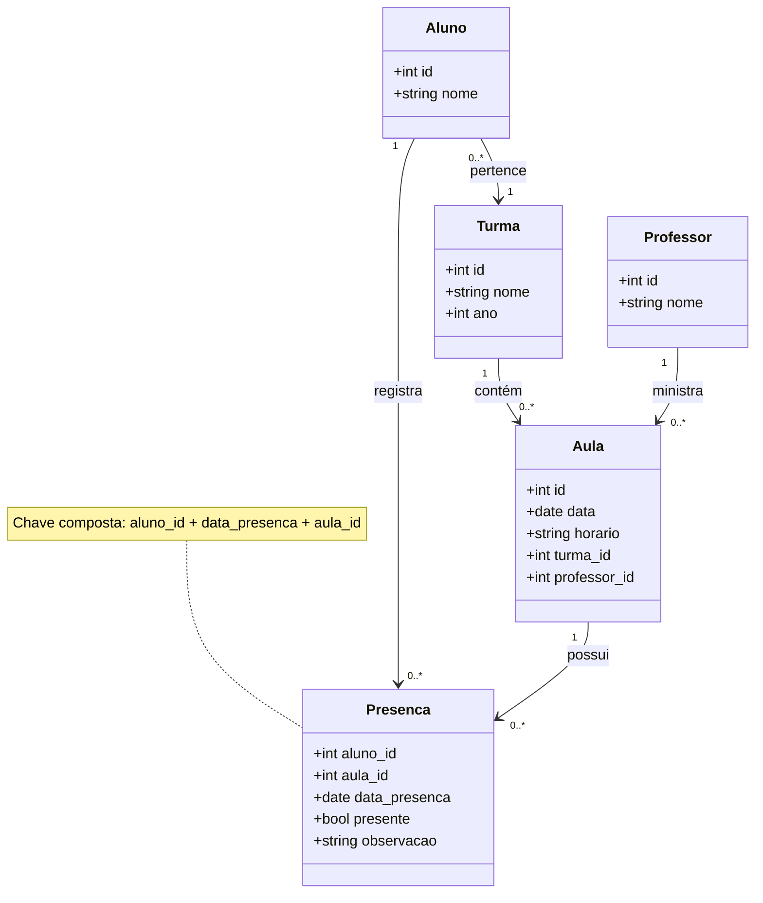

# Novidades do Django 5.2

Em 02 de Abril de 2025 saiu o [Django 5.2](https://docs.djangoproject.com/en/5.2/releases/5.2/).

Veja o video no YouTube em breve.

<a href="">
    
</a>

Doc: [https://docs.djangoproject.com/en/5.2/releases/5.2/](https://docs.djangoproject.com/en/5.2/releases/5.2/)

Github: [https://github.com/rg3915/django52](https://github.com/rg3915/django52)


**Importante:** remova a `\` no meio das tags.


E eu vou destacar aqui algumas das novidades:

## Importação automática dos modelos no shell (Automatic models import in the shell)


Ou digite simplesmente `python manage.py shell`

`python manage.py shell -v 2` é o modo verboso.

Se quiser, você pode desabilitar isso. Leia mais em [How to customize the shell command](https://docs.djangoproject.com/en/5.2/howto/custom-shell/#customizing-shell-auto-imports)


## Composição de Chave Estrangeira (Composite Primary Keys)

O novo [django.db.models.CompositePrimaryKey](https://docs.djangoproject.com/en/5.2/ref/models/fields/#django.db.models.CompositePrimaryKey) permite a criação de tabelas com uma chave primária composta por vários campos.


### 🧳 Exemplo 1: Sistema de Reservas de Passagens

- **Tabela**: Reserva
- **Chave composta**: `(voo_id, passageiro_id)`
- **Motivo**: Motivo: Um passageiro pode ter várias reservas, e um voo pode ter vários passageiros. A chave composta identifica uma reserva única por voo e passageiro.

### 🏫 Exemplo 2: Registro de Presença em Aulas

- **Tabela**: Presenca
- **Chave composta**: `(aluno_id, data, aula_id)`
- **Motivo**: Um aluno só pode ter um registro por aula por dia. Isso evita duplicidade de presença.

### Diagrama UML (feito no [mermaid.live](https://mermaid.live)):




### models.py

Agora veja o arquivo `apps/school/models.py`

### admin.py

Erro ao registrar no admin:

```python
admin.site.register(Attendance)
```

Resultado:

```text
django.core.exceptions.ImproperlyConfigured: The model Attendance has a composite primary key, so it cannot be registered with admin.
```


### Observações:

Segunda a doc:

Ainda estamos trabalhando no suporte a chaves primárias compostas para campos relacionais, incluindo campos `GenericForeignKey`, e para o Django Admin. No momento, modelos com chaves primárias compostas **não podem ser registrados no Django Admin**. Você pode esperar esse recurso em versões futuras.

Veja mais em:

- `apps/school/`
- [Rodando a lista de presença no shell](https://github.com/rg3915/django52/blob/main/passo-a-passo.md#rodando-a-lista-de-presen%C3%A7a-no-shell)


Veja aqui a chave composta via DBeaver.


**Observações:** O Django não oferece suporte para migração para, ou a partir de, uma chave primária composta após a criação da tabela. Também não é possível adicionar ou remover campos de uma chave primária composta por meio de migrações do Django.

Se você deseja migrar uma tabela existente de uma chave primária única para uma chave primária composta, siga as instruções específicas do seu sistema de banco de dados para realizar essa alteração manualmente.

Depois que a chave primária composta estiver definida no banco de dados, adicione o campo `CompositePrimaryKey` ao seu modelo. Isso permitirá que o Django reconheça e trate corretamente a chave primária composta.

Leia mais em [Migrating to a composite primary key](https://docs.djangoproject.com/en/5.2/topics/composite-primary-key/#migrating-to-a-composite-primary-key)


# Minor features

## Forms — New Inputs

### `ColorInput`

```python
class StudentForm(forms.ModelForm):
    class Meta:
        model = Student
        fields = ('name', 'class_group', 'color')
        widgets = {
            'color': forms.ColorInput()
        }
```


Rodando: `localhost:8000/school/create`


### `TelInput`

```python
class StudentForm(forms.ModelForm):
    class Meta:
        model = Student
        fields = ('name', 'class_group', 'color', 'phone')
        widgets = {
            ...
            'phone': forms.TelInput(),
        }
```


### `SearchInput`

```python
class SearchForm(forms.Form):
    search = forms.CharField(
        required=False,
        widget=forms.SearchInput()
    )
```

Você também pode usar o [`django-phonenumber-field`](https://django-phonenumber-field.readthedocs.io/en/latest/) para validar o formato do telefone no models ou no forms.


## JSONArray

A nova função de banco de dados `JSONArray` aceita uma lista de nomes de campos ou expressões e retorna um array JSON contendo esses valores.


## Templates

### simple_block_tags

[Documentação](https://docs.djangoproject.com/en/5.2/howto/custom-template-tags/#django.template.Library.simple_block_tag)

O novo decorador `simple_block_tag()` permite a criação de **block tags** simples, que podem aceitar e utilizar uma seção do template.


- Arquivo: `card_tags.py`  
  

- Template: `student_list.html`  
  


## Alterações incompatíveis com versões anteriores na versão 5.2

### Não tem mais suporte ao PostgreSQL 13

O suporte oficial ao PostgreSQL 13 será encerrado em novembro de 2025. O Django 5.2 oferece suporte ao PostgreSQL 14 e versões superiores.
