# Novidades do Django 5.2

**Versões usadas no vídeo:** Django 5.2, Python 3.12.4, django-extensions 3.2.3, rich 14.0.0 e Pico CSS 2.
{: .versoes }

Em 02 de Abril de 2025 saiu o [Django 5.2](https://docs.djangoproject.com/en/5.2/releases/5.2/).

<a href="https://youtu.be/1ZYXecnJzOA">
    
</a>

Doc: [https://docs.djangoproject.com/en/5.2/releases/5.2/](https://docs.djangoproject.com/en/5.2/releases/5.2/)

Github: [https://github.com/rg3915/django52](https://github.com/rg3915/django52)

**Importante:** nas versões antigas desta página as tags de template apareciam com uma `\` no meio (`{\%`). Aqui elas já estão escritas do jeito certo, sem a barra.


---

E eu vou destacar aqui algumas das novidades:

1. a importação automática dos models no `shell`;
2. as chaves primárias compostas (`CompositePrimaryKey`), com um exemplo completo de lista de presença;
3. os novos widgets de formulário `ColorInput`, `TelInput` e `SearchInput`;
4. a função de banco de dados `JSONArray`;
5. o decorator `simple_block_tag()` para criar template tags de bloco;
6. o fim do suporte ao PostgreSQL 13.

## O projeto de exemplo

Todos os exemplos estão no repositório [rg3915/django52](https://github.com/rg3915/django52), que tem também um [passo a passo](https://github.com/rg3915/django52/blob/main/passo-a-passo.md) que seguimos no vídeo.

```bash
git clone https://github.com/rg3915/django52.git
cd django52

python -m venv .venv
source .venv/bin/activate

pip install -r requirements.txt

python contrib/env_gen.py

python manage.py migrate
python manage.py createsuperuser --username="admin" --email=""
```

O `requirements.txt`:

```
Django==5.2
python-decouple==3.8
rich==14.0.0
django-extensions==3.2.3
```

O projeto se chama `apps` e tem duas apps dentro dele: `core` (página inicial e template tags) e `school` (a escola, com alunos, turmas, aulas e presenças).

```python
# apps/settings.py
INSTALLED_APPS = [
    'django.contrib.admin',
    'django.contrib.auth',
    'django.contrib.contenttypes',
    'django.contrib.sessions',
    'django.contrib.messages',
    'django.contrib.staticfiles',
    'django_extensions',
    'apps.core',
    'apps.school',
]

...

LANGUAGE_CODE = 'pt-br'

TIME_ZONE = 'America/Sao_Paulo'
```

```python
# apps/urls.py
from django.contrib import admin
from django.urls import include, path

from apps.core import views as v


urlpatterns = [
    path('', v.index, name='index'),
    path('school/', include('apps.school.urls', namespace='school')),
    path('admin/', admin.site.urls),
]
```

```python
# apps/core/views.py
from django.shortcuts import render


def index(request):
    return render(request, 'index.html')
```

A página inicial (`index.html`) é um resumo destas anotações, com um botão **Alunos** que leva para `/school/`.

## Importação automática dos modelos no shell (Automatic models import in the shell)

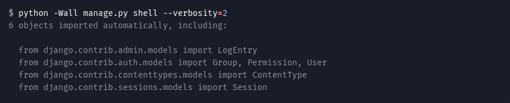

Agora o `shell` importa automaticamente os models de todas as apps instaladas. Basta digitar `python manage.py shell`:

```
$ python manage.py shell
11 objects imported automatically (use -v 2 for details).
```

`python manage.py shell -v 2` é o modo verboso, e mostra o que foi importado:

```
$ python manage.py shell -v 2
11 objects imported automatically:

  from apps.school.models import Attendance, Lesson, Teacher, Student, ClassGroup
  from django.contrib.sessions.models import Session
  from django.contrib.contenttypes.models import ContentType
  from django.contrib.auth.models import User, Group, Permission
  from django.contrib.admin.models import LogEntry
```

São os models da app `school` (que veremos daqui a pouco) e os do `django.contrib`. Não precisamos mais nos preocupar em importar: dá para escrever direto `User.objects.all()`.

Se quiser, você pode desabilitar isso. Leia mais em [How to customize the shell command](https://docs.djangoproject.com/en/5.2/howto/custom-shell/#customizing-shell-auto-imports)


## Composição de Chave Estrangeira (Composite Primary Keys)

O novo [django.db.models.CompositePrimaryKey](https://docs.djangoproject.com/en/5.2/ref/models/fields/#django.db.models.CompositePrimaryKey) permite a criação de tabelas com uma chave primária composta por vários campos.

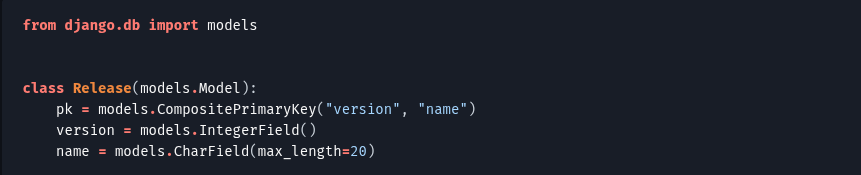

O exemplo da documentação é o model `Release`, cuja chave primária é a combinação de `version` e `name`:

```python
from django.db import models


class Release(models.Model):
    pk = models.CompositePrimaryKey("version", "name")
    version = models.IntegerField()
    name = models.CharField(max_length=20)
```

### 🧳 Exemplo 1: Sistema de Reservas de Passagens

- **Tabela**: Reserva
- **Chave composta**: `(voo_id, passageiro_id)`
- **Motivo**: Um passageiro pode ter várias reservas, e um voo pode ter vários passageiros. A chave composta identifica uma reserva única por voo e passageiro.

### 🏫 Exemplo 2: Registro de Presença em Aulas

- **Tabela**: Presenca
- **Chave composta**: `(aluno_id, data, aula_id)`
- **Motivo**: Um aluno só pode ter um registro por aula por dia. Isso evita duplicidade de presença.

É este segundo exemplo que vamos implementar.

### Diagrama UML (feito no [mermaid.live](https://mermaid.live)):

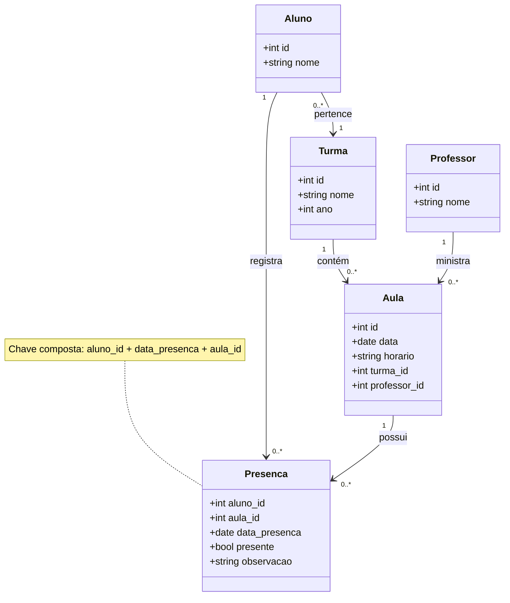
```mermaid
classDiagram
  class Aluno {
      +int id
      +string nome
  }

  class Professor {
      +int id
      +string nome
  }

  class Turma {
      +int id
      +string nome
      +int ano
  }

  class Aula {
      +int id
      +date data
      +string horario
      +int turma_id
      +int professor_id
  }

  class Presenca {
      +int aluno_id
      +int aula_id
      +date data_presenca
      +bool presente
      +string observacao
  }

  Aluno "1" --> "0..*" Presenca : registra
  Aula "1" --> "0..*" Presenca : possui
  Turma "1" --> "0..*" Aula : contém
  Professor "1" --> "0..*" Aula : ministra
  Aluno "0..*" --> "1" Turma : pertence

  note for Presenca "Chave composta: aluno_id + data_presenca + aula_id"
```

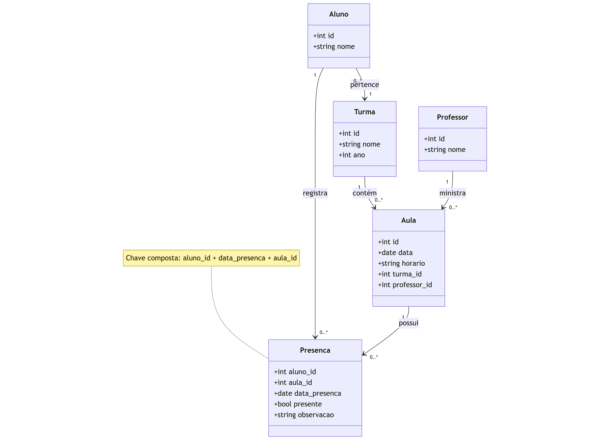

O aluno pertence a uma turma (nome e ano). A aula é de uma turma, dada por um professor, numa data e num horário. E a presença liga o aluno à aula: `aluno_id`, `aula_id` e `data_presenca` formam a chave composta, e ainda temos um booleano `presente` e um campo de `observacao`.

### models.py

Agora veja o arquivo `apps/school/models.py`. Os nomes estão em inglês: `ClassGroup` (turma), `Student` (aluno), `Teacher` (professor), `Lesson` (aula) e `Attendance` (presença).

```python
# apps/school/models.py
from django.db import models
from django.urls import reverse_lazy

# ... (veja o arquivo completo no GitHub)


class Attendance(models.Model):
    pk = models.CompositePrimaryKey('student', 'date_attendance', 'lesson')
    date_attendance = models.DateField(auto_now_add=True, help_text='data da presença')
    student = models.ForeignKey(
        Student,
        on_delete=models.CASCADE,
        related_name='attendances',
        verbose_name="aluno"
    )
    lesson = models.ForeignKey(
        Lesson,
        on_delete=models.CASCADE,
        related_name='attendances',
        verbose_name="aula"
    )
    present = models.BooleanField(
        default=False,
        verbose_name="presente"
    )
    note = models.TextField(
        blank=True,
        verbose_name="observação"
    )

    class Meta:
        verbose_name = "presença"
        verbose_name_plural = "presenças"

    def __str__(self):
        return f"{self.student.name} - {self.lesson} ({'Presente' if self.present else 'Faltou'})"
    # ... (veja o arquivo completo no GitHub)
```

Código completo: [apps/school/models.py](https://github.com/rg3915/django52/blob/4262ffc00c0fb7bff290e66bf8502cdfd6e2e749/apps/school/models.py)

O ponto principal é a linha `pk = models.CompositePrimaryKey('student', 'date_attendance', 'lesson')`: a chave primária de `Attendance` é a combinação do aluno, da data da presença e da aula. Não existe um campo `id`; o `pk` passa a ser uma tupla, por exemplo `(1, datetime.date(2025, 4, 26), 1)`.

### Rodando a lista de presença no shell

Abra o shell (o `-v 2` não é obrigatório, é só para enxergar o que foi importado):

```bash
python manage.py shell -v 2
```

Como os models já vêm importados, só precisamos de:

```python
import random
from datetime import date, timedelta
```

#### 1. Criar algumas turmas

```python
turma1 = ClassGroup.objects.create(name="5º Ano A", year=2025)
turma2 = ClassGroup.objects.create(name="5º Ano B", year=2025)
```

#### 2. Criar professores

```python
prof1 = Teacher.objects.create(name="Regis")
prof2 = Teacher.objects.create(name="Maria Oliveira")
```

#### 3. Criar alunos para as turmas

```python
alunos_turma1 = [
    Student.objects.create(name=name, class_group=turma1)
    for name in [
        "Emma Johnson",
        "Liam Smith",
        "Olivia Williams",
        "Noah Brown",
        "Ava Jones"
    ]
]

alunos_turma2 = [
    Student.objects.create(name=name, class_group=turma2)
    for name in [
        "Elijah Miller",
        "Sophia Davis",
        "James Garcia",
        "Isabella Martinez",
        "Benjamin Wilson"
    ]
]
```

#### 4. Criar aulas para as turmas

Três aulas para cada turma, a partir de hoje: as do 5º Ano A às 08:00 e as do 5º Ano B às 10:00.

```python
today = date.today()

aulas_turma1 = [
    Lesson.objects.create(
        date=today + timedelta(days=i),
        time="08:00",
        class_group=turma1,
        teacher=prof1
    )
    for i in range(3)
]

aulas_turma2 = [
    Lesson.objects.create(
        date=today + timedelta(days=i),
        time="10:00",
        class_group=turma2,
        teacher=prof2
    )
    for i in range(3)
]
```

#### 5. Criar as presenças aleatórias

```python
for aula in aulas_turma1:
    for aluno in alunos_turma1:
        Attendance.objects.create(
            student=aluno,
            lesson=aula,
            present=random.choice([True, False]),
            note=""
        )

for aula in aulas_turma2:
    for aluno in alunos_turma2:
        Attendance.objects.create(
            student=aluno,
            lesson=aula,
            present=random.choice([True, False]),
            note=""
        )
```

#### Verificando os dados

Para ver os dados usamos o [rich](https://github.com/Textualize/rich), que está no `requirements.txt`. (O passo a passo do repositório tem também a linha `from core.models import Attendance`, mas ela não é necessária, porque o `Attendance` já foi importado automaticamente.)

```python
from rich import print
from rich.console import Console
from rich.table import Table

console = Console()

attendances = Attendance.objects.select_related("student", "lesson")

# Tabela com resumo
table = Table(title="Registro de Presenças")

table.add_column("Aluno", style="cyan", no_wrap=True)
table.add_column("Data da Aula", style="green")
table.add_column("Hora", style="yellow")
table.add_column("Turma", style="magenta")
table.add_column("Presença", style="bold")

for a in attendances:
    table.add_row(
        f"{a.student.id}. {a.student.name}",
        a.lesson.date.strftime("%d/%m/%Y"),
        a.lesson.time,
        a.lesson.class_group.name,
        "✅ Presente" if a.present else "❌ Faltou"
    )

console.print(table)
```

A saída é uma tabela como esta (as presenças são aleatórias; no vídeo, as aulas começavam em 26/04/2025):

```
                         Registro de Presenças
┏━━━━━━━━━━━━━━━━━━━━━┳━━━━━━━━━━━━━━┳━━━━━━━┳━━━━━━━━━━┳━━━━━━━━━━━━━┓
┃ Aluno               ┃ Data da Aula ┃ Hora  ┃ Turma    ┃ Presença    ┃
┡━━━━━━━━━━━━━━━━━━━━━╇━━━━━━━━━━━━━━╇━━━━━━━╇━━━━━━━━━━╇━━━━━━━━━━━━━┩
│ 19. Emma Johnson    │ 26/04/2025   │ 08:00 │ 5º Ano A │ ❌ Faltou   │
│ 20. Liam Smith      │ 26/04/2025   │ 08:00 │ 5º Ano A │ ❌ Faltou   │
│ 21. Olivia Williams │ 26/04/2025   │ 08:00 │ 5º Ano A │ ✅ Presente │
│ 22. Noah Brown      │ 26/04/2025   │ 08:00 │ 5º Ano A │ ❌ Faltou   │
│ 23. Ava Jones       │ 26/04/2025   │ 08:00 │ 5º Ano A │ ✅ Presente │
│ ...                 │ ...          │ ...   │ ...      │ ...         │
└─────────────────────┴──────────────┴───────┴──────────┴─────────────┘
```

#### Ou

```python
from rich.pretty import pprint

for a in attendances:
    pprint(a.to_dict())
    print()
```

Cada registro aparece como um dicionário, com o `pk` na forma de tupla (os ids e as datas dependem dos seus dados):

```
{
│   'pk': (19, datetime.date(2025, 4, 26), 1),
│   'display': 'Emma Johnson - 2025-04-26 - 1',
│   'date_attendance': datetime.date(2025, 4, 26),
│   'student': <Student: Emma Johnson>,
│   'lesson': <Lesson: Aula em 2025-04-26 às 08:00 - 5º Ano A>,
│   'present': False,
│   'note': ''
}
```

#### Vamos tentar criar uma nova presença para um aluno que já tem presença.

```python
>>> aluno1 = Student.objects.first()
>>> aluno1
<Student: Emma Johnson>
>>> aula1 = Lesson.objects.first()
>>> aula1
<Lesson: Aula em 2025-04-26 às 08:00 - 5º Ano A>
>>> Attendance.objects.create(student=aluno1, lesson=aula1, present=True)
Traceback (most recent call last):
  ...
django.db.utils.IntegrityError: UNIQUE constraint failed: school_attendance.student_id, school_attendance.date_attendance, school_attendance.lesson_id
```

O banco não deixa: a combinação aluno + data + aula já existe. Ou seja, a chave composta está funcionando e não permite dar duas presenças para o mesmo aluno na mesma aula.

### admin.py

No Admin registramos as turmas, os alunos, as aulas e os professores:

```python
# apps/school/admin.py
from django.contrib import admin

from .models import Attendance, ClassGroup, Lesson, Student, Teacher

# admin.site.register(Attendance)
admin.site.register(ClassGroup)
admin.site.register(Lesson)
admin.site.register(Student)
admin.site.register(Teacher)
```

Mas cadê a tabela de presenças? Erro ao registrar no admin:

```python
admin.site.register(Attendance)
```

Resultado:

```text
django.core.exceptions.ImproperlyConfigured: The model Attendance has a composite primary key, so it cannot be registered with admin.
```

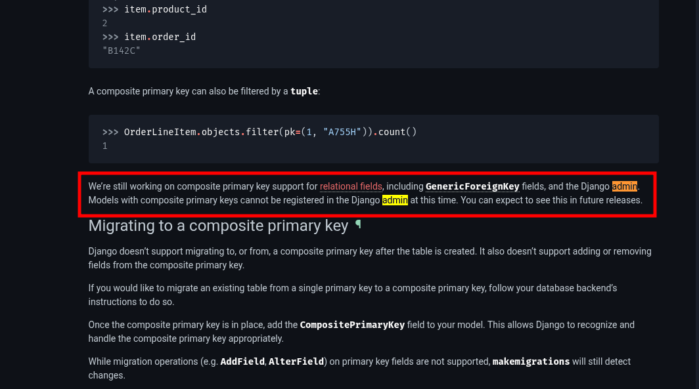


### Observações:

Segunda a doc:

Ainda estamos trabalhando no suporte a chaves primárias compostas para campos relacionais, incluindo campos `GenericForeignKey`, e para o Django Admin. No momento, modelos com chaves primárias compostas **não podem ser registrados no Django Admin**. Você pode esperar esse recurso em versões futuras.

Veja mais em:

- `apps/school/`
- [Rodando a lista de presença no shell](https://github.com/rg3915/django52/blob/main/passo-a-passo.md#rodando-a-lista-de-presen%C3%A7a-no-shell)


Veja aqui a chave composta via DBeaver.

Com o banco SQLite aberto no DBeaver, selecione a tabela `school_attendance`, abra a aba **Chaves** e clique na chave primária: ela é composta pelos três campos, `student_id`, `date_attendance` e `lesson_id`.

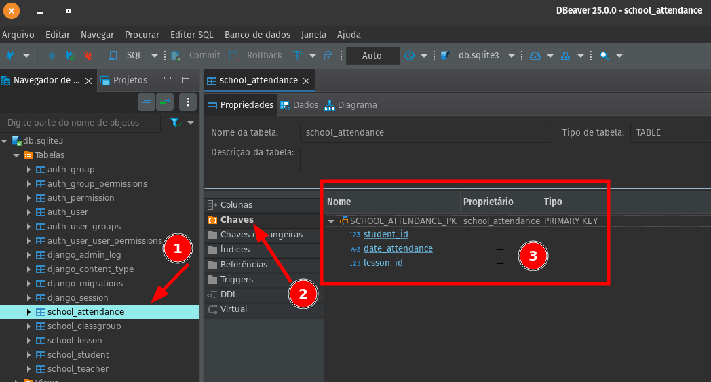

**Observações:** O Django não oferece suporte para migração para, ou a partir de, uma chave primária composta após a criação da tabela. Também não é possível adicionar ou remover campos de uma chave primária composta por meio de migrações do Django.

Se você deseja migrar uma tabela existente de uma chave primária única para uma chave primária composta, siga as instruções específicas do seu sistema de banco de dados para realizar essa alteração manualmente.

Depois que a chave primária composta estiver definida no banco de dados, adicione o campo `CompositePrimaryKey` ao seu modelo. Isso permitirá que o Django reconheça e trate corretamente a chave primária composta.

Leia mais em [Migrating to a composite primary key](https://docs.djangoproject.com/en/5.2/topics/composite-primary-key/#migrating-to-a-composite-primary-key)


## Minor features

## Forms — New Inputs

Para ver os novos widgets, a app `school` tem uma lista de alunos (com busca) e um formulário de cadastro.

```python
# apps/school/urls.py
from django.urls import path

from apps.school import views as v

app_name = 'school'


urlpatterns = [
    path('', v.StudentListView.as_view(), name='student_list'),
    path('create', v.StudentCreateView.as_view(), name='student_create'),
]
```

### `ColorInput`

O `ColorInput` renderiza um `<input type="color">`, que abre o seletor de cores do navegador. O campo `color` do `Student` é um `CharField` de 7 caracteres, que guarda o código hexadecimal (`#41b72a`, por exemplo).

```python
class StudentForm(forms.ModelForm):
    class Meta:
        model = Student
        fields = ('name', 'class_group', 'color')
        widgets = {
            'color': forms.ColorInput()
        }
```

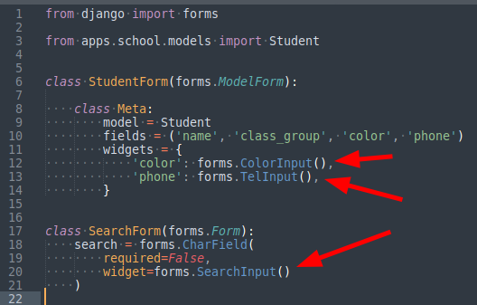

Rodando: `localhost:8000/school/create`


### `TelInput`

O `TelInput` renderiza um `<input type="tel">`, próprio para telefone (no celular, abre o teclado numérico).

```python
class StudentForm(forms.ModelForm):
    class Meta:
        model = Student
        fields = ('name', 'class_group', 'color', 'phone')
        widgets = {
            ...
            'phone': forms.TelInput(),
        }
```


### `SearchInput`

O `SearchInput` renderiza um `<input type="search">`. Com o Pico CSS, ele aparece com o ícone de lupa e as bordas arredondadas.

```python
class SearchForm(forms.Form):
    search = forms.CharField(
        required=False,
        widget=forms.SearchInput()
    )
```

Você também pode usar o [`django-phonenumber-field`](https://django-phonenumber-field.readthedocs.io/en/latest/) para validar o formato do telefone no models ou no forms.

### O código completo

O `forms.py` com os três widgets:

```python
# apps/school/forms.py
from django import forms

from apps.school.models import Student


class StudentForm(forms.ModelForm):

    class Meta:
        model = Student
        fields = ('name', 'class_group', 'color', 'phone')
        widgets = {
            'color': forms.ColorInput(),
            'phone': forms.TelInput(),
        }


class SearchForm(forms.Form):
    search = forms.CharField(
        required=False,
        widget=forms.SearchInput()
    )
```

As views: a `StudentListView` usa o `SearchForm` para filtrar os alunos pelo nome e coloca o form no contexto; a `StudentCreateView` usa o `StudentForm` e, depois de salvar, volta para a lista (por causa do `get_absolute_url` do model).

```python
# apps/school/views.py
from django.views.generic import CreateView, ListView

from .forms import SearchForm, StudentForm
from .models import Student


class StudentListView(ListView):
    model = Student

    def get_queryset(self):
        queryset = super().get_queryset()
        self.form = SearchForm(self.request.GET)

        if self.form.is_valid():
            search = self.form.cleaned_data.get('search')
            if search:
                queryset = queryset.filter(name__icontains=search)

        return queryset

    def get_context_data(self, **kwargs):
        context = super().get_context_data(**kwargs)
        context['form'] = self.form
        return context


class StudentCreateView(CreateView):
    model = Student
    form_class = StudentForm
```

O `base.html` carrega o Pico CSS e o `style.css` do projeto:

```html
<!-- apps/core/templates/base.html -->
<!DOCTYPE html>

<html lang="en">
<head>
  <meta charset="utf-8">
  <meta http-equiv="X-UA-Compatible" content="IE=edge">
  <meta name="viewport" content="width=device-width, initial-scale=1.0, shrink-to-fit=no">
  <link rel="shortcut icon" href="https://www.djangoproject.com/favicon.ico">
  <title>Django 5.2</title>

  
    <link rel="stylesheet" href="https://cdn.jsdelivr.net/npm/@picocss/pico@2/css/pico.min.css" />
  

  <link rel="stylesheet" href="">
</head>
<body>
  

  
</body>
</html>
```

```css
/* apps/core/static/css/style.css */
.ball {
  width: 50px;
  height: 50px;
  border-radius: 50%;
  box-shadow: 0 0 10px rgba(0, 0, 0, 0.2);
  margin: auto;
  /* center inside td */
}
```

O formulário de cadastro:

```html
<!-- apps/school/templates/school/student_form.html -->



  <div class="container">
    <h1>Cadastrar Aluno</h1>

    <form action="" method="POST">
      

      {{ form.as_p }}

      <button type="submit">Salvar</button>
    </form>
  </div>

```

Em `localhost:8000/school/create`, o campo **Cor** abre o seletor de cores e o campo **Telefone** é do tipo `tel`. Ao salvar, a lista mostra o código da cor (por exemplo `#41b72a`) e uma bolinha com a cor escolhida.

A lista de alunos (`student_list.html`) aparece completa mais abaixo, na seção de `simple_block_tag`. Nela, o campo de busca é renderizado com `{{ form.search }}`; inspecionando o elemento no navegador, vemos `<input type="search" name="search" id="id_search">`. Digitando `emma` e apertando Enter, a lista é filtrada. Um pequeno JavaScript recarrega a página sem filtro quando o campo é limpo.


## JSONArray

A nova função de banco de dados `JSONArray` aceita uma lista de nomes de campos ou expressões e retorna um array JSON contendo esses valores.

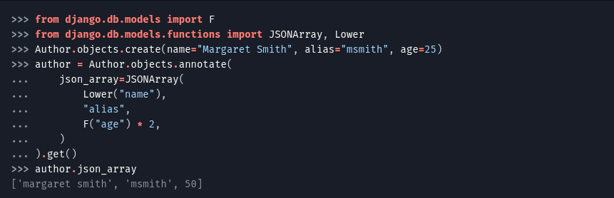

O exemplo da documentação:

```python
>>> from django.db.models import F
>>> from django.db.models.functions import JSONArray, Lower
>>> Author.objects.create(name="Margaret Smith", alias="msmith", age=25)
>>> author = Author.objects.annotate(
...     json_array=JSONArray(
...         Lower("name"),
...         "alias",
...         F("age") * 2,
...     )
... ).get()
>>> author.json_array
['margaret smith', 'msmith', 50]
```

Com o `annotate`, cada autor ganha um campo `json_array` com o nome em minúsculas, o alias e o dobro da idade.


## Templates

### simple_block_tags

[Documentação](https://docs.djangoproject.com/en/5.2/howto/custom-template-tags/#django.template.Library.simple_block_tag)

O novo decorador `simple_block_tag()` permite a criação de **block tags** simples, que podem aceitar e utilizar uma seção do template.

É como criar um componente: a tag recebe o conteúdo que está entre a abertura e o fechamento (o parâmetro `content`) e também pode receber parâmetros (aqui, `level`). O exemplo da documentação cria a tag `msgbox`:

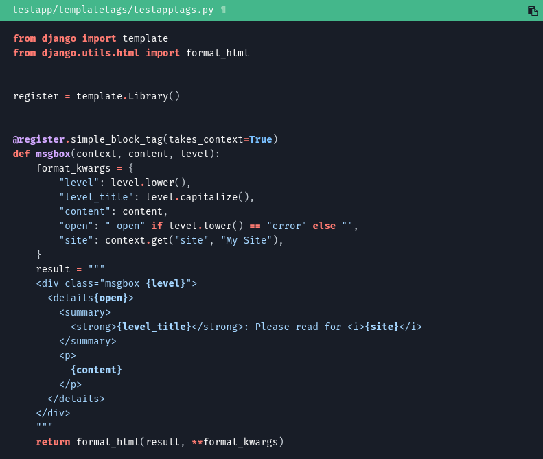

```python
# testapp/templatetags/testapptags.py
from django import template
from django.utils.html import format_html


register = template.Library()


@register.simple_block_tag(takes_context=True)
def msgbox(context, content, level):
    format_kwargs = {
        "level": level.lower(),
        "level_title": level.capitalize(),
        "content": content,
        "open": " open" if level.lower() == "error" else "",
        "site": context.get("site", "My Site"),
    }
    result = """
    <div class="msgbox {level}">
      <details{open}>
        <summary>
          <strong>{level_title}</strong>: Please read for <i>{site}</i>
        </summary>
        <p>
          {content}
        </p>
      </details>
    </div>
    """
    return format_html(result, **format_kwargs)
```

No template, além do `extends`, do `load` e do `block` que já conhecemos, usamos a nova tag com `` e ``:

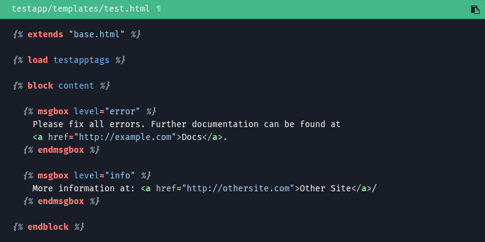

```html
<!-- testapp/templates/test.html -->






  
    Please fix all errors. Further documentation can be found at
    <a href="http://example.com">Docs</a>.
  

  
    More information at: <a href="http://othersite.com">Other Site</a>/
  


```

O resultado é uma `div` com as classes `msgbox error` e outra com `msgbox info` (o `site` vem do contexto; no exemplo da documentação ele vale `Important Site`):

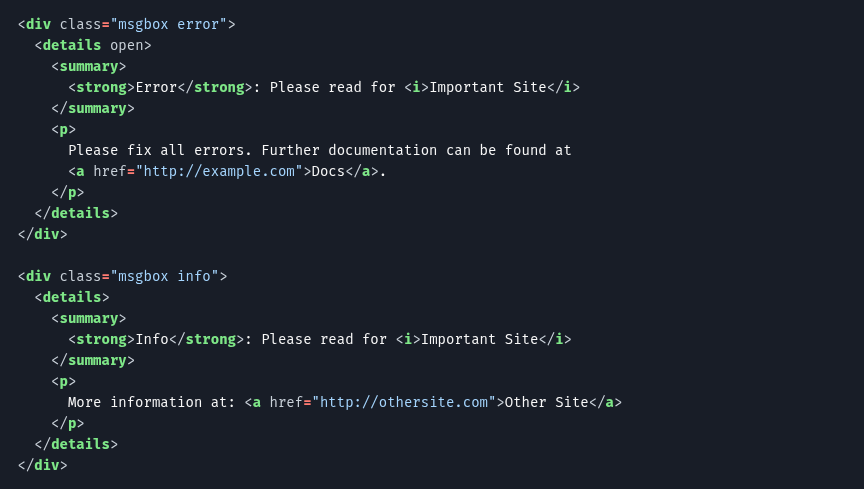

```html
<div class="msgbox error">
  <details open>
    <summary>
      <strong>Error</strong>: Please read for <i>Important Site</i>
    </summary>
    <p>
      Please fix all errors. Further documentation can be found at
      <a href="http://example.com">Docs</a>.
    </p>
  </details>
</div>

<div class="msgbox info">
  <details>
    <summary>
      <strong>Info</strong>: Please read for <i>Important Site</i>
    </summary>
    <p>
      More information at: <a href="http://othersite.com">Other Site</a>
    </p>
  </details>
</div>
```

No projeto, criamos dois arquivos de template tags na app `core`, com o comando do django-extensions:

```bash
python manage.py create_template_tags core -n msgbox_tags
python manage.py create_template_tags core -n card_tags
```

O `apps/core/templatetags/msgbox_tags.py` é o mesmo `msgbox` da documentação. E criei também uma tag `card`, que monta um card do Pico CSS com cabeçalho, conteúdo e rodapé:

- Arquivo: `card_tags.py`  

```python
# apps/core/templatetags/card_tags.py
from django import template
from django.utils.html import format_html


register = template.Library()


@register.simple_block_tag(takes_context=True)
def card(context, content, header, footer):
    format_kwargs = {
        "header": header,
        "content": content,
        "footer": footer,
    }
    result = """
    <article>
      <header>{header}</header>
      {content}
      <footer>{footer}</footer>
    </article>
    """
    return format_html(result, **format_kwargs)
```

  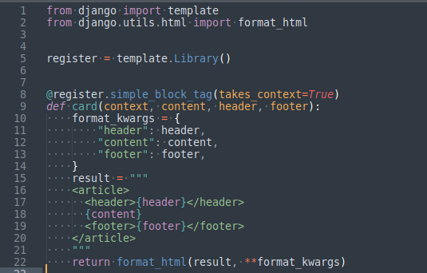

- Template: `student_list.html`  

Não esqueça do `` e do ``.

```html
<!-- apps/school/templates/school/student_list.html -->






  <div class="container">
    <h1>Alunos</h1>

    <div class="grid">
      <a role="button" href="">Cadastrar novo aluno</a>

      <form action="" method="GET">
        {{ form.search }}
      </form>
    </div>

    
      Please fix all errors. Further documentation can be found at
      <a href="http://example.com">Docs</a>.
    

    
      More information at: <a href="http://othersite.com">Other Site</a>/
    }

    
      Este é um exemplo de um card feito com simple_block_tag.

      <figure>
        
      </figure>
    
    <!-- ... -->
```

Código completo: [apps/school/templates/school/student_list.html](https://github.com/rg3915/django52/blob/4262ffc00c0fb7bff290e66bf8502cdfd6e2e749/apps/school/templates/school/student_list.html)

  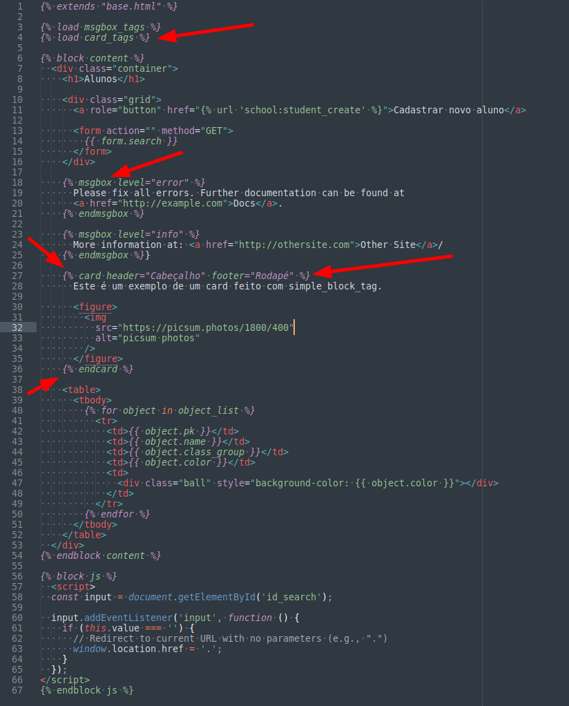

Em `localhost:8000/school/` aparecem as duas caixas do `msgbox` (como não existe a variável `site` no contexto, elas mostram `My Site`), o card com o cabeçalho **Cabeçalho**, uma imagem aleatória do picsum.photos e o rodapé **Rodapé**, e a tabela de alunos. Repare que no código existe um `}` sobrando depois do segundo ``; por isso aparece um `}` solto na página, logo abaixo da caixa de info.


## Alterações incompatíveis com versões anteriores na versão 5.2

### Não tem mais suporte ao PostgreSQL 13

O suporte oficial ao PostgreSQL 13 será encerrado em novembro de 2025. O Django 5.2 oferece suporte ao PostgreSQL 14 e versões superiores. Se você ainda está no PostgreSQL 13, atualize.

## Conclusão

O Django 5.2 traz a importação automática dos models no shell, as chaves primárias compostas (ainda sem suporte no Admin e nas migrations de tabelas existentes), novos widgets de formulário, a função `JSONArray` e o `simple_block_tag()`, que facilita bastante criar componentes nos templates. O projeto completo está no repositório [rg3915/django52](https://github.com/rg3915/django52).
