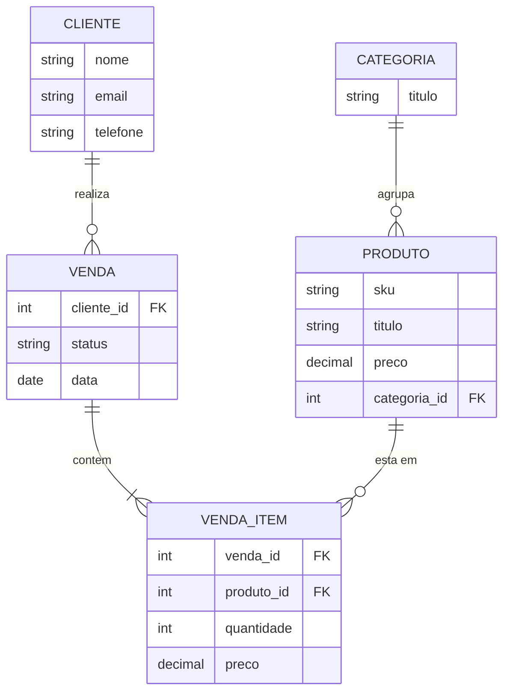

# O segredo para criar qualquer sistema em Django

Publicado em 12/03/2026.

<a href="https://youtu.be/ouw9bCYAvxA">
    
</a>

Github: [https://github.com/rg3915/django-modelagem](https://github.com/rg3915/django-modelagem)

Pedido, compra, orçamento, venda, ordem de serviço, saída de estoque, carrinho de compras: todos têm a mesma estrutura, **cliente + itens + produtos + quantidade + preço**. Neste tutorial vamos modelar isso uma vez (Mermaid, SQL e Django Models) e construir um sistema de pedidos completo com CBVs, admin, templates com PicoCSS e um "carrinho" em JavaScript puro para adicionar os itens do pedido. Depois, para virar orçamento ou venda, basta copiar o app e trocar os nomes.

## Pré-requisitos

* Python 3.12 ou superior (o projeto foi feito com Python 3.14 e Django 6.0).
* Docker e Docker Compose para subir o PostgreSQL.
* Conhecimento básico de models, views e templates no Django.

## A ideia: uma modelagem para vários sistemas

Olhe para um formulário de pedido de compra: cliente, status, data e uma tabela de itens com produto, quantidade, preço e subtotal. Agora olhe um orçamento, uma venda, uma ordem de serviço: é a mesma coisa. Muda o nome da tabela "cabeçalho" (Pedido, Venda, Orçamento) e, às vezes, o "dono" (cliente ou fornecedor).

O diagrama em Mermaid fica assim:



Onde está escrito `VENDA`, leia também Pedido, Compra, Orçamento, OrdemServico, Estoque ou Carrinho.

Repare em dois detalhes importantes:

* O item guarda o **próprio preço** (`preco` em `VENDA_ITEM`). O preço do produto muda com o tempo, mas o preço praticado naquela venda não pode mudar.
* A relação entre venda e produto é muitos-para-muitos, resolvida pela tabela de itens, que carrega os dados extras (quantidade e preço).

Em SQL (PostgreSQL), com os nomes de tabela que o Django vai gerar no nosso projeto, a estrutura é esta:

```sql
-- modelagem.sql
CREATE TABLE pessoa_cliente (
    id BIGSERIAL PRIMARY KEY,
    nome VARCHAR(100) NOT NULL,
    email VARCHAR(254) NOT NULL,
    telefone VARCHAR(20) NULL
);

CREATE TABLE produto_categoria (
    id BIGSERIAL PRIMARY KEY,
    titulo VARCHAR(100) NOT NULL
);

CREATE TABLE produto_produto (
    id BIGSERIAL PRIMARY KEY,
    sku VARCHAR(50) NOT NULL UNIQUE,
    titulo VARCHAR(200) NOT NULL,
    preco NUMERIC(10, 2) NOT NULL,
    categoria_id BIGINT NOT NULL REFERENCES produto_categoria (id)
);

CREATE TABLE pedido_pedido (
    id BIGSERIAL PRIMARY KEY,
    cliente_id BIGINT NOT NULL REFERENCES pessoa_cliente (id),
    status VARCHAR(2) NOT NULL,
    data DATE NULL
);

CREATE TABLE pedido_pedidoitem (
    id BIGSERIAL PRIMARY KEY,
    pedido_id BIGINT NOT NULL REFERENCES pedido_pedido (id) ON DELETE CASCADE,
    produto_id BIGINT NOT NULL REFERENCES produto_produto (id),
    quantidade INTEGER NOT NULL CHECK (quantidade >= 0),
    preco NUMERIC(10, 2) NOT NULL
);
```

O SQL serve para entender a estrutura; quem cria as tabelas de verdade são as migrations do Django. (As tabelas reais têm ainda as colunas `uuid`, `criado_em`, `modificado_em` e `ativo`, que vêm do `BaseModel` que veremos adiante.)

## Criando o projeto

```bash
python -m venv .venv
source .venv/bin/activate

pip install django django-extensions python-decouple psycopg2-binary
pip freeze > requirements.txt

django-admin startproject apps .
cd apps
python ../manage.py startapp core
python ../manage.py startapp pessoa
python ../manage.py startapp produto
python ../manage.py startapp pedido
cd ..

mkdir -p apps/core/templates/includes apps/core/static/js
touch apps/core/templates/{base,index}.html
touch apps/core/templates/includes/{menu,pagination}.html
```

O projeto se chama `apps` e os apps ficam dentro dele: `core` (base, dashboard, templates comuns), `pessoa` (cliente; o nome é mais genérico de propósito), `produto` e `pedido`. Como os apps estão numa subpasta, em cada `apps.py` o `name` precisa do prefixo, por exemplo `name = 'apps.pessoa'`.

O `contrib/env_gen.py` do repositório gera o arquivo `.env` com `DEBUG`, `SECRET_KEY` e `ALLOWED_HOSTS`:

```bash
python contrib/env_gen.py
```

## PostgreSQL com Docker

A porta do host é a 5431 para não brigar com um PostgreSQL que já esteja rodando na 5432.

```yaml
# docker-compose.yml
services:
  postgres:
    image: postgres:16.9-alpine
    container_name: db
    environment:
      POSTGRES_USER: postgres
      POSTGRES_PASSWORD: postgres
      POSTGRES_DB: postgres
    ports:
      - "5431:5432"
    volumes:
      - postgres_data:/var/lib/postgresql/data
    restart: unless-stopped

volumes:
  postgres_data:
```

```bash
docker compose up --build -d
docker container ls
```

## settings.py

Os trechos que mudam em relação ao padrão do `startproject`:

```python
# apps/settings.py
from pathlib import Path

from decouple import Csv, config

BASE_DIR = Path(__file__).resolve().parent.parent

SECRET_KEY = config('SECRET_KEY')
DEBUG = config('DEBUG', default=False, cast=bool)
ALLOWED_HOSTS = config('ALLOWED_HOSTS', default=[], cast=Csv())

INSTALLED_APPS = [
    'django.contrib.admin',
    'django.contrib.auth',
    'django.contrib.contenttypes',
    'django.contrib.sessions',
    'django.contrib.messages',
    'django.contrib.staticfiles',
    # others apps
    'django_extensions',
    # my apps
    'apps.core',
    'apps.pedido',
    'apps.pessoa',
    'apps.produto',
]

ROOT_URLCONF = 'apps.urls'
WSGI_APPLICATION = 'apps.wsgi.application'

DATABASES = {
    'default': {
        'ENGINE': 'django.db.backends.postgresql',
        'NAME': config('POSTGRES_DB', 'postgres'),
        'USER': config('POSTGRES_USER', 'postgres'),
        'PASSWORD': config('POSTGRES_PASSWORD', 'postgres'),
        'HOST': config('DB_HOST', '127.0.0.1'),
        'PORT': 5431,
    }
}

LANGUAGE_CODE = 'pt-br'
TIME_ZONE = 'America/Sao_Paulo'
USE_I18N = True
USE_TZ = True

STATIC_URL = 'static/'
STATIC_ROOT = BASE_DIR.joinpath('staticfiles')
```

```python
# apps/urls.py
from django.contrib import admin
from django.urls import include, path

urlpatterns = [
    path('', include('apps.core.urls')),
    path('', include('apps.pessoa.urls')),
    path('', include('apps.produto.urls')),
    path('', include('apps.pedido.urls')),
    path('admin/', admin.site.urls),
]
```

Teste a conexão:

```bash
python manage.py migrate
python manage.py createsuperuser
```

## O BaseModel no app core

Todo model do projeto herda de um `BaseModel` abstrato. Ele não cria tabela; só empresta campos para quem herda.

```python
# apps/core/models.py
import uuid

from django.conf import settings
from django.db import models


class UuidModel(models.Model):
    uuid = models.UUIDField(unique=True, editable=False, default=uuid.uuid4)

    class Meta:
        abstract = True


class TimeStampedModel(models.Model):
    criado_em = models.DateTimeField('criado em', auto_now_add=True, auto_now=False)
    modificado_em = models.DateTimeField('modificado em', auto_now_add=False, auto_now=True)

    class Meta:
        abstract = True


class CriadoPor(models.Model):
    criado_por = models.ForeignKey(
        settings.AUTH_USER_MODEL, on_delete=models.SET_NULL, verbose_name='criado por', null=True, blank=True
    )

    class Meta:
        abstract = True


class Ativo(models.Model):
    ativo = models.BooleanField('ativo', default=True)

    class Meta:
        abstract = True


class BaseModel(UuidModel, TimeStampedModel, Ativo):
    class Meta:
        abstract = True
```

* `UuidModel`: um campo `uuid` (UUID versão 4) único e não editável. A chave primária continua sendo o `id` inteiro; o `uuid` serve para expor o registro na URL sem deixar os ids sequenciais à mostra.
* `TimeStampedModel`: `criado_em` (preenchido na criação) e `modificado_em` (atualizado a cada `save`).
* `CriadoPor`: FK para o usuário (`settings.AUTH_USER_MODEL`). Fica disponível, mas não entra no `BaseModel`.
* `Ativo`: um booleano para "desativar" em vez de apagar.

## Cliente

```python
# apps/pessoa/models.py
from django.db import models
from django.urls import reverse

from apps.core.models import BaseModel


class Cliente(BaseModel):
    nome = models.CharField('nome', max_length=100)
    email = models.EmailField('e-mail')
    telefone = models.CharField('telefone', max_length=20, blank=True, null=True)

    class Meta:
        ordering = ('nome',)
        verbose_name = 'cliente'
        verbose_name_plural = 'clientes'

    def __str__(self):
        return self.nome

    def get_absolute_url(self):
        return reverse('pessoa:cliente_detail', kwargs={'pk': self.pk})
```

O `get_absolute_url` é o detalhe que faz a mágica nas views: a `CreateView` e a `UpdateView`, quando não têm `success_url`, redirecionam para `self.object.get_absolute_url()`. Ou seja, depois de salvar, você cai na página de detalhes do registro sem escrever nada.

```python
# apps/pessoa/admin.py
from django.contrib import admin

from apps.pessoa.models import Cliente


@admin.register(Cliente)
class ClienteAdmin(admin.ModelAdmin):
    list_display = ('nome', 'email', 'telefone', 'ativo')
    search_fields = ('nome', 'email')
    list_filter = ('ativo',)
    readonly_fields = ('uuid', 'criado_em', 'modificado_em')
```

```python
# apps/pessoa/forms.py
from django import forms

from apps.pessoa.models import Cliente


class ClienteForm(forms.ModelForm):
    class Meta:
        model = Cliente
        fields = ('nome', 'email', 'telefone')
```

As views são CBVs no padrão mais enxuto possível:

```python
# apps/pessoa/views.py
from django.views.generic import CreateView, DetailView, ListView, UpdateView

from apps.pessoa.forms import ClienteForm
from apps.pessoa.models import Cliente


class ClienteListView(ListView):
    model = Cliente
    paginate_by = 20

    # def get_queryset(self):
    #     return Cliente.objects.filter(ativo=True)


class ClienteDetailView(DetailView):
    model = Cliente
    context_object_name = 'cliente'


class ClienteCreateView(CreateView):
    model = Cliente
    form_class = ClienteForm


class ClienteUpdateView(UpdateView):
    model = Cliente
    form_class = ClienteForm
```

Não há `template_name` nem `success_url`. Seguindo os nomes padrão, o Django encontra sozinho:

| View | Template procurado | Variável no contexto |
|---|---|---|
| `ClienteListView` | `pessoa/cliente_list.html` | `object_list` (e `cliente_list`) |
| `ClienteDetailView` | `pessoa/cliente_detail.html` | `object` (e `cliente`) |
| `ClienteCreateView` / `ClienteUpdateView` | `pessoa/cliente_form.html` | `form` e, na edição, `object` |

O `get_queryset` comentado mostra como listar só os clientes ativos, se você quiser.

```python
# apps/pessoa/urls.py
from django.urls import path

from apps.pessoa import views

app_name = 'pessoa'

urlpatterns = [
    path('clientes/', views.ClienteListView.as_view(), name='cliente_list'),
    path('clientes/criar/', views.ClienteCreateView.as_view(), name='cliente_create'),
    path('clientes/<int:pk>/', views.ClienteDetailView.as_view(), name='cliente_detail'),
    path('clientes/<int:pk>/editar/', views.ClienteUpdateView.as_view(), name='cliente_update'),
]
```

## Categoria e Produto

```python
# apps/produto/models.py
from django.db import models
from django.urls import reverse

from apps.core.models import BaseModel


class Categoria(BaseModel):
    titulo = models.CharField('título', max_length=100)

    class Meta:
        ordering = ('titulo',)
        verbose_name = 'categoria'
        verbose_name_plural = 'categorias'

    def __str__(self):
        return self.titulo


class Produto(BaseModel):
    sku = models.CharField('SKU', max_length=50, unique=True)
    titulo = models.CharField('título', max_length=200)
    preco = models.DecimalField('preço', max_digits=10, decimal_places=2)
    categoria = models.ForeignKey(
        Categoria,
        on_delete=models.PROTECT,
        verbose_name='categoria',
        related_name='produtos'
    )

    class Meta:
        ordering = ('titulo',)
        verbose_name = 'produto'
        verbose_name_plural = 'produtos'

    def __str__(self):
        return self.titulo

    def get_absolute_url(self):
        return reverse('produto:produto_detail', kwargs={'uuid': self.uuid})
```

No produto a URL usa o `uuid`, e não o `pk`. Para a `DetailView` e a `UpdateView` buscarem pelo `uuid`, use `slug_field` e `slug_url_kwarg`:

```python
# apps/produto/views.py
from django.views.generic import CreateView, DetailView, ListView, UpdateView

from apps.produto.forms import ProdutoForm
from apps.produto.models import Produto


class ProdutoListView(ListView):
    model = Produto
    paginate_by = 20


class ProdutoDetailView(DetailView):
    model = Produto
    context_object_name = 'produto'
    slug_field = 'uuid'
    slug_url_kwarg = 'uuid'


class ProdutoCreateView(CreateView):
    model = Produto
    form_class = ProdutoForm


class ProdutoUpdateView(UpdateView):
    model = Produto
    form_class = ProdutoForm
    slug_field = 'uuid'
    slug_url_kwarg = 'uuid'
```

```python
# apps/produto/urls.py
from django.urls import path

from apps.produto import views

app_name = 'produto'

urlpatterns = [
    path('produtos/', views.ProdutoListView.as_view(), name='produto_list'),
    path('produtos/criar/', views.ProdutoCreateView.as_view(), name='produto_create'),
    path('produtos/<str:uuid>/', views.ProdutoDetailView.as_view(), name='produto_detail'),
    path('produtos/<str:uuid>/editar/', views.ProdutoUpdateView.as_view(), name='produto_update'),
]
```

O `forms.py` (campos `sku`, `titulo`, `preco`, `categoria`) e o `admin.py` seguem o mesmo padrão do cliente. No admin do produto, `autocomplete_fields = ('categoria',)` exige que o `CategoriaAdmin` tenha `search_fields`.

## Pedido e PedidoItem: o coração do sistema

```python
# apps/pedido/models.py
from django.core.validators import MinValueValidator
from django.db import models
from django.urls import reverse

from apps.core.models import BaseModel
from apps.pessoa.models import Cliente
from apps.produto.models import Produto


class Pedido(BaseModel):
    class StatusChoices(models.TextChoices):
        PENDENTE = 'PE', 'Pendente'
        EM_ANDAMENTO = 'AN', 'Em Andamento'
        APROVADO = 'AP', 'Aprovado'
        CANCELADO = 'CA', 'Cancelado'

    cliente = models.ForeignKey(
        Cliente,
        on_delete=models.PROTECT,
        verbose_name='cliente',
        related_name='pedidos'
    )
    status = models.CharField(
        'status',
        max_length=2,
        choices=StatusChoices.choices,
        default=StatusChoices.PENDENTE
    )
    data = models.DateField('data', null=True, blank=True)

    class Meta:
        ordering = ('-data',)
        verbose_name = 'pedido'
        verbose_name_plural = 'pedidos'

    def __str__(self):
        return f'Pedido {self.pk} - {self.cliente.nome}'

    def get_absolute_url(self):
        return reverse('pedido:pedido_detail', kwargs={'pk': self.pk})

    def get_total(self):
        """Calcula o total do pedido somando todos os itens"""
        total = sum(item.get_subtotal() for item in self.itens.all())
        return total


class PedidoItem(models.Model):
    pedido = models.ForeignKey(
        Pedido,
        on_delete=models.CASCADE,
        verbose_name='pedido',
        related_name='itens'
    )
    produto = models.ForeignKey(
        Produto,
        on_delete=models.PROTECT,
        verbose_name='produto',
        related_name='pedido_itens'
    )
    quantidade = models.PositiveIntegerField(
        'quantidade',
        validators=[MinValueValidator(1)]
    )
    preco = models.DecimalField('preço', max_digits=10, decimal_places=2)

    class Meta:
        verbose_name = 'item do pedido'
        verbose_name_plural = 'itens do pedido'

    def __str__(self):
        return f'{self.produto.titulo} - {self.quantidade}x'

    def get_subtotal(self):
        """Calcula o subtotal do item (quantidade * preço)"""
        return self.quantidade * self.preco
```

Pontos de atenção:

* **`TextChoices`**: o banco guarda o código de duas letras (`'AP'`), e o template mostra o rótulo com `{{ pedido.get_status_display }}`. No código você compara com `Pedido.StatusChoices.APROVADO`, sem string solta.
* **`on_delete`**: `PROTECT` no cliente e no produto (não dá para apagar um cliente que tem pedido), `CASCADE` nos itens (apagou o pedido, os itens vão junto).
* **`related_name='itens'`**: permite `pedido.itens.all()`, usado no `get_total`.
* **`ordering = ('-data',)`**: o sinal de menos ordena do mais recente para o mais antigo.

No admin, o `TabularInline` permite editar os itens na mesma tela do pedido:

```python
# apps/pedido/admin.py
from django.contrib import admin

from apps.pedido.models import Pedido, PedidoItem


class PedidoItemInline(admin.TabularInline):
    model = PedidoItem
    extra = 0
    fields = ('produto', 'quantidade', 'preco')


@admin.register(Pedido)
class PedidoAdmin(admin.ModelAdmin):
    list_display = ('__str__', 'id', 'cliente', 'status', 'data', 'ativo')
    search_fields = ('cliente__nome',)
    list_filter = ('status', 'ativo', 'data')
    readonly_fields = ('uuid', 'criado_em', 'modificado_em')
    inlines = [PedidoItemInline]
    autocomplete_fields = ('cliente',)
```

```bash
python manage.py makemigrations
python manage.py migrate
```

## O formulário do pedido

O form do pedido cuida só do cabeçalho. O `DateInput` com `type="date"` faz o navegador mostrar o seletor de data:

```python
# apps/pedido/forms.py
from django import forms

from apps.pedido.models import Pedido


class PedidoForm(forms.ModelForm):
    class Meta:
        model = Pedido
        fields = ('cliente', 'status', 'data')
        widgets = {
            'data': forms.DateInput(attrs={'type': 'date'}),
        }
```

Os itens chegam no `POST` com nomes numerados (`itens-0-produto`, `itens-0-quantidade`, `itens-0-preco`, `itens-1-produto`...), montados pelo JavaScript. A view salva o pedido e depois cria um `PedidoItem` para cada grupo, tudo dentro de uma transação:

```python
# apps/pedido/views.py
from django.db import transaction
from django.views.generic import CreateView, DetailView, ListView, UpdateView

from apps.pedido.forms import PedidoForm
from apps.pedido.models import Pedido, PedidoItem
from apps.produto.models import Produto


class PedidoListView(ListView):
    model = Pedido
    paginate_by = 20


class PedidoDetailView(DetailView):
    model = Pedido


class PedidoCreateView(CreateView):
    model = Pedido
    form_class = PedidoForm

    def get_context_data(self, **kwargs):
        context = super().get_context_data(**kwargs)
        context['produtos'] = Produto.objects.filter(ativo=True).order_by('titulo')
        return context

    @transaction.atomic
    def form_valid(self, form):
        # Salva o pedido
        self.object = form.save()

        # Processa os itens do pedido
        post_data = self.request.POST
        item_count = 0

        # Identifica quantos itens foram enviados
        while f'itens-{item_count}-produto' in post_data:
            produto_id = post_data.get(f'itens-{item_count}-produto')
            quantidade = post_data.get(f'itens-{item_count}-quantidade')
            preco = post_data.get(f'itens-{item_count}-preco')

            if produto_id and quantidade and preco:
                PedidoItem.objects.create(
                    pedido=self.object,
                    produto_id=produto_id,
                    quantidade=quantidade,
                    preco=preco
                )

            item_count += 1

        return super().form_valid(form)


class PedidoUpdateView(UpdateView):
    model = Pedido
    form_class = PedidoForm

    def get_context_data(self, **kwargs):
        context = super().get_context_data(**kwargs)
        context['produtos'] = Produto.objects.filter(ativo=True).order_by('titulo')
        return context

    @transaction.atomic
    def form_valid(self, form):
        # Salva o pedido
        self.object = form.save()

        # Remove todos os itens existentes
        self.object.itens.all().delete()

        # Processa os novos itens do pedido
        post_data = self.request.POST
        item_count = 0

        # Identifica quantos itens foram enviados
        while f'itens-{item_count}-produto' in post_data:
            produto_id = post_data.get(f'itens-{item_count}-produto')
            quantidade = post_data.get(f'itens-{item_count}-quantidade')
            preco = post_data.get(f'itens-{item_count}-preco')

            if produto_id and quantidade and preco:
                PedidoItem.objects.create(
                    pedido=self.object,
                    produto_id=produto_id,
                    quantidade=quantidade,
                    preco=preco
                )

            item_count += 1

        return super().form_valid(form)
```

* `get_context_data` envia a lista de produtos ativos para o template, que a transforma num objeto JavaScript.
* `@transaction.atomic` garante tudo ou nada: se um item falhar, o pedido também não é gravado.
* Na edição, a view apaga os itens e recria a partir do que veio do formulário. É simples e funciona; com `inlineformset_factory` daria para atualizar só o que mudou.
* Atenção a uma limitação deste código: o `while` para no primeiro índice que não existe. Se o usuário remover a linha `itens-0` e mantiver a `itens-1`, a `itens-1` não é lida. Se for usar em produção, percorra as chaves do `POST` (ou use formsets) em vez de depender de índices contínuos.

```python
# apps/pedido/urls.py
from django.urls import path

from apps.pedido import views

app_name = 'pedido'

urlpatterns = [
    path('pedidos/', views.PedidoListView.as_view(), name='pedido_list'),
    path('pedidos/criar/', views.PedidoCreateView.as_view(), name='pedido_create'),
    path('pedidos/<int:pk>/', views.PedidoDetailView.as_view(), name='pedido_detail'),
    path('pedidos/<int:pk>/editar/', views.PedidoUpdateView.as_view(), name='pedido_update'),
]
```

## Templates com PicoCSS

O `base.html` carrega o PicoCSS pelo CDN; ele estiliza as tags HTML puras (`article`, `table`, `button`, `dialog`) e já tem modo escuro automático.

```html
<!-- apps/core/templates/base.html -->
<!DOCTYPE html>
<html lang="pt-br">
<head>
    <meta charset="UTF-8">
    <meta name="viewport" content="width=device-width, initial-scale=1.0">
    <title>Dashboard</title>
    <link rel="stylesheet" href="https://cdn.jsdelivr.net/npm/@picocss/pico@2/css/pico.min.css">
</head>
<body>
    

    <main class="container">
        
    </main>
</body>
</html>
```

(No repositório o `base.html` tem também um bloco `<style>` com as classes `.card` e `.dashboard-grid` usadas no dashboard.)

```html
<!-- apps/core/templates/includes/menu.html -->
<nav class="container">
    <ul>
        <li><strong><a href="">Dashboard</a></strong></li>
    </ul>
    <ul>
        <li><a href="">Clientes</a></li>
        <li><a href="">Produtos</a></li>
        <li><a href="">Pedidos</a></li>
    </ul>
</nav>
```

A lista de pedidos usa `object_list`, o nome padrão da `ListView`, e o `get_status_display` do `TextChoices`:

```html
<!-- apps/pedido/templates/pedido/pedido_list.html -->


Pedidos


<div style="display: flex; justify-content: space-between; align-items: center; margin-bottom: 1rem;">
    <h1 style="margin: 0;">Pedidos</h1>
    <a href="" role="button">Novo Pedido</a>
</div>

<table role="grid">
    <thead>
        <tr>
            <th>ID</th>
            <th>Cliente</th>
            <th>Status</th>
            <th>Data</th>
            <th>Ações</th>
        </tr>
    </thead>
    <tbody>
        
        <tr>
            <td>
                <a href="">{{ pedido.id }}</a>
            </td>
            <td>{{ pedido.cliente.nome }}</td>
            <td>{{ pedido.get_status_display }}</td>
            <td>{{ pedido.data|date:"d/m/Y"|default:"-" }}</td>
            <td>
                <a href="" role="button" class="outline" style="margin: 0;">Editar</a>
            </td>
        </tr>
        
        <tr>
            <td colspan="5" style="text-align: center;">Nenhum pedido cadastrado.</td>
        </tr>
        
    </tbody>
</table>



```

No detalhe, os itens e o total vêm dos métodos do model:

```html
<!-- apps/pedido/templates/pedido/pedido_detail.html (trecho dos itens) -->
<h2>Itens do Pedido</h2>
<table role="grid">
    <thead>
        <tr>
            <th>Produto</th>
            <th>Quantidade</th>
            <th>Preço Unit.</th>
            <th>Subtotal</th>
        </tr>
    </thead>
    <tbody>
        
        <tr>
            <td>{{ item.produto.titulo }}</td>
            <td>{{ item.quantidade }}</td>
            <td>R$ {{ item.preco }}</td>
            <td>R$ {{ item.get_subtotal|floatformat:2 }}</td>
        </tr>
        
        <tr>
            <td colspan="4" style="text-align: center;">Nenhum item no pedido.</td>
        </tr>
        
    </tbody>
</table>


<div style="text-align: right; margin-top: 1rem;">
    <strong>Total Geral: R$ {{ pedido.get_total|floatformat:2 }}</strong>
</div>

```

Os templates de cliente e produto (`*_list.html`, `*_detail.html`, `*_form.html`) e o `pagination.html` seguem o mesmo estilo e estão completos no repositório.

## O carrinho: formulário do pedido com JavaScript puro

O `pedido_form.html` serve para criar e editar. Ele tem o cabeçalho, uma tabela vazia de itens, o total geral, um `<dialog>` de confirmação e, no fim, um script que passa os produtos (e, na edição, os itens existentes) do Django para o JavaScript.

```html
<!-- apps/pedido/templates/pedido/pedido_form.html -->



Editar PedidoNovo Pedido


<article>
    <header>
        <h1>Editar Pedido #{{ object.id }}Novo Pedido</h1>
    </header>

    <form method="post" id="pedidoForm">
        

        <label for="id_cliente">
            Cliente
            {{ form.cliente }}
        </label>

        <label for="id_status">
            Status
            {{ form.status }}
        </label>

        <label for="id_data">
            Data
            {{ form.data }}
        </label>

        <div style="display: flex; justify-content: space-between; align-items: center; margin-bottom: 1rem;">
            <h2 style="margin: 0;">Itens do Pedido</h2>
            <button type="button" onclick="adicionarItem()">Adicionar Item</button>
        </div>

        <table role="grid" id="itensTable">
            <thead>
                <tr>
                    <th>Produto</th>
                    <th>Quantidade</th>
                    <th>Preço</th>
                    <th>Subtotal</th>
                    <th>Ações</th>
                </tr>
            </thead>
            <tbody id="itensBody">
                <!-- Itens serão adicionados dinamicamente aqui -->
            </tbody>
        </table>

        <div style="text-align: right; margin-top: 1rem;">
            <strong>Total Geral: <span id="totalGeral">R$ 0,00</span></strong>
        </div>

        <div style="display: flex; gap: 1rem; margin-top: 1rem;">
            <button type="submit">Salvar</button>
            <a href="" role="button" class="outline">Cancelar</a>
        </div>
    </form>
</article>

<!-- Modal de confirmação de exclusão -->
<dialog id="confirmDialog">
    <article>
        <header>
            <h2>Confirmar Exclusão</h2>
        </header>
        <p>Tem certeza que deseja remover este item?</p>
        <footer>
            <button onclick="cancelarExclusao()" class="outline">Cancelar</button>
            <button onclick="confirmarExclusao()">Confirmar</button>
        </footer>
    </article>
</dialog>

<script>
// Dados dos produtos vindos do backend
window.produtos = {
    
    "{{ produto.pk }}": {
        titulo: "{{ produto.titulo|escapejs }}",
        preco: parseFloat("{{ produto.preco }}")
    },
    
};

// Dados dos itens existentes (para modo de edição)

window.itensExistentes = [
    
    {
        produto_id: "{{ item.produto.pk }}",
        quantidade: {{ item.quantidade }},
        preco: parseFloat("{{ item.preco }}")
    },
    
];

window.itensExistentes = [];

</script>
<script src=""></script>

```

(No repositório cada campo também exibe `form.<campo>.errors`, como no `cliente_form.html`.) Repare no `` na primeira linha: ele precisa ser a primeira tag do template, antes do ``.

O JavaScript fica em um arquivo estático separado:

```javascript
// apps/core/static/js/pedido.js
let itemParaRemover = null;
let contadorItens = 0;

function adicionarItem() {
    if (!window.produtos) {
        console.error('Produtos não carregados');
        return;
    }

    const tbody = document.getElementById('itensBody');
    const row = document.createElement('tr');
    row.id = `item-${contadorItens}`;

    row.innerHTML = `
        <td>
            <select name="itens-${contadorItens}-produto" onchange="atualizarPreco(${contadorItens})" required>
                <option value="">Selecione um produto</option>
                ${Object.entries(window.produtos).map(([id, produto]) =>
                    `<option value="${id}">${produto.titulo}</option>`
                ).join('')}
            </select>
        </td>
        <td>
            <input type="number" name="itens-${contadorItens}-quantidade" min="1" value="1"
                   onchange="calcularSubtotal(${contadorItens})" required style="margin: 0;">
        </td>
        <td>
            <input type="number" name="itens-${contadorItens}-preco" step="0.01" min="0"
                   onchange="calcularSubtotal(${contadorItens})" required style="margin: 0;">
        </td>
        <td>
            <span id="subtotal-${contadorItens}">R$ 0,00</span>
        </td>
        <td>
            <button type="button" onclick="mostrarConfirmacao(${contadorItens})"
                    class="outline" style="margin: 0;">Deletar</button>
        </td>
    `;

    tbody.appendChild(row);
    contadorItens++;
}

function atualizarPreco(itemId) {
    const select = document.querySelector(`select[name="itens-${itemId}-produto"]`);
    const precoInput = document.querySelector(`input[name="itens-${itemId}-preco"]`);

    const produtoId = select.value;
    if (produtoId && window.produtos[produtoId]) {
        precoInput.value = window.produtos[produtoId].preco;
        calcularSubtotal(itemId);
    } else {
        precoInput.value = '';
        document.getElementById(`subtotal-${itemId}`).textContent = 'R$ 0,00';
    }
}

function calcularSubtotal(itemId) {
    const quantidade = parseFloat(document.querySelector(`input[name="itens-${itemId}-quantidade"]`).value) || 0;
    const preco = parseFloat(document.querySelector(`input[name="itens-${itemId}-preco"]`).value) || 0;

    const subtotal = quantidade * preco;
    document.getElementById(`subtotal-${itemId}`).textContent =
        'R$ ' + subtotal.toFixed(2).replace('.', ',');

    calcularTotalGeral();
}

function calcularTotalGeral() {
    const rows = document.getElementById('itensBody').querySelectorAll('tr');
    let total = 0;

    rows.forEach(row => {
        const quantidadeInput = row.querySelector('input[name*="-quantidade"]');
        const precoInput = row.querySelector('input[name*="-preco"]');

        if (quantidadeInput && precoInput) {
            total += (parseFloat(quantidadeInput.value) || 0) * (parseFloat(precoInput.value) || 0);
        }
    });

    document.getElementById('totalGeral').textContent = 'R$ ' + total.toFixed(2).replace('.', ',');
}

function mostrarConfirmacao(itemId) {
    itemParaRemover = itemId;
    document.getElementById('confirmDialog').showModal();
}

function confirmarExclusao() {
    if (itemParaRemover !== null) {
        const row = document.getElementById(`item-${itemParaRemover}`);
        if (row) {
            row.remove();
            calcularTotalGeral();
        }
        itemParaRemover = null;
    }
    document.getElementById('confirmDialog').close();
}

function cancelarExclusao() {
    itemParaRemover = null;
    document.getElementById('confirmDialog').close();
}

document.addEventListener('DOMContentLoaded', function() {
    // Modo de edição: recria as linhas dos itens existentes
    if (window.itensExistentes && window.itensExistentes.length > 0) {
        window.itensExistentes.forEach(function(item) {
            adicionarItem();
            const itemId = contadorItens - 1;

            document.querySelector(`select[name="itens-${itemId}-produto"]`).value = item.produto_id;
            document.querySelector(`input[name="itens-${itemId}-quantidade"]`).value = item.quantidade;
            document.querySelector(`input[name="itens-${itemId}-preco"]`).value = item.preco.toFixed(2);
            calcularSubtotal(itemId);
        });
    } else {
        // Modo de criação: começa com uma linha vazia
        adicionarItem();
    }
});
```

Como funciona:

* `adicionarItem()` cria uma linha `<tr>` com um `select` de produtos, quantidade, preço, subtotal e o botão de remover. O contador numera os campos (`itens-0-...`, `itens-1-...`), que é exatamente o que a view lê.
* Ao escolher o produto, `atualizarPreco()` preenche o preço com o valor cadastrado; o usuário ainda pode alterá-lo (desconto, por exemplo), e é esse valor que fica gravado no item.
* `calcularSubtotal()` e `calcularTotalGeral()` atualizam os valores na tela a cada mudança.
* O botão "Deletar" abre o `<dialog>` do PicoCSS com `showModal()` e só remove a linha na confirmação.

## Rodando e testando

```bash
docker compose up -d
python manage.py makemigrations
python manage.py migrate
python manage.py createsuperuser
python manage.py runserver
```

1. No admin (`/admin/`), cadastre uma ou duas categorias.
2. Em `/clientes/criar/`, crie um cliente: ao salvar, você cai no detalhe dele (efeito do `get_absolute_url`).
3. Em `/produtos/criar/`, crie alguns produtos e repare que a URL do detalhe usa o UUID.
4. Em `/pedidos/criar/`, escolha cliente, status e data, adicione itens, altere quantidades e veja subtotal e total mudarem. Salve e confira o detalhe com o total geral.
5. Edite o pedido: os itens voltam preenchidos e podem ser alterados ou removidos.

## Transformando em orçamento, venda ou ordem de serviço

Copie o app `pedido` (e o `static/js/pedido.js`), troque `Pedido` por `Orcamento` ou `Venda`, `PedidoItem` por `OrcamentoItem` ou `VendaItem`, ajuste o `app_name`, as URLs e os status do `TextChoices`. Para entrada de estoque ou compra, troque a FK de `Cliente` por um `Fornecedor`. O resto é igual.

Esse é o segredo: entender que quase todo sistema comercial é **cabeçalho + itens**, modelar isso bem uma vez e reaproveitar.

Documentação útil:

* [Enumeration types (TextChoices)](https://docs.djangoproject.com/en/6.0/ref/models/fields/#enumeration-types)
* [Generic display views](https://docs.djangoproject.com/en/6.0/ref/class-based-views/generic-display/)
* [InlineModelAdmin](https://docs.djangoproject.com/en/6.0/ref/contrib/admin/#inlinemodeladmin-objects)
* [Diagrama ER no Mermaid](https://mermaid.js.org/syntax/entityRelationshipDiagram.html)
* [PicoCSS](https://picocss.com/)
