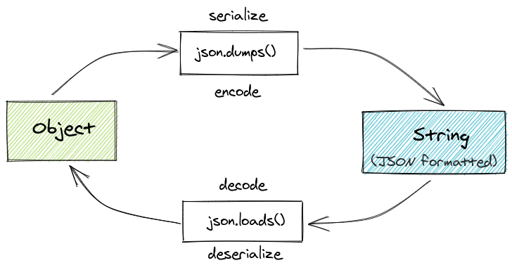

# 23 - Diferença entre JSON dump, dumps, load e loads

<a href="https://youtu.be/4AupIlLYkgE">
    
</a>


**Documentação:** [JSON](https://docs.python.org/3/library/json.html)



--


## [dumps](https://docs.python.org/3/library/json.html#json.dumps)

Serializa um objeto Python para uma string no formato JSON.

`json.dumps(obj)`

```python
import json

my_dict = {
    "name": "Elliot",
    "age": 25
}
json.dumps(my_dict)
```


## [dump](https://docs.python.org/3/library/json.html#json.dump)

Serializa um objeto Python para um arquivo no formato JSON.

`json.dump(obj, fp)`

onde *fp* significa *file-like object*.

```python
import json

my_dict = {
    "name": "Elliot",
    "age": 25
}
with open('/tmp/file.txt', 'w') as f:
    json.dump(my_dict, f)
```


## [loads](https://docs.python.org/3/library/json.html#json.loads)

Deserializa uma string no formato JSON para um arquivo.

`json.loads(s)`

```python
import json

text = """
{
    "name": "Darlene",
    "age": 27
}
"""
json.loads(text)
```

## [load](https://docs.python.org/3/library/json.html#json.load)

Deserializa um arquivo no formato JSON para um arquivo.

`json.load(fp)`

```python
import json

text = """
{
    "name": "Darlene",
    "age": 27
}
"""
with open('/tmp/file.txt', 'r') as f:
    data = json.load(f)

print(data)
```


**Exemplo**


```python
# json_example.py
import json
from io import StringIO
from pprint import pprint


def json_to_string_with_dumps(my_dict):
    '''
    Serializa (encode) objeto para string no formato JSON.
    '''
    return json.dumps(my_dict, indent=4)


def json_to_string_with_dump_stringio(my_dict):
    '''
    Serializa (encode) objeto para string no formato JSON usando StringIO.
    '''
    io = StringIO()
    json.dump(my_dict, io, indent=4)
    return io.getvalue()


def json_to_file_with_dump_open_file(filename, my_dict):
    '''
    Serializa (encode) objeto para arquivo no formato JSON usando open.
    '''
    with open(filename, 'w') as f:
        json.dump(my_dict, f, indent=4)


def string_to_json_with_loads(text):
    '''
    Deserializa (decode) string no formato JSON para objeto.
    '''
    return json.loads(text)


def string_to_json_with_load_stringio(text):
    '''
    Deserializa (decode) string no formato JSON para objeto usando StringIO.
    '''
    io = StringIO(text)
    return json.load(io)


def file_to_json_with_load_open_file(filename):
    '''
    Deserializa (decode) string no formato JSON para arquivo usando open.
    '''
    with open(filename, 'r') as f:
        data = json.load(f)
    return data


if __name__ == '__main__':
    # Serialize (encode)

    my_dict = {
        "name": "Elliot",
        "age": 25
    }
    print(json_to_string_with_dumps(my_dict))
    print(type(json_to_string_with_dumps(my_dict)))

    my_dict = {
        "name": "Elliot",
        "full_name": {"first_name": "Elliot", "last_name": "Alderson"},
        "items": [1, 2.5, "a"],
        "pi": 3.14,
        "active": True,
        "nulo": None
    }
    print(json_to_string_with_dump_stringio(my_dict))
    print(type(json_to_string_with_dump_stringio(my_dict)))

    filename = '/tmp/file.txt'
    my_dict = {
        "name": "Elliot",
        "full_name": {"first_name": "Elliot", "last_name": "Alderson"},
        "items": [1, 2.5, "a"],
        "pi": 3.14,
        "active": True,
        "nulo": None
    }
    json_to_file_with_dump_open_file(filename, my_dict)

    # Deserialize (decode)

    text = """
    {
        "name": "Darlene",
        "age": 27
    }
    """
    pprint(string_to_json_with_load_stringio(text))
    print(type(string_to_json_with_load_stringio(text)))

    pprint(string_to_json_with_loads(text))
    print(type(string_to_json_with_loads(text)))

    pprint(file_to_json_with_load_open_file(filename))
```


[JsonResponse](https://docs.djangoproject.com/en/2.2/ref/request-response/#jsonresponse-objects) [[source](https://docs.djangoproject.com/en/2.2/_modules/django/http/response/#JsonResponse)]


```python
# core/views.py
import json

from django.http import JsonResponse


def article_json(request):
    text = '''
    {
        "title": "JSON",
        "subtitle": "Entendento JSON dumps e loads",
        "slug": "entendento-json-dumps-e-loads",
        "value": "42"
    }
    '''
    data = json.loads(text)
    pprint(data)
    print(type(data))
    print(data['value'], 'is', type(data['value']))

    data['title'] = 'Introdução ao JSON'
    data['value'] = int(data['value']) + 1
    data['pi'] = 3.14
    data['active'] = True
    data['nulo'] = None
    return JsonResponse(data)
```

```python
# core/urls.py
...
path('articles/json/', v.article_json, name='article_json'),
...
```

Leia mais em [Working With JSON Data in Python](https://realpython.com/python-json/).

