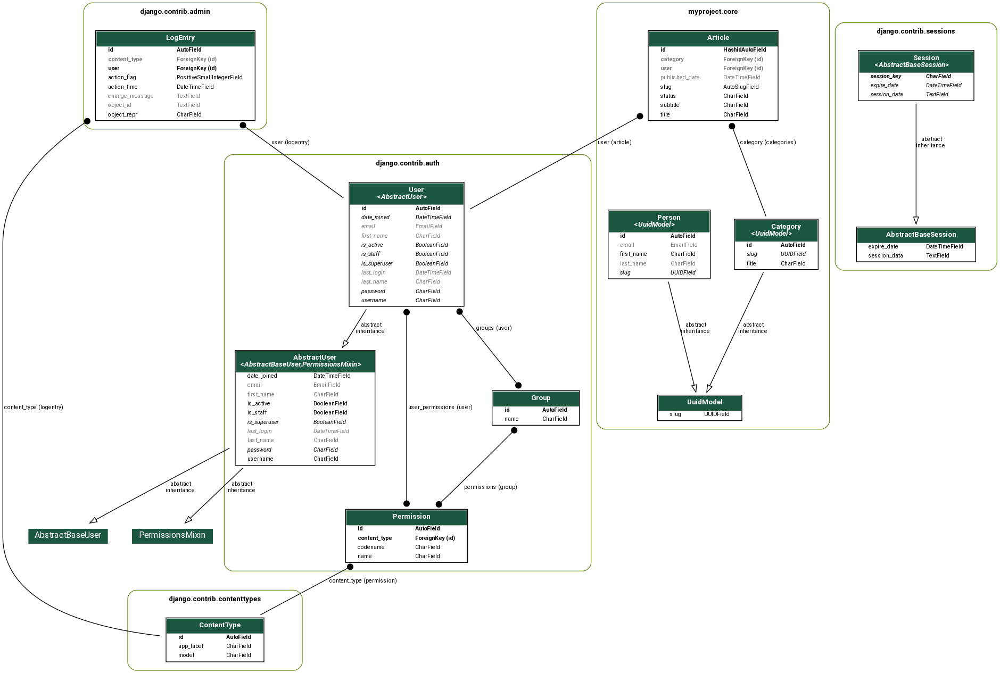

# 36 - Django: visualizando seus modelos com graph models

<a href="https://youtu.be/99dOVsDBUxg">
    
</a>

```
sudo apt-get install -y graphviz libgraphviz-dev pkg-config
python -m venv .venv
source .venv/bin/activate
pip install -r requirements.txt
pip install pygraphviz
pip uninstall pyparsing
pip install -Iv https://pypi.python.org/packages/source/p/pyparsing/pyparsing-1.5.7.tar.gz#md5=9be0fcdcc595199c646ab317c1d9a709
pip install pydot
pip install django-extensions
```

E em `INSTALLED_APPS`

```
INSTALLED_APPS = [
    ...
    'django_extensions',
    ...
]
```

Depois rode

```
python manage.py graph_models -e -g -l dot -o core.png core # only app core
python manage.py graph_models -a -g -o models.png # all
```

### core


### models


