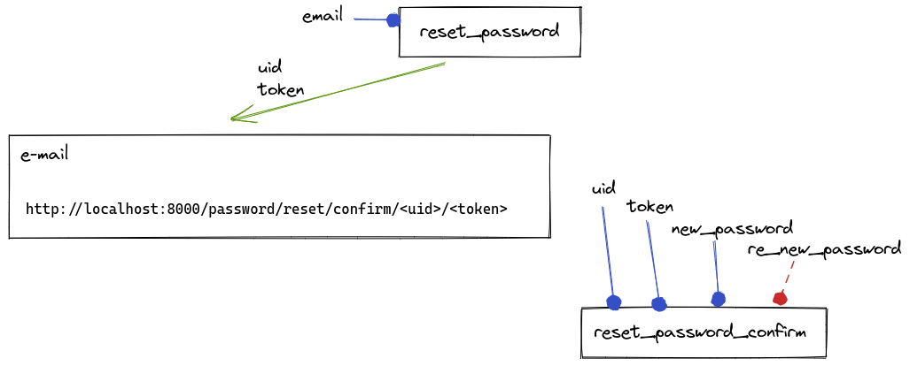

# 48 - DRF: Reset de Senha com djoser - Django REST framework

<a href="https://youtu.be/BilRdaQXX8U">
    
</a>

### MailHog

Rode o [MailHog](https://github.com/mailhog/MailHog) usando Docker.

`docker run -d -p 1025:1025 -p 8025:8025 mailhog/mailhog`


Endpoints

```
/api/v1/auth/token/login/
/api/v1/users/reset_password/
/api/v1/users/reset_password_confirm/
```




Edite `settings.py`

```python
DJOSER = {
    'PASSWORD_RESET_CONFIRM_URL': 'password/reset/confirm/{uid}/{token}',
}

EMAIL_BACKEND = 'django.core.mail.backends.smtp.EmailBackend'

DEFAULT_FROM_EMAIL = config('DEFAULT_FROM_EMAIL', 'webmaster@localhost')
EMAIL_HOST = config('EMAIL_HOST', '0.0.0.0')  # localhost
EMAIL_PORT = config('EMAIL_PORT', 1025, cast=int)
EMAIL_HOST_USER = config('EMAIL_HOST_USER', '')
EMAIL_HOST_PASSWORD = config('EMAIL_HOST_PASSWORD', '')
EMAIL_USE_TLS = config('EMAIL_USE_TLS', default=False, cast=bool)
```

### Página em pt-br

Edite `settings.py`

```python
LANGUAGE_CODE = 'pt-br'
```


### Página com template personalizado

Edite `settings.py`

```python
DJOSER = {
    'PASSWORD_RESET_CONFIRM_URL': 'password/reset/confirm/{uid}/{token}',
    'EMAIL': {
        'password_reset': 'accounts.email.PasswordResetEmail'
    }
}

TEMPLATES = [
    {
        'BACKEND': 'django.template.backends.django.DjangoTemplates',
        'DIRS': [
            BASE_DIR,
            BASE_DIR.joinpath('templates')
        ],
        ...
    }
]
```

Crie uma nova app

```
python manage.py startapp accounts
rm -f accounts/{admin,models,tests,views}.py
```

Crie um arquivo `email.py`

```python
cat << EOF > accounts/email.py
from djoser import email


class PasswordResetEmail(email.PasswordResetEmail):
    template_name = 'accounts/email/password_reset.html'

EOF
```


Crie o template de e-mail

```
mkdir -p accounts/templates/accounts/email
touch accounts/templates/accounts/email/password_reset.html
```

https://github.com/sunscrapers/djoser/blob/master/djoser/templates/email/password_reset.html

Edite `password_reset.html`

```html

Olá {{ user.first_name }},
...


Olá {{ user.first_name }},
...
```


### Postman

#### Login

POST: http://localhost:8000/api/v1/auth/token/login/

```
{
    "username": "huguinho",
    "password": "d"
}
```

#### Reset

POST: http://localhost:8000/api/v1/users/reset_password/

```
{
    "email": "huguinho@email.com"
}
```

* Não precisa de Token Authorization.


#### Reset Password Confirm

POST: http://localhost:8000/api/v1/users/reset_password_confirm/

```
{
    "uid": "MQ",
    "token": "at61wx-d98ea2d93ae43ba571252177750c4de8",
    "new_password": "my_super_new_password123"
}
```

* Não precisa de Token Authorization.

Se em settings você definir `PASSWORD_RESET_CONFIRM_RETYPE=True` então você precisa passar `re_new_password`.

```
{
    "uid": "MQ",
    "token": "at61wx-d98ea2d93ae43ba571252177750c4de8",
    "new_password": "my_super_new_password123"
    "re_new_password": "my_super_new_password123"
}
```
