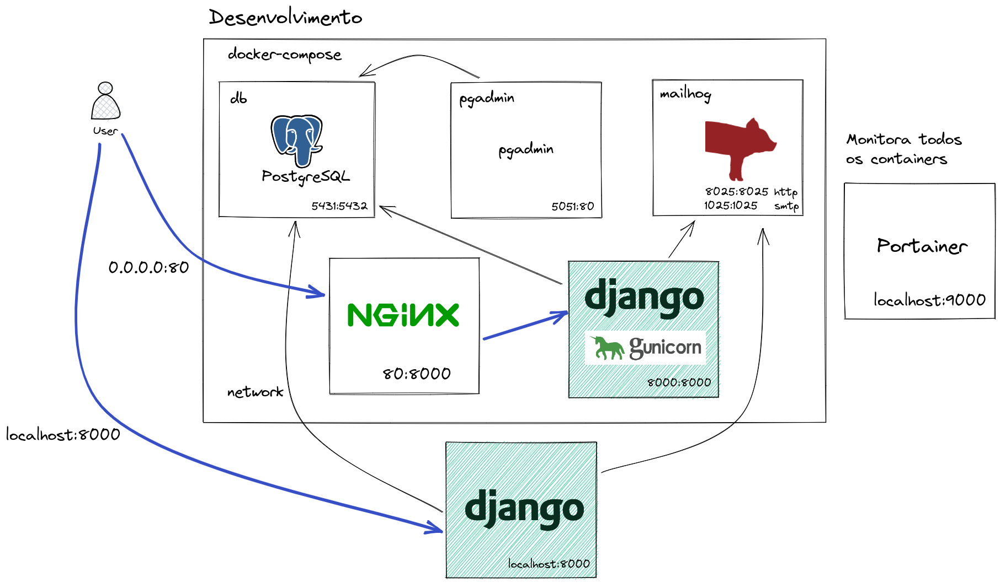
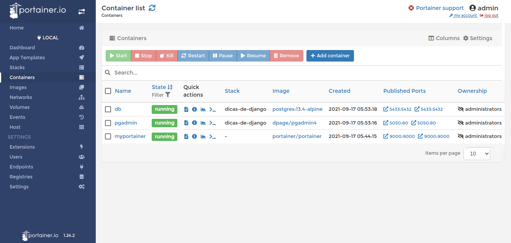

# 7 - PostgreSQL, pgAdmin e MailHog com docker-compose



## portainer

Instale o [docker](https://docs.docker.com/get-docker/) e o [docker-compose](https://docs.docker.com/compose/install/) na sua máquina.

```
docker --version
docker-compose --version
```

Vamos usar o [Portainer](https://www.portainer.io/) para monitorar nossos containers.

```
# Portainer
docker run -d \
--name myportainer \
-p 9000:9000 \
--restart always \
-v /var/run/docker.sock:/var/run/docker.sock \
-v /opt/portainer:/data \
portainer/portainer
```




## docker-compose

Edite `docker-compose.yml`

```yml
version: "3.8"

services:
  db:
    container_name: dicas_de_django_db
    image: postgres:14-alpine
    restart: always
    user: postgres  # importante definir o usuário
    volumes:
      - pgdata:/var/lib/postgresql/data
    environment:
      - LC_ALL=C.UTF-8
      - POSTGRES_PASSWORD=postgres  # senha padrão
      - POSTGRES_USER=postgres  # usuário padrão
      - POSTGRES_DB=dicas_de_django_db  # necessário porque foi configurado assim no settings
    ports:
      - 5431:5432  # repare na porta externa 5431
    networks:
      - dicas-de-django-network

  pgadmin:
    container_name: dicas_de_django_pgadmin
    image: dpage/pgadmin4
    restart: unless-stopped
    volumes:
       - pgadmin:/var/lib/pgadmin
    environment:
      PGADMIN_DEFAULT_EMAIL: admin@admin.com
      PGADMIN_DEFAULT_PASSWORD: admin
      PGADMIN_CONFIG_SERVER_MODE: 'False'
    ports:
      - 5051:80
    networks:
      - dicas-de-django-network

  mailhog:
    container_name: dicas_de_django_mailhog
    image: mailhog/mailhog
    restart: always
    logging:
      driver: 'none'
    ports:
      - 1025:1025
      - 8025:8025
    networks:
      - dicas-de-django-network

volumes:
  pgdata:  # mesmo nome do volume externo definido na linha 10
  pgadmin:

networks:
  dicas-de-django-network:
```

Edite `settings.py`

```python
# settings.py
DATABASES = {
    'default': {
        'ENGINE': 'django.db.backends.postgresql',
        'NAME': config('POSTGRES_DB', 'dicas_de_django_db'),  # postgres
        'USER': config('POSTGRES_USER', 'postgres'),
        'PASSWORD': config('POSTGRES_PASSWORD', 'postgres'),
        # 'db' caso exista um serviço com esse nome.
        # 'HOST': config('DB_HOST', 'db'),
        'HOST': config('DB_HOST', 'localhost'),
        'PORT': config('DB_PORT', 5431, cast=int),
    }
}

# Email config
EMAIL_BACKEND = 'django.core.mail.backends.smtp.EmailBackend'

DEFAULT_FROM_EMAIL = config('DEFAULT_FROM_EMAIL', 'webmaster@localhost')
EMAIL_HOST = config('EMAIL_HOST', 'localhost')  # localhost 0.0.0.0
EMAIL_PORT = config('EMAIL_PORT', 1025, cast=int)
EMAIL_HOST_USER = config('EMAIL_HOST_USER', '')
EMAIL_HOST_PASSWORD = config('EMAIL_HOST_PASSWORD', '')
EMAIL_USE_TLS = config('EMAIL_USE_TLS', default=False, cast=bool)
```

Edite `contrib/env_gen.py`

```
DB_PORT=
```
Edite `.env`

```
POSTGRES_DB=dicas_de_django_db
POSTGRES_USER=postgres
POSTGRES_PASSWORD=postgres
DB_HOST=localhost
DB_PORT=5431
```

```
python manage.py migrate
```

```
django.core.exceptions.ImproperlyConfigured: Error loading psycopg2 module: No module named 'psycopg2'
```

```
pip install psycopg2-binary
pip freeze | grep psycopg2 >> requirements.txt
```

```
python manage.py migrate
python manage.py createsuperuser --username="admin" --email=""
python manage.py runserver
```

## pgAdmin

Conectar no pgAdmin


## Rodando o Django dentro do container

Instale o gunicorn.

```
pip install gunicorn
pip freeze | grep gunicorn >> requirements.txt
```

Edite `Dockerfile`

```
FROM python:3.10-slim

ENV PYTHONUNBUFFERED 1
ENV DJANGO_ENV dev
ENV DOCKER_CONTAINER 1
RUN mkdir /app
WORKDIR /app
EXPOSE 8000

COPY requirements.txt .
RUN pip install -U pip && pip install -r requirements.txt

COPY manage.py .
COPY backend backend

CMD python manage.py collectstatic --no-input
CMD gunicorn backend.wsgi:application -b 0.0.0.0:8000
```

Edite docker-compose.yml

```
version: "3.8"

services:
  ...

  app:
    build:
      context: .
      dockerfile: Dockerfile
    container_name: dicas_de_django_app
    hostname: app
    stdin_open: true
    expose:
      - '8000'
    volumes:
      - .env.docker:/app/.env
    command: bash -c "gunicorn backend.wsgi:application -b 0.0.0.0:8000"
    depends_on:
      - db
    networks:
      - dicas-de-django-network

  nginx:
    container_name: dicas_de_django_nginx
    image: nginx
    hostname: nginx
    ports:
      - '80:8000'
    volumes:
      - ./docker/config/nginx/:/etc/nginx/conf.d/
    depends_on:
      - app
    networks:
      - dicas-de-django-network
```

Edite docker/config/nginx/app.conf

```
# define group app
upstream app {
  # define server app
  server app:8000;
}

# server
server {
  listen 8000;
  charset utf-8;

  client_max_body_size 50M;

  # domain localhost
  server_name localhost;

  # Handle favicon.ico
  location = /favicon.ico {
    return 204;
    access_log off;
    log_not_found off;
  }

  # Django app
  location / {
    proxy_pass http://app;
    proxy_set_header X-Forwarded-For $proxy_add_x_forwarded_for;
    proxy_set_header Host $host;
    proxy_redirect off;
  }
}
```

Rode o docker novamente.

```
docker-compose up --build -d

docker container exec -it dicas_de_django_app python manage.py migrate
docker container exec -it dicas_de_django_app python manage.py createsuperuser --username="admin" --email=""
```

Edite `.env.docker`

```
POSTGRES_DB=dicas_de_django_db
POSTGRES_USER=postgres
POSTGRES_PASSWORD=postgres
DB_HOST=db
DB_PORT=5432
```

Coloque `.env.docker` no `.gitignore`

```
.env.docker
```

## Servindo arquivos estáticos no Docker com WhiteNoise

Para servir os estáticos no Docker vamos usar o [WhiteNoise](http://whitenoise.evans.io/en/latest/).

```
pip install whitenoise

pip freeze | grep whitenoise >> requirements.txt
```

Edite `settings.py`

```python
# settings.py
MIDDLEWARE = [
    # ...
    "django.middleware.security.SecurityMiddleware",
    "whitenoise.middleware.WhiteNoiseMiddleware",
    # ...
]
```

```
docker-compose up --build -d
```