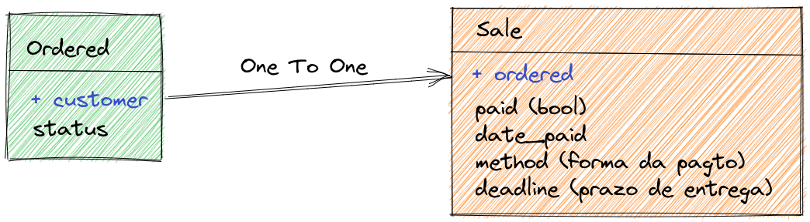
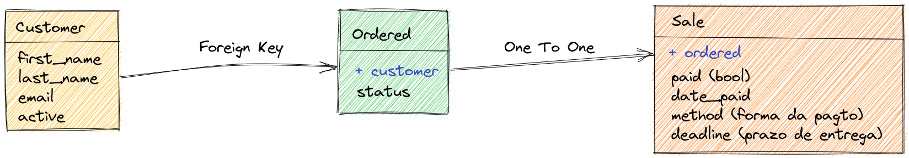
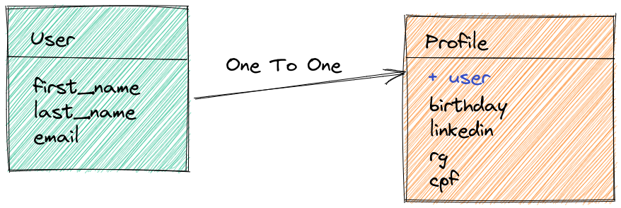

# Dica 20 - Modelagem - OneToOne - Um pra Um

## OneToOne - Um pra Um



```python
# bookstore/models.py

METHOD_PAYMENT = (
    ('di', 'dinheiro'),
    ('de', 'débito'),
    ('cr', 'crédito'),
    ('pix', 'Pix'),
)


class Sale(models.Model):
    ordered = models.OneToOneField(
        Ordered,
        on_delete=models.CASCADE,
        verbose_name='ordem de compra'
    )
    paid = models.BooleanField('pago', default=False)
    date_paid = models.DateTimeField('data de pagamento', null=True, blank=True)
    method = models.CharField('forma de pagamento', max_length=3, choices=METHOD_PAYMENT)  # noqa E501
    deadline = models.PositiveSmallIntegerField('prazo de entrega', default=15)
    created = models.DateTimeField(
        'criado em',
        auto_now_add=True,
        auto_now=False
    )

    class Meta:
        ordering = ('-pk',)
        verbose_name = 'venda'
        verbose_name_plural = 'vendas'

    def __str__(self):
        if self.ordered:
            return f'{str(self.pk).zfill(3)}-{self.ordered}'

        return f'{str(self.pk).zfill(3)}'
```

```python
# bookstore/admin.py
from .models import Sale


@admin.register(Sale)
class SaleAdmin(admin.ModelAdmin):
    list_display = ('__str__', 'paid', 'date_paid', 'method', 'deadline')
    list_filter = ('paid', 'method')
    date_hierarchy = 'created'
```



```
python manage.py makemigrations
python manage.py migrate
```




```python
# core/models.py
from backend.accounts.models import User
from django.db import models
from django.db.models.signals import post_save
from django.dispatch import receiver


class Profile(models.Model):
    user = models.OneToOneField(
        User,
        on_delete=models.PROTECT,
        verbose_name='usuário'
    )
    birthday = models.DateField('data de nascimento', null=True, blank=True)
    linkedin = models.URLField(null=True, blank=True)
    rg = models.CharField(max_length=10, null=True, blank=True)
    cpf = models.CharField(max_length=11, null=True, blank=True)

    class Meta:
        ordering = ('user__first_name',)
        verbose_name = 'perfil'
        verbose_name_plural = 'perfis'

    @property
    def full_name(self):
        return f'{self.user.first_name} {self.user.last_name or ""}'.strip()

    def __str__(self):
        return self.full_name


@receiver(post_save, sender=User)
def create_user_profile(sender, instance, created, **kwargs):
    if created:
        Profile.objects.create(user=instance)


@receiver(post_save, sender=User)
def save_user_profile(sender, instance, **kwargs):
    instance.profile.save()
```


```python
# core/admin.py
from backend.core.models import Profile


@admin.register(Profile)
class ProfileAdmin(admin.ModelAdmin):
    list_display = ('__str__', 'birthday', 'linkedin', 'rg', 'cpf')
    search_fields = (
        'customer__first_name',
        'customer__last_name',
        'customer__email',
        'linkedin',
        'rg',
        'cpf'
    )
```


```
python manage.py makemigrations
python manage.py migrate
```

### Diagrama ER


**Obs:** Caso dê o **erro**

```
RelatedObjectDoesNotExist at /admin/login/

User has no profile.
```

Entre no shell e digite

```python
python manage.py shell_plus

from backend.accounts.models import User
from backend.core.models import Profile

users = User.objects.all()

for user in users:
    try:
        user.profile
    except Profile.DoesNotExist:
        profile = Profile(user=user)
        profile.save()
```

Então no shell ou no notebook experimente

```python
paul = User.objects.create(email='paul@email.com', first_name='Paul')
paul.profile
paul.profile.cpf = '987654321'
paul.profile.save()
```
